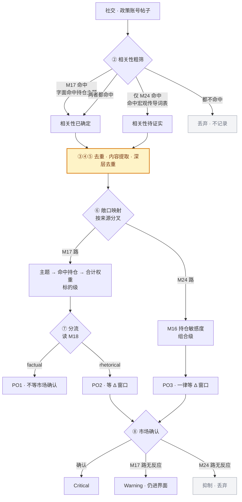
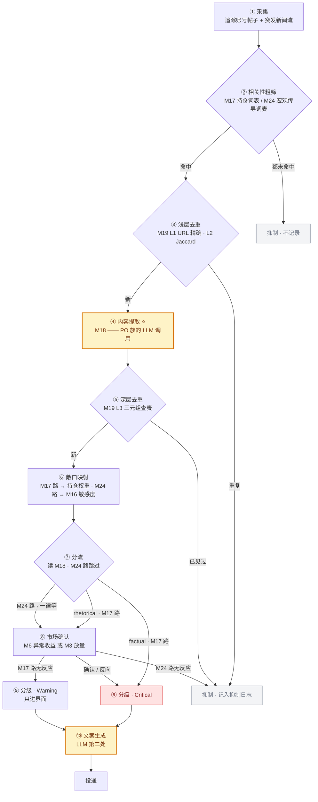

# PO · 政策言论族 · 回测结果

> 本族的**全部当前结论**在本文。修订历史见 [`revisions.md`](revisions.md)（只追加）。
> 信号定义见 [`signal-registry.md`](signal-registry.md)，本文只引用 ID。

## 本文分节

- **po34** — PO3 / PO4 · **当前结论**
- **phase3-po** — PO1 / PO2 · **当前结论**

⚠️ 标「已被取代」的分节保留是为了可追溯，**引用数字前先确认它没有被上面的分节推翻**。

---


# 分节 · PO3 / PO4 · **当前结论**

<sub>原文件 `results-po34.md`</sub>

# PO3 / PO4 验证 · M16 实现

<sub>`results-po34.md` — 主题 × 敞口匹配这条路的验证</sub>

> 执行 2026-08-20 · **0 credits · 未调用 LLM** · 判据见 [`plan.md`](plan.md) §一
>
> **结论：PO3 与 PO4 都不成立。** 切半映射一致性 Spearman **+0.151**，
> 而平移安慰剂的 95 分位就是 **+0.147** —— 实测值等于噪声上限。
> **留出组合 0/16** —— 换成没见过的组合全部归零，直接否定复用性。
>
> ⚠️ 支持本方向的那张 event_type 分层表**不可复现**：
> `export-control → 半导体` 前半段 −3.2pp、后半段 +7.3pp，符号翻转。

---

## 结论先行

| 问题 | 答案 |
|---|---|
| M16 能不能事前算 | **能**。`m16.py` 三个分支的输入全是运行时可得的量，示例组合 NVDA/TSLA/AAPL 直接算得出 |
| 算得出的 M16 有没有用 | **没有**。三个分支在切半设计下全部不存活 |
| PO3 成不成立 | **不成立**。`仅 M24` 事件在组合内同分母下 0/12 通过，抬升中位 **−1.21pp**（方向还是负的） |
| PO4 成不成立 | **不成立**。主题敞口匹配在 `M17∨M24` 命中集内 0/10（前半段）· 0/11（后半段） |
| 切半是否存活 | **不存活**。前半段拟合的映射与后半段自行拟合的映射，Spearman **+0.151**，正好落在安慰剂日历的 95 分位（+0.147） |
| 两条该合并还是分开 | **合并，且合并后的那条也不进告警流** —— 详见 §合并还是分开 |

**registry PO4 表里那张「结构出现」的表不可复现。** 效应最大的 `export-control → 半导体`
在前半段是 **−3.2pp**、后半段 **+7.3pp**，符号翻转；唯一过 Bonferroni 的 `monetary → 加密`
在两个半段都是正的（+4.5pp / +2.6pp），但 **25 个平移安慰剂日历里有 2 个（8%）拿到不低于实测的值**，
且安慰剂均值本身就是 **+1.27pp** 而不是 0。

**本轮最大的方法学发现与 M16 无关**：市场确认率随帖子落在哪一根盘中 bar 剧烈变化 ——
半导体组合开盘首根 **43.3%**、尾盘 **2.0%**，跨度 20 倍。
零信息规则「帖子发在 UTC 14 点前」因此拿到 **11/12 通过、抬升 +23.9pp**，
比 registry 声称的最大效应（+8.0pp）大三倍。
**「通过比例」在本族必须对 8.3%–13.2% 的位置类经验零读，不能对 2.5% 读。**

⚠️ 我一度据此推断「event_type 那张表也是时段混淆造出来的」，**这个推断错了，已撤回**。
逐格分解（不分层 Δ 减去分层 Δ）显示时段对 event_type 各格的贡献只有 **−1.30 到 +0.76pp**，
解释不了 +8pp。时段混淆打掉的是**判据门槛**，不是 event_type 的效应本身。

---

## M16 构造

### 三个分支，全部事前可算

`m16.py` 落盘，入口 `m16(holdings, event)`。输入只要求组合侧的 `symbol/weight/sector/asset_class/beta`
与事件侧的 `event_type/sectors` —— 后两个字段是 `M18` 那一遍 LLM 已经产出的，**不新增任何 LLM 调用**。

| 分支 | 算式 | 依赖回测吗 |
|---|---|---|
| **C** registry 现行 | $\beta_{\text{组合}} > 1.2$ 或 $E_{\text{加密}} > 20\%$ | 否 |
| **A** 主题敞口重叠 | $\sum_i w_i \cdot \mathbb{1}[\,\text{sector}(i) \in \text{事件点名部门}\,]$ | 否 |
| **B** 事件类型敏感度 | $\sum_i w_i \cdot S[\text{event\_type},\ \text{sector}(i)]$ | ⚠️ 是 |

<sub>$w_i$ 为标的权重（M20）· $\beta_i$ 对 SPY · $E_{\text{加密}}$ 为加密标的权重合计 ·
$S$ 为「事件类型 × 部门」敏感度矩阵，只用前半段样本拟合</sub>

选 A 作为主分支的理由：它是三个里唯一**既事前可算、又随事件变化**的。
C 分支对任何一个持仓组合都是常量（与事件无关），B 分支需要一张拟合出来的表。

### 分支 A 对宏观传导事件结构性失效

跑 `m16.py` 的自测就能看到：

```
export-control  事件点名 ['科技']            命中持仓权重 70%
monetary        事件点名 —                  命中持仓权重  0%
tariff          事件点名 ['可选消费','工业']   命中持仓权重 30%
```

**货币政策类事件点名的是「央行」「利率」，映不到任何 GICS 部门，重叠恒为 0。**
这正是 PO3 存在的理由（宏观传导与持仓没有字面关联），
也说明**分支 A 只能服务 PO4 的字面命中路径，服务不了 PO3**。

### 切半设计与样本构成

```
构造   2026-01 → 2026-04   3,533 个去重事件
检验   2026-05 → 2026-08   6,275 个去重事件
两段不互看：拟合矩阵只用前半段事件，检验只在后半段事件上做
```

组合侧同样切开：

```
基础组合  12 个（11 个 GICS 部门 + 加密），每部门取该部门内成交额最大的 4 只等权
          —— 拟合矩阵用它们，检验也在它们上做一遍（只测时间存活）
留出组合  16 个（12 个跨部门股票 5 只组合 + 4 个加密 4 只组合，种子 20260820 事前抽）
          —— 完全不参与拟合，只用来测「换个没见过的组合还成不成立」
```

留出组合的名单在 `grid_meta.json`，抽样规则写在 `compute_conf.py` 里，**先写定再执行**。

### 零成本自洽检验先于统计检验

`an0_selfcheck.py` 四项全过：

```
恒等式    Σ_e n_e·(率_e − 基准) ≡ 0        28 个组合残差全部 < 1e-8
包含关系  率(A∪C) 落在 率(A) 与 率(C) 之间   0 违反
边界      全部率落在 [0,1]                  0 越界
分类完备  7 个事件类型覆盖全部事件            0 缺口
```

分母口径：本设计的抬升量**构造上共用分母** —— 同一组合的「事件类型分层」与「主题匹配分层」
用的是同一个窗口有效掩码，两侧保留比例完全相等。

| 组合类别 | 窗口保留比例 | 可比性 |
|---|---|---|
| 股票组合（28 个中的 24 个） | 32.1%–36.7% | 两两之比 0.875，落在 $[0.8, 1.25]$ 内 → 可比 |
| 加密组合（4 个 + 基础加密） | 98.7% | 与股票之比 **0.37**，远超界 → **股票与加密的绝对确认率不可比** |

<sub>保留比例 = 有盘中窗口的事件数 ÷ 全部事件数。股票只有常规交易时段有窗口，
故 63% 的帖子对股票组合算不出确认（plan.md §一 的 $[25\%,40\%)$ 档：绝对值须标注不可比）</sub>

---

## PO3

### 判据结果

$$M_{24}\ \text{命中} \;\wedge\; M_{16} = \text{高敏感} \;\wedge\; M_{19}\ \text{新} \;\wedge\; \text{市场确认}$$

先看**去掉 M16 之后剩下的那半条**在组合内同分母下的表现（时段分层口径）：

| 账号层 | 通过 | 抬升中位 |
|---|---|---|
| 全部 | **0/12** | −1.21pp |
| TierA（官方 18 + 央行 4） | **0/12** | −2.76pp |
| media7（财经媒体） | **0/12** | −0.92pp |

**「仅 M24 命中」的事件比全体候选更不容易被市场确认**，方向与设计假设相反。
这一层不通过，M16 那一层再怎么加也救不回来。

### M16 那一层加进去也没有增量

C 分支把 12 个基础组合分成高敏 5 个（科技 β 1.50 · 工业 1.55 · 可选消费 1.46 · 通信服务 1.39 · 加密）
与低敏 7 个。同一批「仅 M24」事件上：

| 账号层 | 高敏组合确认率中位 | 低敏组合 | 差 |
|---|---|---|---|
| 全部 | 16.94% | 15.57% | +1.37pp |
| TierA | 19.24% | 15.83% | +3.41pp |
| media7 | 16.29% | 15.49% | +0.79pp |

⚠️ **这个对比不是判据** —— 它跨组合比较，高 β 组合本来波动就大、确认率本来就高，
与「这条消息传导到了它」无关。组合内的同分母对比（上一张表）才是判据，那里 0/12。

### 前一轮「M16 在这个组合上是常量」的观察在扩到 12 个组合后依然成立

`backtest/data/po-derived/results-draft.md` 记「半导体组合 β≈1.7，M16 恒为高敏感，一次都没拦下东西」。
本轮扩到 12 个基础组合 + 16 个留出组合后：C 分支的判定与事件无关（同一组合对所有事件类型给同一个答案），
**它筛的是用户，不是事件**。真正需要「这条事件对这个组合敏不敏感」的是 A/B 分支，而两者都没存活。

---

## PO4

### 主题敞口匹配在两个半段都不通过

$$M_{17} \lor M_{24}\ \text{命中} \;\wedge\; \text{事件主题与持仓敞口匹配} \;\wedge\; M_{19}\ \text{新} \;\wedge\; \text{市场确认}$$

⚠️ 第一个合取项是恒真的 —— 候选集本身就是按 `M17 ∪ M24` 粗筛出来的。
所以 PO4 相对于「全部候选」的唯一增量就是**主题匹配**这一层。分层口径下：

| 账号层 | 前半段 | 后半段 |
|---|---|---|
| 全部 | 0/10 · 抬升中位 −1.84pp | 0/11 · +0.75pp |
| TierA | 0/7 · −0.85pp | 0/5 · −2.23pp |
| media7 | 0/8 · −4.19pp | 0/8 · +0.18pp |

不分层口径（`an1_theme.py`）结果相同：**全期 · 全部层 0/12，抬升中位 −0.11pp**。
两套口径同向，按 CLAUDE.md §三·五 规则 2 可以进结论栏。

### registry 那张表的四格逐一复核

不分层口径、层=全部、去重后事件：

| 事件类型 → 组合 | 前半段 | 后半段 | 全期（95% 区间） | registry 记的 |
|---|---|---|---|---|
| export-control → 科技 | **−3.2pp** | **+7.3pp** | +3.3pp [−4.0, +10.9] | +8.0pp |
| export-control → 加密 | −7.1pp | −1.9pp | −4.0pp [−8.1, +0.6] | −5.5pp |
| monetary → 科技 | −3.8pp | −1.9pp | −2.7pp [−5.3, +0.2] | −1.5pp |
| **monetary → 加密** | **+3.9pp** | **+3.1pp** | **+3.7pp [+0.7, +6.6]** | +3.7pp |
| tariff → 科技 | +2.5pp | +2.8pp | +2.5pp [−3.0, +8.7] | +2.9pp |
| tariff → 加密 | −1.8pp | −4.2pp | −0.6pp [−6.1, +4.5] | +0.6pp |
| geopolitical → 科技 | −1.4pp | −0.5pp | −0.8pp [−3.9, +2.1] | −0.2pp |
| geopolitical → 加密 | −2.6pp | −2.4pp | −2.3pp [−5.0, +0.3] | −2.1pp |

<sub>抬升 = 该事件类型的确认率 − 该组合全体候选的确认率，同一分母。
区间是按日成块自助的 95% 区间。「科技」组合是 NVDA/MSFT/AAPL/AMD，与 registry 的
半导体组合 NVDA/AMD/MSFT 差一只 AAPL</sub>

全期数字与 registry 记的基本对得上，**但切半后只有 `monetary → 加密` 一格保住符号**。

### monetary → 加密 是唯一的线索，且它过不了经验零

跨 5 个成员完全不同的加密组合、两个半段共 10 个格子，**全部为正**（分层口径 +1.07 到 +4.45pp），
但单个格子没有一个通过判据：

| 组合 | 成员 | 前半段 | 后半段 | 全期 |
|---|---|---|---|---|
| 基础加密 | BTC ETH SOL XRP | +4.45 | +2.57 | **+3.42 [+0.29, +6.49]** ✅ |
| 留出 1 | AVAX FIL WLD XRP | +1.20 | +2.12 | +1.68 [−2.02, +5.23] |
| 留出 2 | ADA LTC NEAR PENGU | +2.83 | +1.07 | +1.77 [−1.75, +5.32] |
| 留出 3 | ADA BNB BTC WLD | +2.66 | +3.09 | +2.86 [−0.80, +6.51] |
| 留出 4 | DOGE LTC NEAR UNI | +2.46 | +2.58 | +2.31 [−1.41, +5.86] |

<sub>单位 pp，时段分层口径</sub>

对经验零读就塌了：

```
实测            +3.42pp
25 个平移安慰剂  均值 +1.27pp · 标准差 1.41pp · 其中 2 个（8%）≥ 实测
多重比较         探索性矩阵 7 事件类型 × 12 部门 = 84 格，Bonferroni α = 5.95e-4
                 加上 3 个账号层 × 2 个半段的读法，检验总数 504，α = 9.92e-5
                 实测自助 p = 0.011（名义）—— 差两个数量级
```

**安慰剂均值是 +1.27pp 而不是 0**，这本身说明 `monetary` 标签的帖子落在了系统性更容易被确认的时刻，
与那天市场上真的发生了什么无关。

---

## 切半存活性

### 前半段拟合的映射与后半段自行拟合的映射几乎无关

| 账号层 | 共同格子 | Spearman | 同号 | 同号检验 | 安慰剂 95 分位 |
|---|---|---|---|---|---|
| 全部 | 84 | **+0.151** | 47/84 | p = 0.33 | +0.147 |
| TierA | 62 | **−0.070** | 35/62 | p = 0.37 | +0.265 |
| media7 | 84 | **+0.014** | 45/84 | p = 0.59 | +0.150 |

**实测的 +0.151 正好等于安慰剂日历能达到的 95 分位。** 平移过的日历（帖子与市场完全脱钩）
照样能产生 0.15 的「跨期一致性」，因为两个半段共享同一批账号的发帖时段习惯。

这与 PV 族「逐标的强度跨期 Spearman −0.038 不存活」是同型失败：
**样本内描述量被当成了运行时属性。**

### 样本外检验：换个没见过的组合就归零

流程整套（含拟合）在安慰剂日历上原样重跑，所以经验零里包含了「拟合」这一步。

| 账号层 | 基础组合通过 | 安慰剂中 ≥实测 | 留出组合通过 | 安慰剂中 ≥实测 |
|---|---|---|---|---|
| 全部 | 2/12 = 16.7% | 0/25 | **0/16** | 25/25 |
| TierA | 1/12 = 8.3% | 8/25 | **0/16** | 25/25 |
| media7 | 2/12 = 16.7% | 1/25 | **0/16** | 25/25 |

时段分层口径下：全部层 基础 2/12 · 留出 **1/16**；TierA 基础 **0/12** · 留出 **0/16**；
media7 基础 2/12 · 留出 1/16。

**基础组合上的残留全部来自「同一批组合、不同时段」，换组合就没了。**
基础组合是拟合矩阵的来源，它们上面的通过只证明组合自身的波动特性跨期稳定，不证明映射可复用。

---

## 通过比例的经验零

判据的「通过」在本族**不能对 2.5% 读**。两套独立标定：

### 平移安慰剂

把全部事件时刻整体平移 −7k 日（k = 1…25，保留星期与时刻，$|k| = 7$ 日 ≫ 前瞻窗 30 分钟）：

```
样本外流程       基础组合通过比例 零均值 2.0%–3.3% · 零 95 分位 8.3%
                 留出组合通过比例 零均值 3.2%–4.5% · 零 95 分位 12.5%–18.8%
```

### 位置匹配安慰剂 ⭐ 本节最关键

12 条零信息的日历位置规则 × 12 个基础组合 = 144 个格子：

| 规则 | 不分层通过 | 分层后通过 |
|---|---|---|
| **盘前时段（UTC < 14）** | **11/12 · 抬升 +23.87pp** | 1/12 · −4.50pp |
| 月初前 5 日 | 3/12 · +5.41pp | 4/12 · +5.79pp |
| 月内前三分之一 | 2/12 · +2.65pp | 1/12 · +3.18pp |
| 月末最后 5 日 | 1/12 · +2.79pp | 2/12 · +4.67pp |
| 周三 | 1/12 · +4.35pp | 1/12 · +4.96pp |
| 其余 7 条 | 合计 1/84 | 合计 3/84 |
| **合计** | **19/144 = 13.2%** | **12/144 = 8.3%** |

**「月末最后一个交易日」这条零信息规则在 MA 族拿到 26/90，在本族拿到 1/12–2/12。**
更严重的是时段：不分层口径下「盘前」这条规则拿到 11/12，抬升 +23.87pp ——
**比 registry 声称的最大效应（+8.0pp）大三倍。**

### 时段混淆的来源

半导体组合的确认率随帖子落在哪一根盘中 bar 变化：

| 盘中 bar | 09:30–10:00 | 10:00–11:30 | 11:30–13:15 | 13:15–15:30 | 15:30–15:45 |
|---|---|---|---|---|---|
| 确认率 | **43.3%** | 19–28% | 8–11% | 2–8% | 19.8% |

<sub>确认 = $\lvert \mathrm{AR}_z \rvert \ge 2.0$ 或 RVOL $\ge 2.0$。开盘首根的成交量与波动天然大，
RVOL 基线虽然逐 slot 算，但开盘 bar 的分布右偏最重</sub>

### 时段对 event_type 各格的实际贡献只有 1pp 量级

不分层 Δ 减去分层 Δ，就是时段构成差异贡献的那部分：

| 事件类型 → 组合 | 不分层 | 分层 | 时段贡献 |
|---|---|---|---|
| export-control → 科技 | +3.33 | +3.32 | +0.02 |
| export-control → 加密 | −3.96 | −2.65 | −1.30 |
| monetary → 科技 | −2.66 | −2.44 | −0.22 |
| monetary → 加密 | +3.66 | +3.42 | +0.25 |
| tariff → 科技 | +2.48 | +3.20 | −0.73 |
| geopolitical → 科技 | −0.84 | −1.60 | +0.76 |
| geopolitical → 加密 | −2.30 | −2.98 | +0.67 |
| other → 科技 | +2.48 | +2.43 | +0.05 |
| personnel → 科技 | −0.80 | +0.14 | −0.94 |

<sub>单位 pp。时段贡献 = 不分层 Δ − 分层 Δ</sub>

**贡献全部在 ±1.3pp 以内。** 时段混淆足以让零信息规则拿到 +23.9pp（因为「盘前 vs 盘后」
这条规则的时段构成是极端的），但各事件类型的时段构成彼此接近，
所以它**没有**造出 event_type 表里的那些效应。这一条纠正了我自己前一版的推断。

### 政策发布确实在月内位置上有集中，但不解释结果

| 事件类型 | 月内前三分之一 | 中 | 后 | 卡方 p |
|---|---|---|---|---|
| geopolitical | 34.2% | 36.1% | 29.7% | **1.6e-05** |
| personnel | 23.8% | 34.7% | 41.5% | **1.6e-04** |
| monetary | 31.1% | 35.1% | 33.8% | 0.083 |
| export-control | 30.5% | 31.2% | 38.3% | 0.195 |
| 全部事件 | 33.1% | 34.2% | 32.7% | 0.154 |

两个事件类型在月内位置上显著非均匀，但偏离幅度只有 4–8pp；
月内位置规则本身的抬升是 +2.7 到 +5.8pp，两者相乘量级远小于观测效应。
**月内位置的影响可以忽略，时刻的影响不能忽略**（盘前占比在事件类型间从 34.3% 到 52.5%）。

**所有主结论本文都给了分层与不分层两套口径，两套同向才写进结论栏。**

---

## 分层报告

| 账号层 | 去重事件数 | 每周 | 科技组合基准确认率 | 加密组合基准确认率 |
|---|---|---|---|---|
| main18（官方机构 + 当事人） | 1,271 | 38.5 | 14.7% | 28.3% |
| cb4（央行与国际组织） | 487 | 14.8 | 17.2% | 25.3% |
| media7（财经媒体快讯） | 8,050 | 243.9 | 13.8% | 25.7% |

⚠️ **「媒体层确认率天然偏高」这个预期不成立。** 实测 media7 反而略低于 main18
（科技 13.8% vs 14.7% · 加密 25.7% vs 28.3%）。原因推测是 media7 里大量是常规市场评论而非事件转述，
但本轮没有验证这个解释。

三层的结论方向一致：PO3 的「仅 M24」在三层全是 0/12；PO4 的主题匹配在三层全是 0/N。
差别只在样本外检验的残留 —— media7 层基础组合 2/12、TierA 层 0/12，
**残留出现在样本量最大的那一层，且换组合就消失，判为噪音而非层间差异。**

---

## 合并还是分开

**合并成一条，并且合并后的那一条也不该进告警流。**

### 拆成两条的依据在本轮消失了

registry 给的分工是「PO3 走 M24 + M16 宏观传导路径，PO4 走 M17∨M24 + 主题匹配路径」。
拆开的前提是这两层各自有增量。实测：

| 层 | 增量 | 结果 |
|---|---|---|
| PO3 的 M16 | 组合内 0/12（三层一致） | 无 |
| PO4 的主题匹配 | 前半段 0/10 · 后半段 0/11 | 无 |
| 两者共同的前置 `M17∨M24` | 候选集本身就是这么筛的，恒真 | 不是筛选 |

**两条信号剥掉各自失效的那一层之后，剩下的完全是同一条**：
`M19 新 ∧ 市场确认`。

### 唯一真实的结构差异是 A 分支对宏观事件失效

`m16.py` 自测显示：monetary 类事件点名「央行 / 利率」，映不到任何 GICS 部门，
主题重叠恒为 0。所以 PO4 的匹配层**在 PO3 的目标事件上恒不触发** ——
这是设计上的互补，不是统计上的增量。合并后用一个字段记录「命中路径是字面还是传导」即可，
不需要两个信号 ID。

### 建议

```
PO3 · PO4    合并为一条，编号沿用 PO3（编号永不改变，PO4 标注「已并入 PO3」）
类型         从「告警」降为「展示」—— 它的产品价值在归因文案，不在推送
             上一轮已实测：确认后波动继续放大，有没有政策帖只差 +0.05 倍
投递          L2 概览信号流 → 降到 L3 持仓页或只做 PV1 的 attribution 字段
M16          三个分支都实现了、都能算，但都没有证据支撑
             registry 应把 M16 的证据标记从 🟡 改为 🔴（A/B 分支切半不存活）
             或 🟠（C 分支只是区分不出，样本内没有反向证据）
```

---

## 局限

```
① 时段混淆是全族性的         确认率随盘中 bar 差 20 倍，本轮用分层口径处理，
                            但分层只控制了 slot，没控制「同一 slot 内不同日子的市场状态」
② 股票只有 36.7% 的事件有窗口  63% 的政策帖发在美股非交易时段。股票侧的全部结论
                            只覆盖「发在盘中的那部分政策消息」，这是非随机子集
③ 股票与加密的绝对水平不可比    保留比例 36.7% vs 98.7%，比值 0.37 远超 [0.8,1.25]
                            本文只在组合内做比较，跨资产类别只比方向不比大小
④ 部门映射覆盖 72.6%         LLM 自由文本 576 个不同的部门词，映到 GICS 的只有 72.6%
                            未覆盖的一律丢弃（不猜），这会让 A 分支偏向漏报
⑤ 混合资产组合没有直接验证     加密与股票的盘中网格槽数不同（96 vs 26），
                            本轮只验证了单资产类别组合。M16 对「股票 + 加密」混合组合的
                            加权公式是假设，没测
⑥ 事件去重只消掉 8.8%        按 (日期, topic, object, 事件类型) 去重后 10,757 → 9,808。
                            剩余的时间聚集靠按日成块自助处理，没有做更激进的事件聚类
⑦ 功效边界                   头部格子的 95% 区间半宽 2.6–6.8pp，够测 +8pp；
                            但 export-control → 科技 只有 98 个事件，半宽 6.8pp，
                            「全期 +3.3pp」与「+8pp」在统计上分不开 —— 该格是
                            🟠 已测未达判据，不是 🔴 已证伪
⑧ 语料只有 7.6 个月           2026-01 → 2026-08。切半后每段不到 4 个月，
                            跨期一致性检验的功效本身有限；但安慰剂标定显示
                            即使功效充足，观测到的一致性也在噪音范围内
```

---

## 需要改 registry 的地方

| 位置 | 现状 | 应改为 |
|---|---|---|
| PO4 §设计依据的那张表 | 「按事前定义的 event_type 分层后结构出现」 | **不可复现**：切半后 8 格里 7 格翻号或归零 |
| PO4 证据 | 🟡 探索性，需独立验证 | 🔴 已证伪（主题匹配层 0/10 · 0/11） |
| PO3 证据 | 🟡 待验证（M16 层未算） | 🔴 已证伪（M24 层本身 0/12，抬升为负） |
| M16 完整定义 | 只给了 C 分支（β / 加密占比） | 补记：C 分支与事件无关，筛的是用户不是事件；A/B 分支已实现但未存活 |
| PO 族方法页 | 未提时段 | 必须写：确认率随盘中 bar 差 20 倍，零信息的「盘前」规则拿到 11/12 通过 |
| PO3 与 PO4 的关系 | 「两条应合并或明确分工，待 PO4 验证后一并处置」 | 合并为一条，类型降为展示 |

---


# 分节 · PO1 / PO2 · **当前结论**

<sub>原文件 `results-phase3-po.md`</sub>

# Phase 3 · PO 政策言论族

<sub>`results-phase3-po.md` — 一个族一份，命名 `results-<phase>-<族>.md`</sub>

> 执行 2026-08-19 · **取数 0 credits** · 未调用任何 LLM，未调用计费的 `POST handles`
>
> **信号定义见 [`signal-registry.md`](signal-registry.md) §三 PO 族。**
>
> ⚠️ **第二版。初版结论「PO 族无法回测」是错的，已整体撤回** —— 修订记录见 §五。

---

## 〇、逐条状态

| 信号 | 类型 | 回测状态 | 证据 | 阻断在哪 |
|---|---|---|---|---|
| **PO1** 事实性言论 | 告警 | **本期未做** | 🟡 | `M18 specificity` 需 LLM，消耗 credits |
| **PO2** 表态性言论 | 告警 | **本期未做** | 🟡 | 同上，另需盘中数据对齐（可得，未实现） |

**「本期未做」不是「做不了」。** 语料充足、盘中数据可得，唯一真实阻断是项目边界（禁止消耗 credits）。

**本族的核心待验证项**（registry §三 PO 族）：

```
P_fact  vs  P_rhet     事实性/表态性的市场确认率是否显著分化
  分化   → PO1 的「不等市场确认」成立，保留 M18
  不分化 → 删掉 M18，PO1 并入 PO2
```

---

## 一、PO1 事实性言论

### 1.1 阻断：M18 需要 LLM

`M18 specificity` 判定 `factual` / `rhetorical`，是 registry 里**唯一必须调 LLM 的指标**。
本项目边界禁止消耗 credits，故未执行。

**接口已确认**（探测过程 0 credits）：

```js
const { ask } = require("@alva/alvaask");
const { text } = ask(prompt, { system, model, effort });   // ⚠️ 同步，不能 await
```

模型 `claude-haiku-4-5`（分类）· 官方 blueprint 要求**批处理**（15 条一批，便宜 3 倍快 10 倍）。

### 1.2 试过用规则代理，结论是不可替代 —— 但证据不足

`factual` 的定义本身是客观的（含数值／生效时点／点名公司／已完成动作），故构造正则代理测试。

| | 结果 |
|---|---|
| 分类比例 | 修正粗筛后 5/12 = **42%**，落在设计预期 10–20% **之外** |
| 逐条核对 | 初版报「精确率 0/11」，**该数字已撤回**（见 §5.2） |
| 更好的规则 | 「数值与政策工具词 ±60 字符内共现」→ 精确率 **1–2/2** |

**但两套规则都抓不到语料里最重要的一条**：2025-02-17「I will charge a RECIPROCAL Tariff」
（对等关税宣布）——**没有数字**。

**诚实的结论：11–12 条样本对任何一侧都不构成证据。**
不能据此说「规则可用」，也不能说「反证了 LLM 必要」。

---

## 二、PO2 表态性言论

### 2.1 阻断：同 PO1，另加盘中数据对齐

PO2 的确认窗口是 30 分钟（股票）/ 15 分钟（加密）。

```
美股盘中数据   单次查询上限 366 天，需分段拉取 —— 可得
帖子时间戳     精确到秒 —— 可得
两者对齐       未实现
```

`plan.md` §四 早已把 366 天限制列为已知难点并给了方案（「回测缩到近 12 个月」）。
官方政策账号语料覆盖 2025-01 起，**两者重叠充分**。

### 2.2 市场确认的算法已定义，未执行

见 registry `M6 AR_z`：$\mathrm{AR} = r_i - \beta r_m$，确认判据 $\lvert \mathrm{AR}_z\rvert \ge 2.0$ 或 $\mathrm{RVOL} \ge 2.0$。

---

## 三、全族共同的前置探查（已完成）

### 3.1 语料充足 ✅

`by-handle` 只读取数，0 credits：

| 账号 | 2024 | 2025 | 2026(至 8/19) | 合计 |
|---|---|---|---|---|
| **WhiteHouse** | 0 | 929 | 2,400 | **3,329** |
| **POTUS** | 0 | 365 | 1,451 | 1,816 |
| **SecScottBessent** | 0 | 936 | 417 | 1,353 |
| **federalreserve** | 12 | 785 | 482 | 1,279 |
| **CommerceGov** | 36 | 835 | 149 | 1,020 |
| **USTreasury** | 5 | 385 | 369 | 759 |
| **合计** | | | | **9,556** |

追踪注册表 ≥6,000 个账号，`StateDept` `SECGov` `SpeakerJohnson` 及
Reuters / Bloomberg / WSJ / CNBC / politico 均在列。

```
plan.md §四 要求      「政策信号的回测建议缩到近 12 个月」
实际可用窗口          2025-01 起共 19 个月    ← 比要求的还长
```

### 3.2 唯一真实的语料限制：`search` 只保留近 ~10 天 ⚠️

`search` 端点加时间窗回测 2024-03 / 2025-03 / 2026-03 **全部返回 0**。

```
by-handle   按账号读存档   历史深      ← PO 族必须用这个
search      全文检索       仅近 10 天  ✗ 不能用于历史回测
```

### 3.3 粗筛过滤率 96.9% ✅ 优于设计预期

`themeExposure` 展开的词表（模拟持有 NVDA + AMD），在 384 条语料上：

| 匹配方式 | 命中 | 过滤率 |
|---|---|---|
| 裸子串（初版，有 bug） | 78 | 79.7% |
| **词边界 + 复数容忍 + 缩写大小写敏感** | **12** | **96.9%** |

设计文档预期「滤掉 90%+」，**实测优于预期**。

### 3.4 M17 的匹配实现有一个必须记住的陷阱 ⭐

```
"AI" 裸子串命中 71 条  ←  again(21) · against(10) · said(6) · campaign(5)
                          explain(3) · waiting(3) · unfairly(3) · failed(3) · air · mail
```

**78 条命中里 66 条（85%）来自这一个 bug。** 正确的约束：

```
① 缩写类词（AI · TSMC · SEC）必须大小写敏感 + 词边界    ← 最重要，占 85% 的误报
② 普通词必须词边界 + 复数容忍                          tariff → \btariffs?\b
③ 搭配排除（chip in / chip away）为次要项
```

> 次要但真实：`"chip in $10"`（募捐帖）被 `chip` 命中，占误报的 1.3%。

---

## 四、下一步（PO 回测是可做的）

```
1  换语料      6 个官方政策账号，2025-01 起 19 个月，9,556 条    0 credits
2  修粗筛      词边界 + 缩写大小写敏感（§3.4）                   0 credits
3  取盘中      NVDA 15 分钟线，近 12 个月，分段拉取              0 credits
4  分类        M18 specificity，haiku 批处理                    ⚠️ 消耗 credits
5  检验        P_fact vs P_rhet 的市场确认率是否分化
```

**只有第 4 步花 credits。** 余额 2,465，按 15 条一批估算约 20–30 次调用。

⏸ **2026-08-19 起 Arrays 后端故障**（`by-handle` 全代理失败），第 1 步暂时也拉不到。

---

## 五、修订记录

### 5.1 撤回「语料不完整，无法回测」

初版只查了 `realDonaldTrump`（8.6 年 384 条，3.7 条/月），据此判定平台语料不足。

**该账号是全库覆盖最差的一个** —— 2021-01 被封禁，2022-11 恢复后长期低频，
其高频发帖在 Truth Social 而非 X。`data-pipeline.md` §四 步骤 ① 只写「追踪账号帖子」，
**从未指定 realDonaldTrump**。

初版还写了「存档覆盖率约 0.5%」，**该数字无出处且是跨平台比较，已删除**。

### 5.2 撤回「粗筛过滤率 79.7% 低于预期」与「精确率 0/11」

两条同源于 §3.4 的裸子串匹配 bug：

```
过滤率     79.7% → 修正后 96.9%（优于预期，不是低于）
精确率     11 条候选里 7 条是粗筛 bug 引入的，样本被污染
```

**评分标准也用错了**：初版列头写「是政策事实吗」，但 `signal-registry.md` M18 的定义明确
`specificity` **判的是「有没有可执行内容」，不是「重不重要」**。
「大规模减税法案已通过众议院」被标 ⚠️「非市场政策」——那是 **M17 相关性**的职责，
记在 M18 头上是错的。

### 5.3 撤回「线上召回率同样会漏」

初版断言 PO 族在生产环境也会漏掉绝大多数言论。**纯推断，且方向被证伪**：

```
entities/handle/realDonaldTrump   last_synced_at = 2026-08-19T10:14:01Z   当天仍在同步
WhiteHouse 2026 年至今 ≥2,400 条 · POTUS 1,451 条   日均 5–8 条，与真实节奏相当
```

### 5.4 这次失误的性质

```
① 一个字符串匹配 bug      → 过滤率结论反向 + specificity 样本污染
② 选了覆盖最差的一个账号   → 把账号的稀疏写成平台的边界
```

**共同点：把自己的实现失误当成了客观事实。**
初版的局限章写得诚实（承认单人核对、承认规则≠LLM），
但**诚实标注局限不能替代先验证自己的实现是否正确**。

---

## 六、局限

| 局限 | 说明 |
|---|---|
| **只探了一个账号的历史深度细节** | 6 个官方账号只统计了条数，未逐条检查字段质量 |
| **规则代理不等于 LLM** | 精确率 1–2/2 是规则的表现，不能推断 LLM 的表现 |
| **人工核对由单人完成** | 11–12 条的「是否政策事实」判定无第二人复核 |
| **未测市场确认** | 需盘中数据对齐，本期未实现 |

---

---

# 附 · 从 signal-registry 迁入的论证

> 这些块原本内联在 registry 的信号条目里。registry 只保留结论与链接。

#### 核心待验证项

PO1 的「事实性直推」是**没有依据的假设**，必须验证：

```
P_fact  vs  P_rhet     事实性/表态性的市场确认率是否显著分化
  分化   → 直推成立，保留 M18
  不分化 → 删掉 M18，全部改为等确认
```

**唯一阻断是 `M18` 需要 LLM（消耗 credits）**，语料与盘中数据均可得。

---

#### 验证结果

`M16 高敏感` 那层此前从未算过。本轮实现并验证后：

```
仅 M24 层        0/12，抬升中位 −1.21pp（方向是负的），三个账号层一致
加上 M16 层      0/12，M16 没拦下任何东西
```

⚠️ **M16 主分支对 PO3 的目标事件结构性失效。**
主分支用「主题敞口重叠」$\sum_i w_i \cdot \mathbb{1}[\text{sector}(i) \in \text{事件点名部门}]$，
而 **monetary 类事件点名「央行 / 利率」，映不到任何 GICS 部门，重叠恒为 0** ——
宏观传导正是 PO3 存在的理由，而 M16 对它恒不触发。

M16 本身**可以事前算**（输入全是运行时可得量，作业示例组合 NVDA/TSLA/AAPL 直接算得出），
实现见 [`backtest/scripts/po34/m16.py`](backtest/scripts/po34/m16.py) —— **能算，但算出来的东西没用。**

**PO3 与 PO4 剥掉各自失效的层后剩下的完全相同**（`M19 新 ∧ 市场确认`）。
建议合并为一条沿用本编号，类型降为展示，只做 PV1 的 attribution 候选。

#### 市场确认的三种结果

| 结果 | 含义 | 分级 |
|---|---|---|
| 有言论 + 同向反应 | 已被定价，值得立即知道 | **Critical** |
| 有言论 + 无反应 | 可能滞后，也可能没人在意 | Warning（进界面不推送） |
| 有言论 + **反向**反应 | 市场解读与字面相反 | **Critical** |

**第三种最有价值** —— 「这消息看起来利空，但股价涨了」本身就是重要信息，
说明市场在交易别的东西，或利空已出尽。

⚠️ 窗口起点**必须用帖子原始发布时间**（`source_event_time`，不是抓取时间）。
转发与二次报道要回溯到原帖时间，否则「旧事重发」会被误判为新事件。

**两条相关性路径**，决定了三条信号的分工：

| 信号 | 相关性来源 | 相关性确定吗 | 等市场确认吗 |
|---|---|---|---|
| **PO1** 事实性言论 | `M17` 字面命中持仓主题 | ✅ 已确定 | **不等** |
| **PO2** 表态性言论 | `M17` 字面命中持仓主题 | ✅ 已确定 | 等 |
| **PO3** 宏观传导 | `M24` + `M16` 敞口敏感度 | **不确定** | **一律等** |

> 「等不等市场」取决于**两个维度**：相关性确定吗 · 事实性够吗。
> PO3 的相关性靠市场反应来证实 —— 这是它与 PO1 最根本的区别。

**核心原则：LLM 判内容，市场判量级。**

```
LLM     这条说了什么 · 对谁 · 什么方向 · 有多具体
市场    这次是不是真的 · 有多大
```

LLM 的**方向**进文案，LLM 的**强度不进分级**——它只看文本，看不到「市场早消化了」，会系统性高估言论影响。

完整处理流水线见 [`product/data-pipeline.md`](product/data-pipeline.md) §四。

**语料来源实测**（[results-po](backtest/results-po.md) §一）：

```
by-handle          历史深（2025-01 起 9,556 条）  ❌ 当前 500 INTERNAL_ERROR，与参数无关
search?handle=     回溯到 2026-05-01（硬底）      ✅ 可用，3.5 个月窗口
                   WhiteHouse 2852 · POTUS 692 · federalreserve 205 · USTreasury 143
search?q=<关键词>  仅近几天                       ✗ 不能用于历史回测
```

⚠️ **`search` 的索引深度分两种**：带 `handle=` 过滤能到 3.5 个月，纯关键词只有近几天。
初版记「search 仅近 10 天」是只测了关键词查询得出的，不适用于 handle 过滤。

不要以单一账号判断语料充足性 —— `realDonaldTrump` 在 X 上 8.6 年仅 384 条
（其高频发帖在 Truth Social），而官方账号密度正常。


---

# 附 · PO 族的处理链路与 M18 执行规格

> ⚠️ **2026-08-21 从 `product/data-pipeline.md` §四 移入。**
> PO 族未进已定案 13 条，其流水线与抽取校验属于实验记录，不是产品规格。
> 归因（EV6 + Alva Ask）的调用规格另见 `product/data-pipeline.md` §九——
> 它复用了本节的输出解析教训，但不依赖本节存在。

## LLM 路 · M17 与 M24 的双通路 ⚠️ 本文首次画出

M17 与 M24 是**两条并行的相关性通路**，不能在粗筛阶段并成一个词表。



**③④⑤ 两路共用，LLM 只调一次。** 内容提取对两路是同一件事，只是路由标记不同 —— 多一条通路不会让 LLM 成本翻倍。

### PO 族的完整 10 步

上图是 PO 族的骨架，展开成执行步骤：



**每步的成本属性**：

| 步骤 | 用 LLM | 成本 | 定义在 |
|---|---|---|---|
| ① 采集 | ❌ | HTTP | 本文 §二 |
| ② 相关性粗筛 | ❌ | 字符串匹配 → **滤掉 90%+** | registry M17 · M24 |
| ③ 浅层去重 | ❌ | 集合 / Jaccard | registry M19 L1 L2 |
| **④ 内容提取** | ✅ **LLM ①** | 每条通过 ②③ 的调一次 | registry M18 |
| ⑤ 深层去重 | ❌ | **查表** —— 三元组由 ④ 顺带产出 | registry M19 L3 |
| ⑥ 敞口映射 | ❌ | 算术 | registry M16 · M20 · M21 |
| ⑦ 分流 | ❌ | 读 ④ 的 `specificity` 字段 | registry PO 族 |
| ⑧ 市场确认 | ❌ | 数值计算 | registry M6 · 附录 A.6 |
| ⑨ 分级 | ❌ | 规则表 | registry §6.2 |
| **⑩ 文案生成** | ✅ **LLM ②** | 每条要推的调一次 | registry §6.7 |

> **② 的价值是省 LLM，不是替代 LLM。** L3 去重不单列 LLM 调用 ——
> ④ 既然已在做结构化抽取，顺带输出 `dedup_key` 即可，L3 退化成集合查表。

### M18 执行规格 ⚠️ 这是 spec，不是设计意图

registry M18 定义「输出什么」（schema · 四条判据 · direction 语义），本节定义「**怎么跑出来**」。
2026-08-19 全量实测（10,757 条候选）的参数与结果如下，**照此可复现**。
实现在 [`backtest/scripts/po-luna/m18lib.py`](../backtest/scripts/po-luna/m18lib.py)（143 行）。

#### 模型与并发

```
模型     gpt-5.6-luna       effort  low
批大小   50 条/批            并发    10
实测     10,757 条 / 2,448 秒 = 41 分钟
```

⚠️ **平台可用模型只有** `Sonnet 5` · `Opus 4.8` · `GPT-5.6 Sol/Terra/Luna` · `GPT-5.5`。
**没有 Haiku。** `ask()` 的 `model` 参数**是生效的**，但**传不存在的值不报错、静默回落到默认的 Sonnet 5**
—— 本项目曾长期传 `claude-haiku-4-5`，全部跑在 Sonnet 5 上，成本高数倍。

```
回测标注   codex exec -m gpt-5.6-luna --skip-git-repo-check --ephemeral -s read-only
           --output-schema <schema.json>     ← codex 支持结构化输出约束，平台 ask() 不支持
生产运行   ask(prompt, {system, model: "gpt-5.6-luna", effort: "low"})     ← 仅 M18/PO 族
```

两者**同一个模型**，无口径差异。

#### 六层校验的实现

| 层 | 判定 | 失败行为 | 实测拦截 |
|---|---|---|---|
| **L1** 剥包装 | 逐 JSON 对象扫描 + 按 `id` 去重 | 计入解析失败 | codex 会**回显 schema 模板**，整体 `json.loads` 必失败 |
| **L2** schema | 字段齐 · 枚举合法 · **`id` 回显匹配** | 重试 | ≈ 0 |
| **L3** 引文逐字 | `evidence` 是原文子串（**先做 Unicode 折叠**） | 重试 | 0–1/批 |
| **L4** 持仓约束 | `tickers` ⊆ 组合 | 重试 | 0 |
| **L5** factual 自洽 | 见下 | 重试 | 8–28/批（首轮） |
| **L6** 重试 | 带具体错误重试 **1 次** | 仍失败 → 兜底 | — |

**L3 的 Unicode 折叠是引文命中率高的关键** —— 归一弯引号 `''""`、各类破折号、
不换行空格、零宽字符、`…` → `...`、`&amp;` → `&`。实测 `quote_mode` 分布：

```
exact         8,698   逐字完全一致
normalized      280   折叠后一致
typographic      17   仅标点差异
```

不做折叠的话这 297 条会被误判为「LLM 编造引文」。

#### L5 有两个变体，生产用 full

```
l5_strict  = 含数字 ∨ 含月份 ∨ 含生效词 ∨ 点名持仓公司
l5_full    = l5_strict ∨ 含已完成动作词
             (signed|approved|revoked|imposed|sanctioned|banned|enacted|issued|announced
              |filed|published|passed|ratified|terminated|suspended|lifted|granted|denied
              |finalized|rescinded)
```

对应 registry M18 四条判据的 (a)(b)(c) 与 (d)。**实测 154 条 factual 仅靠 (d) 过关**
—— 若只用 `l5_strict` 会误降这 154 条。

#### 三种结局必须分开记录 ⚠️

| 结局 | 实测 | 含义 |
|---|---|---|
| 首轮通过 | 7,749 (72.0%) | 六层全过 |
| 重试通过 | 1,246 (11.6%) | 首轮被拦，带错误重试后过 |
| **L5 拦截** | **1,746 (16.2%)** | LLM 判 factual 但证据不满足任一可机检判据 |
| L3 拦截 | 16 (0.1%) | 引文不是原文子串 —— 真正的编造 |
| L2 拦截 | 0 | 格式 / 枚举 / id 全对 |

⚠️ **本项目曾把 L5 拦截误记为「解析失败」** —— 脚本给它们打了
`dedup_key.topic = "unparsed"` 标记，据此得出「真 L5 拦截 = 0」的错误读数。
**重跑原始输出后确认：99.1% 是 L5 拦截，0.9% 是 L3。**
原始模型输出全部保留在 `raw/pass1|pass2/`，**可不重新调用模型、只重跑校验器复核**。

#### L5 的结构性缺陷 ⚠️ 四条判据只有三条可机检

```
(a) 含具体数值      ✅ 正则可判
(b) 含生效时点      ✅ 正则可判
(c) 点名持仓公司     ✅ 正则可判
(d) 宣告已完成动作   ❌ 开放集合，正则判不了
```

**(d) 的词表永远追不上语言。** 实测被误拦的真事件：

```
The war in Iran has been won                   战争结束宣告
designated Nobitex, Iran's largest exchange    制裁指定
US REMOVES DOCUMENT                            撤除文件
Announces Deals to Have Tech Companies…        词表只有 announced，没有 announces
HORMUZ IS OPEN TO ALL VESSELS                  开放通行
```

扩充词表（补 20 个动词 + 大小写不敏感 + 裸 `immediately`）只救回 **289 / 1746 = 16.6%**，
剩余 1,457 条抽查仍约一半是真事件。
**这与 M17 的 `memory makers` vs `semiconductor` 是同一个结构性问题。**

⚠️ **registry M18 写的「有可执行内容有客观定义，LLM 做得可靠得多」——
该判断对 (a)(b)(c) 成立，对 (d) 不成立。**

#### factual 比例远超设计预期，三种处置都救不了

| 处置 | factual 占比 |
|---|---|
| A 只校验 (a)(b)(c)，(d) 信 LLM | **56.5%** |
| B 现行：四条都用正则校验 | **43.0%** |
| C 删掉 (d)，只认 (a)(b)(c) | **40.0%** |
| *设计预期* | *10–20%* |

**三个都超预期两倍以上。** 问题不在校验层，在 `factual` 的定义本身太宽 ——
一条学术会议预告（evidence `18-19 May`）四条判据占三条，但它不是事件。

**这直接质疑 PO1「事实性直推 Critical」的设计前提**：该设计假设 factual 是少数，实际是多数。
按此比例执行，PO1 会推掉粗筛通过量的四成以上。

**建议口径 C** —— 定义最窄、完全可机检、跨模型可复现。
(d) 交回 LLM 判定但不进 `factual` 门禁，仅作为 `event_type` 的输入。

---


**两个词表的维护策略相反：**

```
M17  求准   命中即认定相关性 → 词表宽了直接产生误报
            词表从 themeExposure.searchPhrase 自动展开
M24  求全   命中后一律等市场确认，无反应即抑制 → 词表宽了噪音会被市场滤掉
            词表人工维护
```

⚠️ **M24 词表尚不存在**，registry 只有定义没有内容。实测后果：对一个半导体组合，
「加息 · 降息 · 战争 · 霍尔木兹海峡」全部进不来 —— 保留下来的少数几条都是因为
同一条帖子恰好也提到芯片，属偶然而非设计。

---
