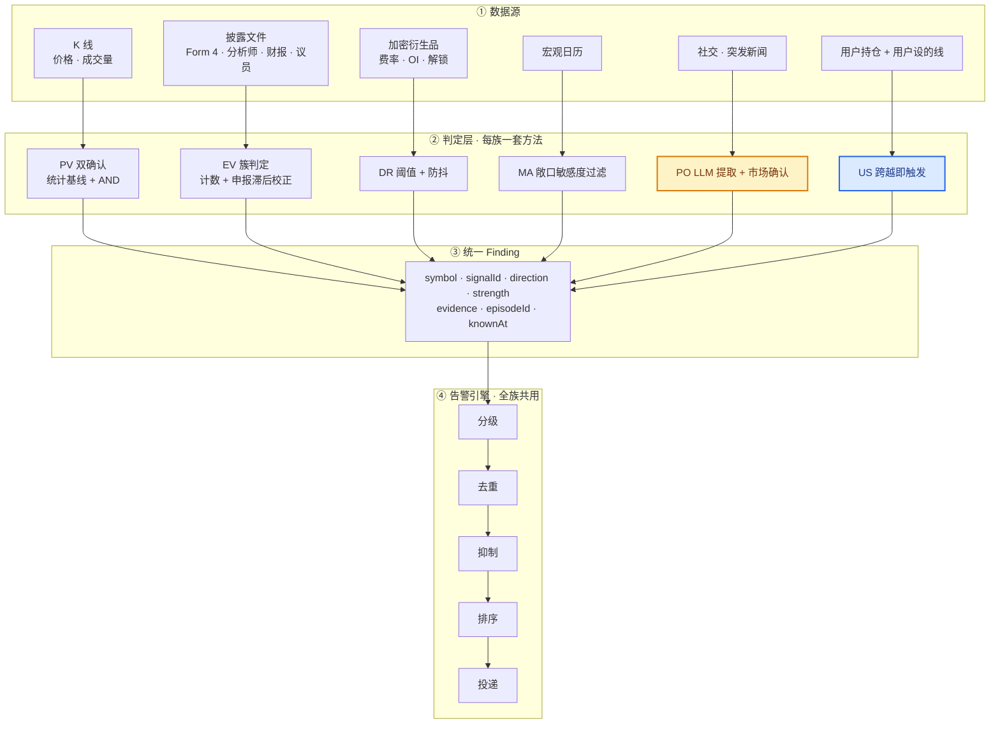

# 信号注册表 · Signal Registry

> **本文是信号的唯一定义处。** 其他文档只引用 ID，不重复定义。
> 改任何阈值、算式、适用范围，改这里；其他文档跟着引用走。
>
> **阅读顺序**：§三 总表速查（一屏索引）→ §四 S 层信号逐条定义 → §五 M 层指标字典
> → §六 告警引擎 → 附录 A 算法明细

---

## 一、结构约定（已锁定，不再变更）

**只有两层。「族」不是一层，它只是 ID 前缀。**

```
M 层 · 指标     基础量，每个定义一次        M1 z_rob · M2 RVOL · M7 内部人簇计数 …
      ↑ 被引用（多对多）
S 层 · 信号     触发规则，引用 M 的 ID       PV1 = |M2| ≥ θz  AND  M3 ≥ θv
```

**不采用「族 → 信号 → 指标」三层的原因**：指标被多个信号复用（`M3 RVOL` 同时被 `PV1`/`PV2`/`PO2` 用），
嵌套就要重复定义，两处早晚不一致。族（PV/EV/DR/…）只是分组标签，写在 ID 前缀里。

### 两个标注维度

**血统**回答「这想法哪来的」：平台 · 业界 · 原创。

**证据**回答「凭什么说这数对」：

| 取值 | 含义 | 做过回测吗 |
|---|---|---|
| 🟢 已验证 | 通过判据 | ✅ |
| 🟠 已测未达判据 | 没通过，但证据不足以证伪（样本不足 · 规则不可复用） | ✅ |
| 🔴 已证伪 | 有明确的零效应或反向证据 | ✅ |
| 🔵 引用未自测 | 别人的结论，我们没在本组合上验过 | ❌ |
| 🟡 待验证 | 还没测 | ❌ |
| 🟡 自测通过·待审核 | **测了，判据通过，但没有独立复核** | ✅ |
| ⚪ 无法验证 | 数据或方法阻断，不是没开工 | 试过，被挡住 |
| — 不适用 | 不提出统计主张（展示类 · 用户设定值 · **日历类**） | 不需要 |

**两条分界线**：🟠 与 🟡 的区别是「做没做过」；🟠 与 🔴 的区别是「有没有反证」。
三者曾全部挤在 🟡 里，导致「N 条待验证」既指没做、也指做了判不了。

**🟡 的两个子态共用符号但投递上限不同**：`待验证` 封顶 L2，`自测通过·待审核` 可到 L1。
上限规则的本意是「没验证过的信号不许吵醒用户」——
自测通过判据、经验零干净的信号已经验证过了，缺的是**第二双眼睛**，不是证据。
代价是一页纸上必须逐条标「未经独立复核」。
总表的「证据」列因此必须写全称，两个子态在评审时要解释的东西完全不同。
**🟢 只能由独立审核授予**（CLAUDE.md §一）；自测跑完再漂亮也最多 `🟡 自测通过·待审核`。

**日历类不取证据等级。** EV4 / DR4 不提出统计主张 ——
「明天有财报」是排程事实，准确性取决于日历数据源而非回测。
它们的质量指标是**日历覆盖率与提前量**，写在各自条目里。
这与 US 族豁免同理（用户自设的线也不受我们的证据标准约束）。

> `✍️原创 + 🟡待验证` 的条目最需要在评审时解释清楚。

---

## 二、全信号架构

七族信号，**判定方法各不相同，告警引擎完全共用**。



<sub>🟡 = 唯一用到 LLM 的通路　🔵 = 用户硬规则，绕过重要性判断</sub>

**三点设计要害**

1. **判定层各族独立，不做统一异动分数。** 价量要双确认、事件要看簇、衍生品要防抖——硬套一个通用分数会把每一族都做坏。共用的是引擎，不是判据。
2. **US 族绕过重要性判断。** 用户自己设的线不该被系统判「今天不够重要」压掉，直接进 Critical，只受去重约束。
3. **Finding 带 `knownAt`。** EV 族有申报滞后，事件发生日 ≠ 可知日，两个时间戳都要带（见 M8）。

---

## 三、总表速查

| ID      | 信号       | 类型  | 粒度    | 标的  | 触发（简）                           | 证据              | 投递           | 血统    |
| ------- | -------- | --- | ----- | --- | ------------------------------- | --------------- | ------------ | ----- |
| **PV1** | 双确认 · 日线 | 告警  | 日线    | 美股  | `\|M2\| ≥ 1.5` AND `M3 ≥ 2.0`   | 🟢              | L1 推送        | 平台+原创 |
| **PV1** | 双确认 · 日线 | 告警  | 日线    | 加密  | `\|M2\| ≥ 1.5` AND `M3 ≥ 3.0`   | 🟢        | L1 推送        | 平台+原创 |
| **PV5** | 双确认 · 盘中 | 告警  | 15 分钟 | 美股  | θz 4.75 · 仅 RTH                  | 🟢     | L1 推送        | 原创    |
| **PV5** | 双确认 · 盘中 | 告警  | 15 分钟 | 加密  | θz 10.0 · 全时段                   | 🟢     | L1 推送        | 原创    |
| **PV2** | 放量强度     | 记录  | 随宿主   | 美股  | PV1 内 `M3 ≥ 3.0`                | 🔴 相对 \|z\| 无增量 | L4 记录页       | 原创    |
| **PV2** | 放量强度     | 记录  | 随宿主   | 加密  | 同上                              | 🔴 规则恒真         | L4 记录页       | 原创    |
| **PV3** | 幅度标注     | 展示  | 日线    | 美股  | `\|r\| > 5%` 且非 PV1             | —               | L3 持仓页       | 原创    |
| **PV3** | 幅度标注     | 展示  | 日线    | 加密  | 同上                              | —               | L3 持仓页       | 原创    |
| **PV4** | 覆盖标注     | 展示  | 日线    | 美股  | 基线不足 60 日                       | —               | L3 持仓表列      | 原创    |
| **PV4** | 覆盖标注     | 展示  | 日线    | 加密  | 同上                              | —               | L3 持仓表列      | 原创    |
| **EV1** | 内部人簇买    | 记录  | 日     | 仅美股 | 30 日内 ≥2 人 · 代码 P               | —               | L4 记录页       | 业界    |
| **EV2** | 内部人簇卖    | 记录  | 日     | 仅美股 | 同上 · 代码 S · 剔 10b5-1            | 🔴              | L4 记录页       | 原创    |
| **EV3** | 分析师簇     | 记录  | 分钟    | 仅美股 | `M9 ≥ 3` 同向 · 30 日              | 🟠              | L4 记录页       | 业界    |
| **EV4** | 财报日历     | 日历  | 日     | 仅美股 | 财报日历 T−1 · 分盘前/盘后               | —               | L1 推送        | 业界    |
| **EV5** | 议员交易     | 记录  | 日     | 仅美股 | `M11 ≥ 1` · 30 日                | 🔴              | L4 记录页       | 业界    |
| **EV6** | 公司新闻     | 归因源 | 随宿主   | 美股  | 相关度 1.0 ∧ 事件类 ∧ ≤ ±120 分（日级共现口径） | 🟡 收窄后待审核     | 挂 PV1/PV5 卡片 | 原创    |
| **EV6** | 公司新闻     | 归因源 | 随宿主   | 加密  | 同上                              | 🔴 六口径全 < 1.0   | 不显示          | 原创    |
| **DR1** | 费率极端     | 展示  | 8 小时  | 仅加密 | `\|M12\| ≥ 0.05%/8h`            | 🟠              | L3 持仓页       | 业界    |
| **DR2** | 费率转向     | 告警  | 8 小时  | 仅加密 | 跨 0 且近 30 日首次                   | 🔴              | L4 记录页       | 业界    |
| **DR3** | 未平仓量骤变   | 告警  | 8 小时  | 仅加密 | `M13 > ±10%`                    | 🔴              | L4 记录页       | 业界    |
| **DR4** | 代币解锁     | 日历  | 日     | 仅加密 | T−7 · 解锁 > 流通 3%                | —               | 不投递（字段待厘清）   | 业界    |
| **MA1** | 发布预告     | 告警  | 日     | 美股  | Tier-1 数据 T−1                   | 🔴              | L4 记录页       | 业界    |
| **MA1** | 发布预告     | 告警  | 日     | 加密  | 同上                              | 🟡 待验证           | 未测 · 闭环后再议        | 业界    |
| **MA2** | 实际值偏离    | 告警  | 日     | 美股  | `M15 ≥ 1.5` 且 `M16` 高敏          | 🔴              | L4 记录页       | 业界    |
| **MA2** | 实际值偏离    | 告警  | 日     | 加密  | 同上                              | 🟡 待验证           | 未测 · 闭环后再议        | 业界    |
| **MA3** | FOMC 决议  | 告警  | 日     | 美股  | 发布即触发                           | ⚪ 无前瞻日历端点       | 不投递          | 业界    |
| **MA3** | FOMC 决议  | 告警  | 日     | 加密  | 同上                              | ⚪ 同上            | 不投递          | 业界    |
| **PO1** | 事实性言论    | 告警  | 秒     | 美股  | `M17` ∧ `M18=factual` ∧ `M19` 新 | 🔴 日线轮          | L4 记录页       | 原创    |
| **PO1** | 事实性言论    | 告警  | 秒     | 加密  | 同上                              | 🔴 bar 级轮       | L4 记录页       | 原创    |
| **PO2** | 表态性言论    | 告警  | 秒     | 美股  | `M17` ∧ `M19` 新 ∧ 市场确认          | 🔴 日线轮          | L4 记录页       | 原创    |
| **PO2** | 表态性言论    | 告警  | 秒     | 加密  | 同上                              | 🔴 bar 级轮       | L4 记录页       | 原创    |
| **PO3** | 宏观传导     | 告警  | 秒     | 美股  | `M17` 宏观词表 ∧ `M16` 映射           | 🔴 留出 0/16      | L4 记录页       | 原创    |
| **PO3** | 宏观传导     | 告警  | 秒     | 加密  | 同上                              | 🔴 bar 级轮       | L4 记录页       | 原创    |
| **PO4** | 主题敞口匹配   | 告警  | 秒     | 美股  | 言论主题命中 `themeExposure`          | 🔴 留出 0/16      | L4 记录页       | 原创    |
| **PO4** | 主题敞口匹配   | 告警  | 秒     | 加密  | 同上                              | 🔴 bar 级轮       | L4 记录页       | 原创    |
| **PF1** | 单股集中度    | 展示  | 状态    | 美股  | `M20 > 15%` / `> 25%`           | 🔴 标记 240/240   | L4 记录页       | 业界    |
| **PF1** | 单股集中度    | 展示  | 状态    | 加密  | 同上                              | 🔴 同上（与资产无关）    | L4 记录页       | 业界    |
| **PF2** | 主题集中度    | 展示  | 状态    | 美股  | `M21 > 35%`                     | 🟠 仅波动口径成立      | L3 体检页       | 业界    |
| **PF2** | 主题集中度    | 展示  | 状态    | 加密  | 同上                              | ⚪ 无主题数据         | 数据阻断         | 业界    |
| **PF3** | 主题共振     | 展示  | 状态    | 美股  | ≥2 标的同主题                        | 🟠 卡在块数 ≥5      | L3 体检页       | 原创    |
| **PF3** | 主题共振     | 展示  | 状态    | 加密  | 同上                              | ⚪ 无主题数据         | 数据阻断         | 原创    |
| **US1** | 止损线      | 告警  | 实时    | 美股  | 用户设定值                           | —               | L1 推送        | 平台    |
| **US1** | 止损线      | 告警  | 实时    | 加密  | 同上                              | —               | L1 推送        | 平台    |
| **US2** | 止盈线      | 告警  | 实时    | 美股  | 用户设定值                           | —               | L1 推送        | 平台    |
| **US2** | 止盈线      | 告警  | 实时    | 加密  | 同上                              | —               | L1 推送        | 平台    |
| **US3** | 回撤线      | 告警  | 实时    | 美股  | `M22` 跨越用户设定                    | —               | L1 推送        | 平台    |
| **US3** | 回撤线      | 告警  | 实时    | 加密  | 同上                              | —               | L1 推送        | 平台    |

<sub>θz = 价格阈值（日线 1.5 · 盘中 4.5 股 / 10.0 币）· θv = 量能阈值（2.0 股 / 3.0 币）</sub>

<sub>「标的」列：**通用** = 美股与加密都适用（阈值可分档，见各条）· **仅美股** = 数据源只覆盖美股 ·
**仅加密** = 概念本身只存在于加密（资金费率 · 未平仓量 · 代币解锁）。</sub>

**「仅美股」是数据源限制，不是设计选择。** EV 族依赖 SEC Form 4（内部人）、
国会申报、卖方分析师覆盖，这三者都没有加密对应物。
**EV6 曾短暂改为「通用」后又改回「仅美股」**：端点确实能查加密符号
（`symbol=BTC` 返回 100 条，`CRYPTO:BTC` 相关度 0.9999），
但 2026-08-20 的 bar 级验证显示加密上倍数全部 < 1.0（见 EV6 条目），**能取到不等于有用**。

**「通用」不等于阈值相同。** PV 族在两类资产上用不同的 θv（股 2.0 / 币 3.0）
与不同的 θz（盘中股 4.5 / 币 10.0）；MA 族的传导路径也不同。
**分档只按资产类别，不按单只标的**（锁定决策 #2 #3）。

**「严重度」不再单列。** 决策 #5 推翻配额层后，Critical/Warning 只剩**排序输入**（见 6.6），
不再决定投递渠道 —— 渠道由「类型 + 证据上限」决定（见 6.2）。同时列两者会打架：
曾出现 **9 条矛盾**（🔴 已证伪却标 Critical、⚪ 不投递却有 Warning）。

**四个维度的分工：**

```
类型   这条信号本质上是什么      告警 · 修饰符 · 展示 · 记录 · 归因源 · 日历
粒度   在什么时间序列上算        日线 · 15 分钟 · 8 小时 · 秒 · 状态 · 实时 · 随宿主
证据   我们验到什么程度          决定投递上限
投递   最终归宿                 = f(类型, 证据)，本表直接给出，读者不必自己推
```

#### 粒度写进编号

**同一条信号在不同粒度上是两条独立条目**，各自有触发式、阈值、证据和投递。
编号用**基础编号 + 粒度后缀**：

```
EV3·日      分析师簇 · 日线
EV3·15m     分析师簇 · 盘中 15 分钟
```

| 规则 | 说明 |
|---|---|
| 基础编号永不改变 | `EV3` 永远指分析师簇这条规则，历史引用不失效 |
| 只有一个粒度时可省后缀 | 现存 24 条大多如此，写 `EV1` 即 `EV1·日` |
| 出现第二个粒度时，**两条都补后缀** | 不能只给新的加，否则读者不知道旧的是哪个粒度 |
| 每条的标题必须写出粒度 | `#### EV3·15m 分析师簇 · 盘中 15 分钟` |
| **§三 总表也分两行** | 同一基础编号的两个粒度各占一行，各自的证据 · 投递 · 标的独立填写 |
| 后缀取值 | `日` · `15m` · `8h` · `秒` · `状态` · `实时` |

**理由是证据按粒度授予。** PV1 的 🟢 来自 8.6 年日线，PV5 的 🟢 来自 2 年盘中 ——
若共用一个条目，读者无法知道那个 🟢 指的是哪一套数据。

**PV1 与 PV5 是历史例外**：盘中版本在本规则确立前已获得独立族内编号，且已被大量文档引用，
按「编号永不改变」保留。二者的关系写在各自条目里，**不另立别名**。

**把日聚合改回原生粒度算修正，不算新粒度。**
DR 族的定义一直写着 `0.05%/8h`，是实现时压成了日线；改回 8 小时是修 bug，
条目仍是 `DR1·8h` 一条，不产生 `DR1·日`。

#### 信号之间的挂靠关系写在条目内部

**本文件的定位是信号的定义与注册**，不承担编排逻辑。
「EV6 给 PV1 做归因」这类关系写在 EV6 自己的条目里（作为它的适用范围），
不体现在编号、章节层级或总表结构上。投递与编排见 §六 告警引擎。

#### 粒度受数据限制而不是选择的信号

```
只有日期，永远做不了盘中     EV1 · EV2（内部人申报）· EV5（议员申报）
                          原始记录形如 2026-08-11|2026-08-11|S|1|0|NEWSTEAD JENNIFER
发布时刻客观存在但端点没给    MA1 · MA2 · MA3
                          observed_at ≡ release_date + 1 天（737/737 行）
没有「发生时刻」这个概念      PF1 · PF2 · PF3（状态量）
```

**这三类不重测。** 其余带 待重测 的，是我们自己聚合到日维度的，属实现选择不是数据限制。

### 证据分布

**按行计，不按信号计** —— 同一信号在两类资产上可以是不同的证据等级。

```
🟢 已验证               4   PV1·股 · PV1·币 · PV5·股 · PV5·币
🟡 自测通过·待审核          1   EV6·股
🟡 待验证               2   MA1·币 · MA2·币
🟠 已测未达判据            4   EV3·股 · DR1·币 · PF2·股 · PF3·股
🔴 已证伪              19   PV2·股 · PV2·币 · EV2·股 · EV5·股 · EV6·币 · DR2·币 · DR3·币 · MA1·股 …等 19 行
⚪ 无法验证              4   MA3·股 · MA3·币 · PF2·币 · PF3·币
— 不适用              13   PV3·股 · PV3·币 · PV4·股 · PV4·币 · EV1·股 · EV4·股 · DR4·币 · US1·股 …等 13 行
```

**已通过独立审核的：PV1·股 · PV1·币。** 系统自主打断用户的行：PV1 两行 · PV5 两行 · EV4 一行。

⚠️ **拆开后暴露的空格**：MA1·币 与 MA2·币 完全没测 · PO 两轮资产不重叠 ·
PF2·币 与 PF3·币 无主题数据。

---


## 四、S 层 · 信号逐条定义

> **状态标记只写在 [§三 总表](#三总表速查)。** 本节标题只保留类型（告警/修饰符/展示/记录），
> 不重复证据符号 —— 同一事实写两处必然不一致（实测曾有 8 处）。
> 一致性由 `backtest/scripts/check_consistency.py` 检查。

> **标题标注**：`<ID> <名称> · <类型> <证据>`
> 类型 `告警` 进告警流 · `修饰符` 是另一条信号的字段 · `展示` 只在界面永不推送
>  ·  已证伪 ·  待验证 ·  引用未自测 ·  未实现
>
> **族级标注**：✅ 已回测 · 🔄 回测中 · ⏳ 待回测 · — 无需统计回测

**这一章是本文的主体。** 24 个条目按七族排列，每条一个 `####` 标题，
触发式里引用的 `M<n>` 指标见 [§五 M 层指标字典](#五m-层--指标字典)，一屏速查见 [§三 总表](#三总表速查)。

**每条信号的标准结构**（PV 族已全部补齐，其余族待补）：

```
触发          数学式 + 引用的 M 指标
参数          阈值取值，按资产类别/档位
属性          适用范围 · 降级规则 · 严重度 · 去重窗口
含义与用法     在说什么 · 不代表什么 · 看到后做什么     ← 给用户看的
文案模板       实际推送长什么样                        ← 给用户看的
血统与证据     想法来源 + 验证状态
```

> **「含义与用法」和「文案模板」是给用户看的，其余是给实现者看的。**
> 对应 §6.7 富化要求：每条告警必须自带「发生了什么 · 对你的仓位意味着什么 · 接下来看什么」。

---

### PV · 价量族

**四个条目，只有 PV1 产生告警。** PV2/PV3/PV4 经回测证明不适合独立成告警，
但**编号保留不变** —— 便于追溯历史结论。依据见
[results-pv](backtest/results-pv.md) §二 §三、[revisions](backtest/revisions.md) R8。

| ID | 名称 | **类型** | 去向 |
|---|---|---|---|
| **PV1** | 双确认 | **告警** | Critical（高波股票 Warning） |
| **PV2** | 放量强度 | **修饰符** | 并入 PV1 的 `strength` 字段，不独立触发 |
| **PV3** | 幅度标注 | **展示** | 持仓表「幅度」列，永不推送 |
| **PV4** | 覆盖标注 | **展示** | 持仓表「覆盖」列标「仅幅度」，永不推送 |

> **「类型」是属性，不是 ID 的一部分。** 一条信号可能因为回测结论从「告警」变成「展示」，
> 但它的编号不变 —— 否则历史文档里的引用会失效。

**PV 族的处理链路**见 [`product/data-pipeline.md`](product/data-pipeline.md)。

#### 随标的变的量与不变的量

##### θz = 1.5 全部标的统一，不分档 ⭐ 锁定决策 #2

```
年化波动在标的间差   13.3 倍
价格腿触发频率只差    1.6 倍     ← 三档 45 / 45 / 46 次每年，秩相关 +0.056（p=0.60）
```

**MAD 基线已经把波动差异消掉了** —— $z^{\mathrm{rob}}$ 本身就是「相对该标的自身常态」的量，
再按波动分档等于除两次。

⚠️ 曾据网格表认为「低波档收紧 θz 增益更大（1.49→1.90）」，**该说法是未配对比较造成的假象** ——
配对后三档增益完全相同（+0.089 / +0.089 / +0.065）。见
[results-pv](../backtest/results-pv.md)。

```
🔒 写死，任何标的都一样
   θz = 1.5                      实测波动差 4.7 倍、触发频率只差 1.5 倍，MAD 已消掉差异
   PV2 strength 门槛 = RVOL 3.0
   PV3 幅度门槛 = 5%
   基线窗口 = 90 交易日 · 前瞻窗口 = 5 日

🔒 只按资产类别分，不按个股
   θv = 2.0 股票 / 3.0 加密       量能分布形状在两类资产间差 2.7–3.8 倍

📊 按标的运行时算 —— 但算的是「参照系」和「适用性」，不是阈值
   M2 的 med / MAD               基线，每只标的自己的常态
   M3 的 90 日中位量             同上
   M4 σ_ann → 定档               决定该标的走哪一档的 θv，以及是否降级
   M23 ρ → 分布可用性            决定 PV1 对该标的适不适用
```

**关键区分：阈值是固定的，判定是动态的。**

Agent 在实际调用时**不需要为用户的标的重新回测选阈值** —— 那会引入过拟合（在用户的 3 只票上调参），
且不可解释（「回测选的」不是用户能质疑的答案）。它只需要四步确定性计算：

```
1  拉 2 年日线
2  算 σ_ann 中位  →  落到 低波 / 中波 / 高波 某一档
3  算 ρ           →  判 PV1 对该标的适不适用（M23）
4  套用该档的固定阈值
```

> 这对应 CLAUDE.md 锁定决策 #2 #3 #5 —— 阈值只跟资产类别有关，
> 总量控制在 S 信号层（靠触发规则本身，不靠事后按条数截断），**运行时只做分类，不做优化**。

#### PV1 双确认（日线）· 告警

**触发**

$$
\bigl\lvert z^{\mathrm{rob}}_t \bigr\rvert \;\ge\; \theta_z
\quad\wedge\quad
\mathrm{RVOL}_t \;\ge\; \theta_v
$$

并且**可归因**（当日存在可确认的驱动因素）。引用 **M2** · **M3**；**M4** 用于分档，**M23** 用于适用性判定。

> **M4 判「波动多大」，M23 判「分布形状能不能用」** —— 两者并列，都作用于适用范围而非触发条件。

| 参数 | 股票 | 加密 |
|---|---|---|
| $\theta_z$ | **1.5** | **1.5** |
| $\theta_v$ | **2.0** | **3.0** |

> $\theta_z$ 全部标的统一，**不分档**；只有 $\theta_v$ 按资产类别分。
> 取值经细网格（步长 0.25）扫描，依据分三层：判据筛选 → 质量优先 → 跨档统一。

##### 为何用 AND 而非官方的 OR ⭐ 锁定决策 #1 · 依据 

平台官方异动检测用 `价格 OR 量能`，我们改成 `AND`。**两者的目标不同：**

```
官方   数据层要「不漏」—— 宁可多标记，下游再筛
我们   最后一公里要「不吵」—— 每一条都会打断用户
```

> **这不是反对官方。** 官方社区版 blueprint 要求 `move AND volume AND attribution` 三者同时
> （`research/platform-capability.md`），**比我们还严**。
> 我们是在官方的两个变体之间选了更严的那个，并给出了选择依据。

**依据是告警量，不是单条质量。** 113 只标的实测（等阈值口径）：

| 组合 | 年触发次数中位 | 5 只组合的告警量 |
|---|---|---|
| **双确认 AND** | **10.4** | **1.0 次/周** |
| 仅价格 | 46.3 | 4.5 次/周 |
| 价格 OR 量能 | 57.8 | 5.6 次/周 |

<sub>OR ÷ AND：触发日数中位 **5.96×**（P10 3.94 · P90 7.97 · 最大 16.19）· 告警场次（块）中位 **3.17×**</sub>

**把对照的阈值调到相同触发数后，AND 与仅价格、与 OR 都分不出高下** —— 三套分母一致：

| 分母口径 | 配对差 | AND 赢 | $p$ |
|---|---|---|---|
| 共用净化 | $-0.000$ $[-0.076, +0.068]$ | 48.5% | 0.842 |
| 不净化 | $-0.009$ | 47.7% | 0.704 |
| 各自净化 | $-0.050$ | 39.8% | 0.038 |

**选 AND 是选「量」，不是选每条的质量。** 这一点必须准确表述 ——
不是「双确认发现了单独看价格或量能发现不了的东西」。

##### 第二条依据：参数可复用 ⭐ 这条比告警量更硬

既然等触发数下打平，选哪个就不由质量决定。**决定性的是参数能不能复用到没见过的标的上。**

单腿要达到 AND 同样的触发数，$\theta_z$ 必须提到 **2.966**（113 只中位）：

| | 取值 | 来源 | 跨期稳定性 |
|---|---|---|---|
| **双确认** | $\theta_z = 1.5$ $\wedge$ $\theta_v = 2.0$ | **业界锚** —— `research/alert-methodology.md` §1.1 RVOL 尺（1.5 关注度抬升 · 2.0 值得监控 · 3.0 重大催化剂） | 固定值，无需逐标的标定 |
| 单腿等价 | $\theta_z \approx 2.97$ | **无任何锚** —— 为凑触发数反解得到 | 切半后逐标的绝对差中位 **0.318** |

**对一个「要对没见过的组合也能用」的 Skill，这个差别是决定性的：**

```
|z| ≥ 1.5 且 量能 ≥ 2.0     两个有业界背书、开箱即用的数
|z| ≥ 2.97                 必须现场反解，而且解不稳
```

反解 $\theta_z$ 需要先知道该标的的触发分布，那正是新用户组合上**没有的东西** ——
这与已作废的 $F$ 判据是同一类失败（[revisions](../backtest/revisions.md) R18：
判据依赖样本窗口 $\Rightarrow$ 换用户换历史就给出不同阈值）。

**三套分母都同意的结论只有一条**：仅量能单独用最弱（AND 优 $+0.06$ ~ $+0.20$，三套同号显著）。
等阈值下「AND 单条质量更高」这一行**符号随分母翻转，不可引用**。

 —— 按时间切半后六种口径**全部翻号**
（前半 $-0.042$ ~ $-0.190$，后半 $+0.001$ ~ $+0.065$）。
逐年拆分与年份无趋势（Spearman $+0.367$，$p = 0.332$），
说明这不是期间效应而是**真值近零时的估计抖动** —— 它支持「打平」这个结论本身，
但意味着**任何单一切法得到的方向都不可引用**。

> ⚠️ **一次被撤回的推翻**（[revisions](../backtest/revisions.md) R34 → R35）：
> 曾据「各自净化分母」得出「仅价格 1.741 > 双确认 1.567，量能腿是负贡献」并判定本决策被推翻。
> **该口径算术上不自洽，不需要统计检验就能撤回** ——
> 等阈值下 `仅价格 = 双确认 ⊎ 价格中·量能未中` 是严格划分，
> 同一分母时全集中位必落在两子集之间，而该口径 **74.8%（80/107）的标的违反**。
> 根因是净化抽薄不对称：双确认保留 75.5% 的基准日，仅价格因触发密 5 倍只剩 **19.4%**。
> 换共用分母后符号翻转。**跨 arm 比较必须统一分母**（规则见 [`plan.md`](../backtest/plan.md) §一）。

**未解**：双确认只占仅价格全集的 **20.2%** —— 两条规则选的是**不同的日子**，
只是这些日子在「波动放大」这把尺子上恰好一样强。
量能腿筛掉的那 79.8% 波动放大确实更弱（1.675 vs 2.118），**说明筛选不是随机的**；
但「筛得对」与「筛得对用户有用」是两件事，本轮判据测不了后者。

##### 为何用固定阈值而非滚动分位 ⭐ 锁定决策 #9

```
滚动分位   保证「总有 4% 的日子触发」—— 告警量恒定，与市场实际情况脱钩
固定阈值   让告警量随实际情况波动 —— NVDA 逐年 1–18 次，18 倍差异
```

**年际波动是想要的行为，不是缺陷。** 市场平静的年份就该少告警。

**推论：触发频率不能同时又拿来当判据** —— 那等于把分位的行为从后门放回来。
原 `F ∈ [8,18]` 判据已据此作废（[revisions](../backtest/revisions.md) R18）。
> 完整推导与局限见 [results-pv](backtest/results-pv.md) §1.2。

#### PV5 双确认（盘中 15 分钟）· 告警

**新信号，不是 PV1 的延伸** —— 阈值、基线、前瞻窗全部独立标定，**禁止与 PV1 混用参数**。

$$
\bigl\lvert z^{\mathrm{rob}}_{t,k} \bigr\rvert \;\ge\; \theta_z^{\text{intra}}
\quad\wedge\quad
\mathrm{RVOL}_{t,k} \;\ge\; \theta_v
$$

其中 $k$ 为当日第 $k$ 个 15 分钟 bar。

| 参数 | 股票 | 加密 |
|---|---|---|
| $\theta_z^{\text{intra}}$ | **4.5** | **10.0** |
| $\theta_v$ | 2.0 | 3.0 |
| 时段 | **仅 RTH 26 槽** | UTC 96 槽 |
| 前瞻窗 | 5 个 bar（75 分钟） | 同 |

⚠️ **「双确认」这个名字在盘中不准确。** 等触发数下「双确认 − 仅价格」
美股 +0.075（52/87，p = 0.086）· 加密 −0.141（9/24，p = 0.307） —— **符号相反且都不显著**。
**盘中的 $\theta_v$ 是严格度旋钮，不是第二个确认。** 这与日线 PV1 的情形不同（见决策 #1）。

**基线必须同时段**：$\sigma_{\mathrm{rob}}$ 用前 90 天**同一时刻**的 bar 收益，
RVOL 用今日第 $k$ 个 bar 累计量 ÷ 前 90 天同位置累计量中位数。
量能与波动有强日内节律 —— 美股 RTH 最大槽/最小槽 **7.7 倍**，收盘一根占全日量 **18.07%**。

**阈值为何从 1.5 涨到 4.5**：不是盘中更肥尾（单 bar $P(\lvert z\rvert \ge 1.5)$ 实测 19.2%，
与日线 14.7–21.9% 同量级），而是**每天看 26 次而不是 1 次**。
沿用 1.5 会得到 0.85 次/日/股，触发时单 bar 幅度中位仅 0.67%。
锚用「与日线的日级告警量对齐」：日线触发日占比 4.01%。

⚠️ **美股侧的锚不复现，但阈值不必改。** 8 种口径组合（valid 口径 × 池统计量 × 样本）
反解**全部 ≥ 4.75，无一给出 4.5**；标的自助中位 4.75、95% 区间 [4.5, 5.0]，落在 4.5 的重复只有 8.8%。
**判据分辨不出 4.0 / 4.5 / 5.0**（通过 87 / 88 / 85），所以保留 4.5，但不能宣称它是反解出来的。
加密相反 —— 8 种口径全给 10.0，自助 82.3%，**加密侧的锚站得住**。

⚠️ **此前写的「θz = 4.5 → 有触发日 4.08%」一行三个数来自两个阈值。**
4.5 实际给 4.65%（窗 A 口径）/ 4.99%（z 口径），4.08% 是 θz = 4.75 / 5.0 的值；
「触发 0.105 次/日」倒确实是 4.5 的。加密「10.0 → 3.29%」同样不复现（实为 3.58%）。

**实测**（15min · 2024-08 → 2026-08 · 92 美股 + 25 加密）：

| 前瞻窗 | 美股 | 加密 |
|---|---|---|
| **5 bar（75 分钟）** | **88/90 = 98%**，倍数 2.613 | **24/25 = 96%**，4.411 |
| 到当日收盘 / 24h | 98%，2.311 | 96%，2.662 |
| 5 个交易日（对照） | 47%，1.359 | 36%，1.499 |

经验零 6.4% 美股 / 2.4% 加密（同丛集结构位置随机构造）。

#### 换时零假设此前违反了自己的硬约束

原实现允许 **0 位移**，而窗 A 窗长 5 槽 —— 美股 **45.5% 的抽样落在 |位移| ≤ 5 的禁区**，
其中 **19.2% 的前瞻窗真的含真实触发那根 bar**。加密只有 13.7% / 6.7%。

**美股与加密的差异是 K = 26 与 K = 96 的污染率差，不是「6.5 小时 vs 24 小时」。**

加上硬约束（|位移| ≥ 6）重跑：美股配对差 **−0.001 → +0.330（82/90）**，三个种子 +0.330 / +0.400 / +0.346。
而安慰剂 −8 bar 给 **+0.349（83/90）** —— 两个独立口径逐位对上。
**此前说这两者「互相印证」是错的，当时它们其实互相矛盾。**

正确的读法是分解而不是对立：

```
美股   72% 日级 / 28% bar 级
加密   39% 日级 / 61% bar 级
```

**提前量**：美股中位 **315 分钟**（5.25 小时）· 加密 **990 分钟**（16.5 小时）。

**它不是「更早的 PV1」，是重叠一半的另一条信号**：
对日线触发日召回 **56%**，且盘中触发有 **54% 当天收盘时已不成立**（日内回吐）。
产品上要说清：上午提醒的事，下午可能就解除了。

⚠️ **美股扩展时段不可用** —— ETH 64 槽只有 62.8% 存在，**50% 的格子算不出 $\sigma_{\mathrm{rob}}$**
（盘前收益中位恰为 0 → MAD = 0）。**这正是决策 #10 预言的静默失效，也是 M23 的首个真实验证案例。**

⚠️ **M23 在常规时段也失效了一只**：ALX 暖机后 47.9% 无 $\sigma_{\mathrm{rob}}$、填充率 44.8%，
应改判 ⚪ 数据阻断。**美股通过率因此是 88/89 而不是 88/90**，
「唯一真实未通过的标的」这个说法失去实例。

⚠️ **阈值锚逐标的不可复现**：切半后只有 26/90 = 29% 选出同一 $\theta_z$（加密 60%）。
**池级可用，不得给用户的标的单独反解。**

⚠️ **但它与 F 判据不是同一种失效。** 同期奇偶切半给 30/90、随机切半给 17/90，
**时间切半的 26/90 夹在中间** —— 这是估计噪声，不是跨期漂移。三种切法都只有偶合期望的 1.7–1.9 倍。
症状相同、病因不同：F 判据是真的跨期不稳，这里只是小样本反解本身抖。
（补救措施不变，理由要改。）

⚠️ **逐标的通过表只能当样本内描述。** 逐标的倍数跨期 Spearman
**−0.066（美股）/ −0.396（加密）** —— 与日线已知情形一致，
「哪些标的通过」不跨期存活，不能当运行时属性。

样本期仅 2 年（日线是 8.6 年），年际稳定性未测。

完整结果见 [`backtest/results-pv.md`](backtest/results-pv.md)。

#### PV2 放量强度 · 记录

$$
\mathrm{strength} =
\begin{cases}
\textbf{强} & \mathrm{RVOL}_t \ge 3.0 \\
\text{普通} & \text{否则}
\end{cases}
$$

**独立复核结论：撤回。** 2026-08-20 的独立复核推翻了「标强」这个动作，两条独立理由：

#### 加密上这条规则是常量字段

PV1 在加密上的 $\theta_v = 3.0$（见上方参数表），而 PV2 的条件正是 $M_3 \ge 3.0$。
**PV1 已经要求 $M_3 \ge \theta_v$，所以在加密上 PV2 恒真** —— 实测 1,972 次触发**全部**标「强」。

这是同一份文档里两个数字就能看出的逻辑错误，不需要任何统计。

#### 股票上「强」相对稳健 z 分数没有增量

强档日的 $\lvert z \rvert$ 中位比普通档高 0.97（2.55 → 3.73）。**五种控制方法全部归零或翻负**：

| 控制方法 | 配对差 | 结果 |
|---|---|---|
| 偏相关 | +0.022 | 91 中 51，p = 0.29 |
| $\lvert z \rvert$ 三分位层内 | +0.075 | p = 0.33 |
| $\lvert z \rvert$ 五分位层内 | **−0.065** | p = 1.00 |
| 卡钳匹配（匹配后 $\lvert z \rvert$ 差 +0.002） | **−0.008** | 81 中 39，p = 0.82 |
| 三档单调对保留 $\lvert z \rvert$ 的经验零 | 30% vs 28.6% | p = 0.39 |

**同覆盖率下改用 $\lvert z \rvert$ 切档，配对差从 +0.162 升到 +0.488，91 只里 67 只 $\lvert z \rvert$ 更优**（p < 0.0001）。
换言之：RVOL 看起来有用，是因为它和 $\lvert z \rvert$ 相关；单独用 $\lvert z \rvert$ 更好。

原先挂在这里的「三档单调 1.72 → 3.09」由 **2020 年 3 月**驱动 ——
低波档「强」只有 62 个池化日，40 天在 2020（XOM 20 天里 19 天）。剔除 2020 后该档**符号翻转**：1.54 → 1.39。

完整复核见 [results-pv](backtest/results-pv.md)。

**所以它不消失，而是降为 PV1 的一个字段。**

| 属性 | 值 |
|---|---|
| **适用范围** | 全部股票 + 加密，**但需先过 M23 分布可用性检验** |
| **降级规则** | ① $\sigma_{\mathrm{ann}} > 50\%$ 的股票 → **Warning**，不推手机<br/>② $\rho > 40\%$（M23 过松）→ **Warning**<br/>③ $\rho < 2\%$（M23 过严）→ **停用**，界面标注覆盖不足 |
| **去重** | 同 `anomalyEpisodeId` 内更新；窗口**短**（次日仍触发占比 $0.19\text{–}0.42$） |

**含义与用法**

| | |
|---|---|
| **在说什么** | 价格明显偏离该标的自身常态，**且有真实换手支撑** |
| **不代表什么** | **不预测方向。** 触发后涨跌各半，它标记的是「值得看一眼」的时刻 |
| **看到后做什么** | 打开归因看驱动因素；若无可确认驱动，记为待观察，不作为行动依据 |

**文案模板**

> **NVDA 价量异动 · 强** · 你的仓位 24.5% · Critical
> 收盘 −5.6%，偏离自身常态 2.7 倍稳健标准差，成交量为平时 3.4 倍
> 归因：市场 −0.4% ／ 板块 −1.2% ／ **个股特异 −4.0%**
> 关注：8/26 财报对中国需求的口径

**血统 —— 三部分来源不同，不要混为一谈**

| 组成 | 内容 | 来源 | 证据 |
|---|---|---|---|
| **① 用哪些指标** | $z^{\mathrm{rob}}$ · RVOL | 🏛 官方 `price_z` / `volume_z`（我们换了基线算法与口径） | — |
| **② 怎么组合** | **AND** | ✍️ **本项目假设**。原则出自 [`research/alert-methodology.md`](research/alert-methodology.md) §三 第 1/4 条，**但从原则到式子这一步无外部依据** |  回测证实 |
| **③ 阈值取多少** | $\theta_z=1.5$ · $\theta_v=2.0/3.0$ |  回测（判据见 [`backtest/plan.md`](backtest/plan.md) §一） |  |

**② 是整个设计里唯一的结构性原创。** ① 是照搬官方指标，③ 是数据定的数字。

**与平台官方的关系**：官方 `company-anomaly-read` 是四条规则**任一命中**即为异动 —

```
price_z  OR  volume_z  OR  price_move_abs  OR  insufficient_history
```

我们改成 $\wedge$（全部成立）。**不是官方错了，是目标不同**——官方是数据层要不漏（检测），我们是最后一公里要不吵（告警）。

**** · 相对基准倍数（触发日 ÷ 同期非触发日中位）：

| 档 | 仅价格 | 仅量能 | **双确认** |
|---|---|---|---|
| 股票 低波 | 1.42 | 1.57 | **1.96** |
| 股票 中波 | 1.31 | 1.52 | **1.53** |
| 股票 高波 | 1.22 | 1.21 | 1.26 |
| 加密 中波 | 1.31 | 1.66 | **1.75** |

<sub>本表为三对照组横向比较，用同一组阈值 $z2.0{+}v2.0$；采用配置下的数字见 results §1.2</sub>

**高波股票降级的依据**：细网格扫过 $\theta_v \in [1.5,\,3.5]$ 共 9 个取值，
**没有一个同时满足触发频率 $\in [8,18]$ 且 波动放大 $\ge 1.5$ —— 判据零解，不是选不出最优。**

$$
P\bigl(\mathrm{RVOL} \ge \theta_v \;\big|\; \lvert z^{\mathrm{rob}}\rvert \ge \theta_z\bigr)
\;=\;
\begin{cases}
0.22 \text{–} 0.27 & \text{低波蓝筹（放量稀有，是有效证据）}\\[2pt]
0.43 \text{–} 0.62 & \text{高波标的（放量是常态，筛子网眼太大）}
\end{cases}
$$

**不关闭是因为**用户会觉得「我的 RIVN 从来没告警」；降级既诚实又不吵人。

---

> 以下两条**类型是「展示」而非「告警」** —— 保留原编号，但不进告警流、不参与排序。

#### PV3 幅度标注 · 展示

$$
\lvert r_t \rvert > 5\% \quad\wedge\quad \neg\,\mathrm{PV1}_t
$$

**呈现**：持仓表「幅度」列显示当日涨跌幅，不产生告警条目。

> **证据维度不适用。** 当前定义只陈述事实（显示当日涨跌幅），不提出统计主张，无从证伪。
> 下方的  结论针对的是**旧定义**（把 $\lvert r_t\rvert > 5\%$ 当告警），那次证伪正是降为展示的理由。

**降为展示的依据**：PV3 作为告警在**三个判据上全部不成立** —— 见 [results-pv](backtest/results-pv.md) §三。

| 判据 | 股票高波 | 加密高波 |
|---|---|---|
| 波动放大（匹配基线后） | 1.13 | 0.90 |
| $\lvert$后5日收益$\rvert$（匹配幅度后） | 1.17 | 1.52 |
| **前兆性**（后 10 日内出 PV1） | **0.74** | **0.74** |

第三条最致命：PV1 在同一判据下是 **2.81–4.17**。机制上讲得通 ——
$\lvert z\rvert < 1$ 按定义就是「这次移动在该标的正常范围内」，**它挑的就是噪音日**。

**保留的理由是产品性的，不是统计性的**：

> 用户的心理阈值是绝对百分比，不是 z 分数。对持有者来说 5% 就是 5%，
> 不该因为「这只票平时就这么抖」而在界面上完全看不到。

#### PV4 覆盖标注 · 展示

$$
n_{\text{基线}} < 60 \text{ 日}
$$

**呈现**：持仓表「覆盖」列标注 **「仅幅度」**，并在方法页说明该标的暂无统计类异动检测能力。

> **证据维度不适用。** 当前定义 $n_{\text{基线}} < 60$ 是确定性条件（数出来的，不是估出来的）。
>  曾针对官方 5% 阈值过松，而当前定义已不含 5%。

**降为展示的依据**：新上市期缺基线，$z^{\mathrm{rob}}$ 算不出，**PV1 结构性无法触发**。
官方 5% 门槛实测在该阶段触发 33% 的日子（折合 84 次/年），10–15% 是方向但 $n=13$ 不足以定点。

**代价必须说清**：该标的在覆盖期内**完全没有价量告警**。
这是「说清楚盯不了」而非「假装能盯」——与 M23 检出分布不适用时的处置一致。

> 更好的方案是用**同行业同期基准**代替自身基线（registry §八 缺口），工程量大，本期范围外。

---

### EV · 事件族

#### 触发日用申报日

内部人在 $t_{\mathrm{transaction}}$ 买卖，在 $t_{\mathrm{filing}}$ 申报。
**用交易日做触发日会带前视偏差** —— 那一天市场还不知道这笔交易。

```
申报滞后   中位 2 日 · 37% 超过 2 日 · P90 4–13 日 · 极端 464 日
```

⚠️ **该字段约四成标的不可信**（见 M8）：有 ≥5 笔公开市场买入的 58 只里，
**24 只的「滞后 ≤ 0」占比超过 20%**（ALAB 100% · EPD 74% · FUL 71%）。
滞后 ≤ 0 意味着申报不晚于交易，用它仍会带前视。

**全族共同约束（PV 族没有的）**：

```
定义簇     用 transaction_date / 事件真实发生日
可知时点   用 filing_date / 申报日        ← 触发日必须用它
```

见 M8 的滞后实测。**告警文案必须同时给出两个日期**：

```
❌  3 位高管本周减持
✅  3 位高管减持（交易日 8/12–8/15，今日申报）
```

#### EV1 内部人簇买 · 记录

```
触发    30 日历日内 distinct(owner_name) ≥ 2，transaction_code = P
```

**血统 📚** — 簇买有量化证据：6–12 个月 4–8% 超额（Cohen/Malloy/Pomorski 2012，opportunistic 买入 6 月 alpha ≈ 5.2%）。


```
公开市场买入 P（8.6 年全量）
  AAPL      0 笔          ← 一次都没有
  PLTR      2 笔 / 1 人
  NVDA     20 笔 / 2 人   ← 且全部集中在 2020 年
  TSLA     20 笔 / 6 人
  RIVN     30 笔 /12 人
  SOFI    123 笔 / 8 人
```

**必须写进覆盖矩阵**：这条规则对用户最可能持有的大盘股是近乎失效的。

⚠️ **主导标的的申报日字段不可信**（[results-ev](backtest/results-ev.md) §3.3）：
SOFI 有 **61% 的记录 `filing_date == transaction_date`**，同时 P90 高达 347 日 —— 双峰坏字段。
SOFI 贡献 EV1 的 21/41 次触发，若这些申报日是用交易日填充的，**该批触发带前视偏差**。

#### EV2 内部人簇卖 · 记录

```
触发    30 日历日内 distinct(owner_name) ≥ 2
        AND  transaction_code = S
        AND  is_10b51 = false          ← 关键，剔除计划性卖出
```

**定为 Warning 而非 Critical**：按「难被解释掉」总纲，卖出即使剔除计划交易，仍有分散配置、行权后套现等良性解释，比买入弱一档。

**必须剔除 `is_10b51`**：计划性卖出是预先设定的，与当前信息无关，正是「卖出原因很多」的主要来源。实测剔除比例极高：

|  | S 卖出 | 10b5-1 | 自主 | 30日簇 | **F/年** |
|---|---|---|---|---|---|
| NVDA | 733 | 429 (59%) | 304 (19人) | 43 | 5.0 |
| TSLA | 565 | 272 (48%) | 293 (19人) | 57 | 6.6 |
| MSFT | 250 | 61 (24%) | 189 (14人) | 28 | 3.3 |
| AAPL | 223 | 94 (42%) | 129 (12人) | 25 | 2.9 |
| PLTR | 1256 | 749 (60%) | 507 (15人) | 31 | 5.5 |
| MSTR | 143 | 10 (7%) | 133 (6人) | 5 | 0.6 |

> 字段 `is_officer` / `is_director` / `is_ten_percent_owner` 可进一步按角色加权（TSLA 自主卖出 293 笔中 226 笔是高管），**当前未启用**。

**无效** — [results-ev](backtest/results-ev.md) §4.1：

$$\text{相对基准倍数} = 0.95 \quad (n=903)$$

触发后 5 日的波动**显著低于**随机日（分层自助单侧 $p = 0.006$，留一法 0.938–0.970 稳健）。
申报日当天本身也无异动（$|z|$ 0.99× · $|$收益$|$ 1.07×）。

**建议严重度降为 Informational**，理由只用这一条。

> 「触发频率超标」不作为降级理由 —— 当前时间去重规则失效（30 日窗口内反复触发），
> 频率数字由一条未定稿的规则决定，见 results §2.1。

#### EV3 分析师簇 · 记录

$$M_9 \ge 3\ \text{（30 日内同向机构数）}$$


**方向必须用口径 B**（同机构相邻两次目标价之差），**但理由是文案正确性，不是信号质量**：

| | 口径 A（vs 当时股价） | 口径 B（同机构前值） |
|---|---|---|
| 判为看多 | **88%** | 61% |
| 两口径方向相反 | **40%** | |
| 相对基准倍数中位 | 1.02 | 1.06 |

**「同向」这个要件在实践中不 binding** —— 实测「不分方向 ≥3」的倍数是 1.07，
与「同向 ≥3」的 1.06 差 ≤0.08。3 家机构 30 日内修订目标价时约 90% 本来就同向（分析师羊群）。

**所以换口径不提升触发质量，它防的是「40% 的告警把方向说反」。**
不写清楚的话，后来的人会以为换口径是为了提质，测下来没提升又绕回口径 A。

#### EV4 财报日历 · 日历

$$\text{距下次财报} \le 1\ \text{交易日}\quad(\text{数据源：}\texttt{/api/v1/stocks/earnings-calendar})$$

**这是日历不是信号** —— 它不检测任何东西，只把一个已排定的日期提前告诉用户。
因此**不走告警判据**（相对基准倍数），质量指标是日历覆盖率与提前量。

**财报日波动是平日的 2.58 倍**，85/87 只标的 > 1.0，平移安慰剂 1.03 倍，切半 2.72 / 2.50。
完整表见 [results-ev](backtest/results-ev.md) §EV4。

**日历提前量约 30 天**（P75 = P90 = 30，数据方固定提前一月建条目）。
⚠️ 旧记载「45% 提前量 < 5 日」测的是档案回填（2025-09-22 建库日），见 [results-ev](backtest/results-ev.md) §EV4。

#### EV5 议员交易 · 记录

$$M_{11} \ge 1\ \text{（申报命中持仓）}$$


⚠️ 申报滞后比内部人更长（见 M11），触发时点同样必须用申报日。

---

#### EV6 公司新闻 · 归因源

**不独立告警。** 挂在 PV1 / PV5 卡片上，回答「刚才那下**当日同期**发生了什么」。
**不回答「原因是什么」，也不声明该稿件驱动了这根 bar。**

$$
\exists\ \text{news}:\ \text{relevance} = 1.0
\ \wedge\ \text{topic} \in \{\text{earnings}, \text{M\&A}, \text{IPO}\}
\ \wedge\ \lvert t_{\text{publish}} - t_{\text{alert}} \rvert \le 120\ \text{分钟}
$$

**数据源** `/api/v1/stocks/market-news`（1 credit / 次，计入 `arrays_x_feed`）

#### 判别力 79% 在日级，21% 在 bar 级

±120 配对差 +0.1554 = **日级 +0.1230 + bar 级 +0.0324**。

**在产品能用的截断口径下**（材料须在该 bar 收盘前已发布），
bar 级成分在全体 342 根触发上**不成立**（p = 0.050 / 0.215 / 0.110，跨标的中位三档全含 0），
**只在 11:30 ET 前触发的那批上成立**（+0.045 / +0.054 / +0.071，p = 0.0052 / 0.0064 / 0.0008）。

⚠️ R40 的距离梯度复现了（+15.54% → +3.54% 单调），
**但梯度成立 ≠ bar 级成立** —— 从「同日 > 3 小时外 +3.54%」到「邻日 +0.14% / 远日 −2.33%」
这一段才是日级成分，占大头。

#### 三条收窄

```
① 窗口语义降级    从「存在性判据」降为「日级共现 + 时间邻近排序」
                声明层级是「当日同期发生了什么」，不声明该稿件驱动了这根 bar
② 按宿主分挡      PV1 日线照常
                PV5 · 11:30 ET 前 → 可与该 bar 关联
                PV5 · 11:30 ET 后 → 只作「当日稍早」列出，不与该 bar 关联
③ 覆盖率报截断值   19.01%，不报 25.73%（后者含 26.1% 事后报道）
                倍数不可单独引用 —— 换对照池在 1.6–3.7 之间摆
```

#### 11:30 ET 后确实更弱，不是功效问题

| 子集 | 判断 | 依据 |
|---|---|---|
| 时间前半 | 档案 / 功效 | 覆盖日中有材料 20.7% vs 46.5%，非触发命中 5.90% vs 16.80%；bar 级交互 p = 0.27–0.51 |
| **11:30 ET 后** | **效应确实更弱** | 可得性相同（46.4% vs 42.9%），双重差分三窗口全负（−0.005 / −0.040 / −0.069），交互 p = 0.042 / 0.0045 / 0.0004。截断口径同向，剔开盘那根后仍成立 |

⚠️ 前半那格「档案变薄」与「当时效应就弱」**本数据分不开**，跨期稳定性没建立。

#### 一处致命设计缺陷（已修）

RTH 一天 390 分钟，**±120 窗口跨度 240 分钟 = 交易日的 61.5%**。
同日对照与触发 bar 的窗口大面积重叠，同一条稿件同时命中两边。
不加约束的同日配对给 −0.0032（p = 0.57）—— **那不是反证，是对照被吃掉**。
本轮凡同日对照一律要求 $\lvert \Delta t \rvert > 2W$。

#### 五处表述订正

```
①「有日线 PV1 确认的 256 根」  →「初版语料即覆盖的 256 根」
   真正的 PV1 分层是 221/171。初版语料本就是绕日线 PV1 日 ±5 交易日整块取的
②「补齐那半单独不成立 p=0.31」  → **撤回**。置换检验给 p = 0.0027
   0.31 来自逐标的符号检验，功效模拟显示同等强度下 46.7% 概率不显著、10.3% 概率给出 ≥0.31
③ 覆盖率 25.77%              → 归因用 **19.01%**
④ R40「触发日本身几乎不加分」   → 实测加 3.4pp，且日级占 79%
⑤「窗口随宿主粒度取值」        → 暗示 bar 级判别，与截断口径下的实测不符
```

⚠️ **「收窄到有日线 PV1 确认」这个方案被否掉**：bar 级成分两边几乎相等（交互 p 高到 0.91），
非 PV1 那批自己也过（p = 0.0023），**砍掉 40% 触发换不到东西**。

#### 收窄后仍是 🟡，缺四项

```
跨标的中位自助下界压在 0.0000   18 只太少，需扩到 40–50 只，约 400–600 credits
非触发侧只覆盖 21.7%          且集中在 PV1 日附近，随机补取约 200–300 credits
档案密度趋势与效应变化不可分离    无当期解
11:30 分挡是本轮首提            需独立复核，零成本，数据已落盘
```

⚠️ **θz 4.5 → 4.75 后触发 392 → 342，仍 342/342 全覆盖，且是严格子集。**

---

### DR · 衍生品族

三个指标构成**反身性回路**，理解回路比单看任一指标有用：

```
OI 堆积杠杆  →  资金费率揭示方向偏好  →  爆仓重置  →  回到 OI
```

**口径统一**（研究里的数字周期不一致，必须先归一到 8h）：

```
0.05% / hour   →  0.40% / 8h      极端阈值
0.0182% / 8h   →  0.0182% / 8h    动量转变（≈ 中性值 0.01% 的 1.8 倍）
```

**全族引用未自测。** 待查的重叠风险：DR1/DR2 与 DR3 可能高度共现
（反身性回路本就同向），若 Jaccard > 0.5 应合并为一条「杠杆异动」的多个证据，而非多条告警。

#### DR1 费率极端 · 展示

$$\lvert M_{12} \rvert \ge 0.05\%\,/\,8\mathrm{h}$$

**阈值 2026-08-19 由 0.40% 改为 0.05%** —— 原值在 25 只加密上 **0/25**，一只也判不了。
0.05% 是所有能通过标的的**公共解**（16/25 通过，通过阈值集合嵌套）。
Phase 5 记的「跨标的差 6 倍」是 4 只标的每只 1–6 个触发的噪声，**跨标的分档没必要**。

⚠️ **但跨时代不可复用**：按 2023-06 切半，前半 13/19 · 后半 6/21，**两半都通过的只 3/25**。
根因是费率水平结构性压缩 —— $\ge 0.05\%$ 的日子占比 2021 年 **23.5%**、2022 年后 **1.6–4.6%**，差 **14 倍**。
**这与已作废的 $F$ 判据同型失效**，只是失效轴从「标的」换成「年份」。


#### DR2 费率转向 · 告警

$$\operatorname{sign}(M_{12,t}) \ne \operatorname{sign}(M_{12,t-1}) \;\wedge\; \lvert M_{12}\rvert \ge 0.0182\% \;\wedge\; \text{近 30 日首次}$$


**「近 30 日首次」是关键**——费率在 0 附近频繁抖动，不加这个条件会产生大量噪音。

#### DR3 未平仓量骤变 · 告警

$$M_{13} \ge 10\%$$


#### DR4 代币解锁 · 日历

$$\text{距解锁} \le 7\ \text{日} \;\wedge\; \frac{\text{解锁量}}{\text{流通量}} > 3\%$$

**与 EV4 同类，是日历不是信号。** 数据源 `/api/v1/crypto/unlock-events`。

**适用面窄**：25 个代币里只有 ENA / SUI / AVAX 三个有未来 12 个月的解锁事件。
见 [results-dr](backtest/results-dr.md) §DR4。

### MA · 宏观族

**Tier-1 事件**：NFP · CPI · FOMC · PCE · GDP。

**敏感度映射（M16）—— 决定推给谁，这是本族的方法论核心**：

| 指标 | 敏感资产 | 判定 |
|---|---|---|
| CPI / PCE | 成长股 · 长久期 · 加密 | 加权 $\beta > 1.2$ 或加密占比 > 20% |
| FOMC | 全市场，尤其高 $\beta$ | 同上 |
| NFP | 整体风险偏好 · 周期股 | 全组合触发 |
| GDP | 周期 · 大宗 | 仅当持有相关板块 |

> 示例组合 NVDA/TSLA/BTC 全是高 $\beta$ 风险资产 → 对 FOMC/CPI 高敏感，**GDP 发布不该打扰这个用户**。

**端点实测可用**（`/api/v1/macro/economic-indicators`，34 个 `indicator_type`）：

```
必填参数   indicator_type · time_type · start_time · end_time
time_type  CALENDAR_START_DATE  观测代表的期间
           RELEASE_DATE         数据发布日
           OBSERVED_AT          ⭐ PIT 安全时点，官方文档指定用于防前视回测
可用       CPI · CORE_CPI · TOTAL_NONFARM_PAYROLL · FEDERAL_FUNDS · VIX
           UNEMPLOYMENT_RATE · GDP · 各期限国债收益率 · treasury-rates 单独端点
```

⚠️ **MA 族的触发日必须用 `observed_at`，不能用 `date`** —— 这与 EV 族的 `filing_date`
是同一类前视陷阱。实测 CPI 的 `date=2026-07-01` 而 `release_date=2026-08-12`，**滞后 42 天**。

⚠️ **两个数据缺口**：

```
① 无 consensus 端点   M15 只能用「vs 前 12 次的 MAD z」代替「vs 市场共识」
                      这是口径降级，结论不能声称测了「意外度」
② 无 FOMC 专项端点     只有 FEDERAL_FUNDS 有效利率，没有会议日历/决议声明/点阵图
                      MA3 需「官方日历 + 利率数据 + 声明文本」组合，本期  未实现
```

#### MA1 发布预告 · 告警

$$\text{距发布} = 1\ \text{日} \;\wedge\; M_{16} = \text{高敏感}$$


#### MA2 实际值偏离 · 告警

$$\lvert M_{15} \rvert \ge 1.5 \;\wedge\; M_{16} = \text{高敏感}$$


#### MA3 FOMC 决议 · 告警

发布即触发（高 $\beta$ 持仓）。血统 📚 。

⚠️ **Arrays 无 FOMC 专项端点** —— 会议日历、决议声明、纪要、点阵图均无。
只有 `FEDERAL_FUNDS`（有效利率，非目标区间）。实现需外部日历 + 声明文本，本期范围外。

---

### PO · 政策言论族

#### LLM 判内容，市场判量级

```
LLM   这条说了什么 · 对谁 · 什么方向 · 有多具体
市场   这件事有多大 —— 用 Δ 窗口的异常收益与放量衡量
```

**LLM 的方向进文案，LLM 的强度不进分级。分级用市场。**

不让 LLM 打分（「利空 −0.8」）的理由：分数没有校准、没有物理意义，
LLM 能给任何一条编出合理理由，且**系统性高估言论影响** —— 它只看文本，
看不到「这事市场早消化了」。这对应 [CLAUDE.md](../CLAUDE.md) 锁定决策 #6。

#### 分流

若所有言论都等 30 分钟确认，**告警就晚 30 分钟**。用户要的是「有大事提醒我」，
不是「半小时后告诉我」。因此把取舍绑在 `M18` 这个客观分类上：

| specificity | 处理 | 理由 |
|---|---|---|
| **factual** | 不等市场，立即 Critical | 这类言论本身就是既成事实，不需要市场背书 |
| **rhetorical** | 等 Δ 窗口市场确认 | 表态是否被当真，只有市场知道 |

**直推的代价**：可能推一条市场不在意的。可接受 —— 事实性帖子预计只占粗筛通过量的 10–20%，
而漏掉一条即时生效的关税宣布代价大得多。

**等确认的收益**：等来的告警里已含「NVDA 已跌 2.1%」，比「特朗普说了句狠话」信息量高一个量级。

**市场确认的三种结果**（确认 / 证伪 / 超时）的完整规格见 [results-po](backtest/results-po.md)。
PO 族已全线证伪，该规格保留仅为可追溯。

#### PO1 事实性言论 · 告警

$$M_{17}\ \text{命中} \;\wedge\; M_{18} = \texttt{factual} \;\wedge\; M_{19}\ \text{新}$$

**不等市场确认，立即 Critical** · 血统 ✍️ 。

**依据**：事实性言论（含税率数字、生效时点、点名公司）本身就是既成事实，不需要市场背书。
代价是可能推一条市场不在意的，可接受——事实性帖子预计只占粗筛通过量的 10–20%，
而漏掉一条即时生效的关税宣布代价大得多。

#### PO2 表态性言论 · 告警

$$M_{17}\ \text{命中} \;\wedge\; M_{18} = \texttt{rhetorical} \;\wedge\; M_{19}\ \text{新}$$

**等 $\Delta$ 窗口市场确认**（$\Delta$ = 30 分钟股票 / 15 分钟加密）：

```
确认或反向 → Critical
无反应     → Warning，只进界面
```

血统 ✍️ 。

#### PO3 宏观传导 · 告警

$$
M_{24}\ \text{命中} \;\wedge\; M_{16} = \text{高敏感} \;\wedge\; M_{19}\ \text{新} \;\wedge\; \text{市场确认}
$$

**一律等 $\Delta$ 窗口市场确认**（不区分 specificity）：

```
确认   → Critical   组合级告警，并成为同窗口 PV1 的 attribution
无反应 → 抑制       与 PO2 不同 —— PO2 无反应还进界面，PO3 直接丢弃
```

| 属性 | 值 |
|---|---|
| **层级** | **组合级**，不挂单一标的 |
| **血统** | ✍️ 原创 |

**存在的理由**：`财政部扩大国债回购 → BTC +5%` 这类事件掉在 MA 和 PO1/PO2 中间 ——

```
MA 族      只覆盖 Tier-1 日历事件（NFP·CPI·FOMC·PCE·GDP），国债回购不在其中，且无固定日历
PO1/PO2    M17 是字面匹配，BTC 的主题词（bitcoin/crypto）命不中 "Treasury buyback"
PV1        只会说「BTC 异动了」，说不出「因为财政部扩大回购」
```

**无反应就抑制的依据**：PO3 的相关性本来就不确定，市场没反应说明这次传导没发生。
PO2 无反应还进界面是因为它的相关性已确定（字面命中持仓），只是重要性未定 —— 两者性质不同。

**含义与用法**

| | |
|---|---|
| **在说什么** | 一个与你持仓无字面关联的宏观事件，通过流动性/利率预期传导到了你的风险敞口 |
| **不代表什么** | 不预测方向。它解释的是「刚才那波动从哪来的」 |
| **看到后做什么** | 主要当**归因**用 —— 它下面挂的 PV1 才是你持仓的实际反应 |

**文案模板**

> **财政部扩大国债回购规模** · 你的加密敞口 42% · Critical
> 该类事件影响全部风险资产。你的组合加权 β 1.4，判定为高敏感
> 发布后 30 分钟内你的持仓已反应 ——
> ├─ BTC +5.2%（z 2.8 · RVOL 3.4）
> ├─ ETH +4.1%（z 2.1 · RVOL 2.9）
> └─ SOL +6.8%（z 3.2 · RVOL 4.1）

**PO3 / PO4 已证伪**：切半符号翻转，留出组合 0/16；bar 级重测落在经验零内。
见 [results-po](backtest/results-po.md)。

#### PO4 主题敞口匹配 · 告警

**曾提出替代 PO1/PO2，2026-08-20 证伪**（证据等级见 §三 总表）。

原设想：把所有主题所有组合平均会把效应抹平，按事前定义的 `event_type` 分层后结构会出现。

⚠️ **支持它的那张分层表不可复现。** 切半后：

| 格 | 前半段 | 后半段 |
|---|---|---|
| `export-control → 半导体` | **−3.2pp** | **+7.3pp** |

**符号翻转。** 该表是在全样本上一次算出、未做切半就报告的 ——
与 CLAUDE.md §三·五 根因 ① 「单一口径就下结论」同型（第 9 次）。

**完整验证结果**（见 [`results-po.md`](backtest/results-po.md)）：

```
主题匹配层          前半 0/10 · 后半 0/11，两套口径同向
切半映射一致性       Spearman +0.151，而平移安慰剂 95 分位就是 +0.147 —— 等于噪声上限
留出组合            0/16   ← 换成没见过的组合全部归零，直接否定复用性
经验零              平移安慰剂 8.3–18.8% · 位置匹配安慰剂 13.2%
```

**唯一线索 `monetary → 加密`**：5 个成员完全不同的加密组合 × 2 半段 **10/10 全为正**
（+1.07 ~ +4.45pp），但 25 个安慰剂里 **2 个（8%）≥ 实测**，
且**安慰剂均值本身是 +1.27pp 而非 0**；名义 $p=0.011$，
Bonferroni 门槛 $5.95\times10^{-4}$（84 格）—— **差两个数量级**。

> **PO3 与 PO4 剥掉各自失效的层后剩下的完全相同**（`M19 新 ∧ 市场确认`），
> `M17∨M24` 对候选集恒真。建议**合并为一条，沿用 PO3 编号**，
> 类型降为展示，只做 PV1 的 attribution 候选 —— 但 attribution 本身尚未验证（见 EV6）。

**一处应标  而非 **：`export-control → 科技` 只有 98 个事件，
95% 区间半宽 **6.8pp**，「+3.3pp」与「+8pp」统计上分不开 —— 是**样本不足**，不是有反证。

### PF · 组合族

**业界阈值来源**（`research/industry-dashboard.md` §五）：单股 >5% 关注 / >15% 高风险；
板块 >20% / >35%；5/25 再平衡规则。

**全族不进概览信号流** —— 集中度是**状态**不是**事件**，天天成立会挤掉真事件，属于持仓页的体检区。

#### PF1 单股集中度 · 展示

$$M_{20} > 15\%\ (\text{黄})\quad/\quad M_{20} > 25\%\ (\text{红})$$

**阈值已证伪，量本身无法验证。** 2026-08-20 独立测试：

```
等权抽样下 M20 ≡ 1/N，层内零方差 —— 这个设计下 PF1 根本无法验证
换 Dirichlet 权重 / 市值权重后：>15% 标记 240/240 组合，>25% 标记 90.4–100%
权重置换零完全复现效应
```

**15% 这个数来自 30–100+ 只的机构组合。3–10 只组合里 $1/N$ 本身就是 10–33%，
门槛落在整个分布之下，判别力为零。** 这一步不需要统计。

#### PF2 主题集中度 · 展示

$$M_{21} > 35\%$$

**🟠 已测未达判据 · 终态。** 两轮验证，第二轮试了计数条件，同样不成立。

#### 等权下它本来就是一个计数条件

```
合计权重 > 0.35  ⟺  持仓数 ≥ ⌊0.35N⌋ + 1
N = 3/4/5/6/8/10 →  需要 [2, 2, 2, 3, 3, 4] 只同主题
240 个组合上违反 0 处
```

**所以「换成计数条件」在多数规模档上是恒等变换，不是新检验**：

| 条件 | 与现行同一划分的档 | 真正换了划分的档 |
|---|---|---|
| `≥2 只同主题` | N = 3/4/5（分散比差逐位相同 +0.0277 / +0.0294 / +0.0464） | N = 6/8/10 —— 但对照组被清空到 1/0/0 个，**三层全不可比** |
| `≥3 只同主题` | N = 6/8（+0.0068 / +0.0291 逐位相同） | N = 3/4/5 —— **全部变弱**（−0.0063 / −0.0301 / −0.0289），N=4 翻号 |

#### 三种条件的对照

| 量 | 现行 `> 35%` | `≥2 只` | `≥3 只` |
|---|---|---|---|
| 标记率（240 组合，等权） | 73.3% | 87.1% 更差 | 52.9% 更好 |
| 可比层数 | 6 | **3** 更差 | 5 |
| 分散比相对差中位 | +4.2% | +4.6% 打平 | +2.7% 更差 |
| 分散比经验零单侧 p | **0.010** | 0.027 | 0.053 未过 P95 |
| 四口径同向数 | **1/4** | 1/4 | 0/4 更差 |

**核心病没被修好**：判 PF2 不成立的理由是「四个口径只有波动一个同向」，
`≥2` 仍然只有分散比一个，`≥3` 连分散比都掉到 4/5。

#### 与 PF3 删门槛不可类比

```
PF3 的门槛   卡掉的是整只组合 → 删掉后可评估组合 137 → 159，触发量涨 28.9%
PF2 的门槛   切的是同一批组合的分组线 → 切法变了，组合一个没多，没有收益来源
```

#### 唯一支持计数条件的一格，只能标线索

`≥3` 在 Dirichlet 权重下确实好于现行（4/4 同号、经验零 p = 0.047 vs 现行 0.116）。
但同一条件在市值加权下 p = 0.894、切半两段都为负，等权下 p = 0.053 不过 P95 ——
**三个权重口径两个反对**，按硬规则 2 不进结论栏。

#### 产品处置

```
不改触发条件      现行 M21 > 35% 保留
不进告警流        体检页展示「最大主题占 X%，覆盖 M 只持仓」
⚠️ 文案禁止       不得写「因此风险更高」「建议分散」—— 四口径三个不支持
⚠️ 若界面用 35% 配色，须写明它是业界惯例值不是回测值
```

#### 方法可比性已核验

置换零重跑 300 次，与上一轮存下的结果**逐组合完全一致（300/300，三种权重口径均如此）**，
经验零的差异只可能来自标记规则。抽样 R1–R8、四个量、分层、切半全部未改。

#### PF3 主题共振 · 展示

$$\exists\,\theta:\ \lvert\{i \in \text{持仓}: \theta \in \text{themes}(i)\}\rvert \ge 2$$

**🟠 已测未达判据。两轮（日线 + 盘中）后的核心结论：「主题」这个维度几乎没有增量。**

#### 主题增量只有 1.34 倍，且切半不复现

原先报的「同日共振提升中位 2.269」**是跨规模池化的产物** ——
该统计量随组规模饱和：2 只主题 23.2 → ≥10 只 5.1 → 全池 91 只 0.91。

换成**规模不变的逐对口径**：

| | 盘中同 bar | 日线同日 |
|---|---|---|
| 全池任意两只美股共振 | **15.80 倍** | — |
| 同主题两只 | 24.19 | — |
| 非同主题两只 | 16.02 | — |
| **主题增量** | **1.34–1.51 倍** | **1.125–1.134 倍**（四窗口全稳） |

**且盘中增量切半不复现**：前半 1.338 / 后半 **1.044**。
真正的驱动是**流动性**（四分位 9.56 → 31.83，Spearman +0.347）。

#### 盘中版：效应更强，判据更弱，块数问题更严重

| | 日线 同日 ≥2 | 盘中 同 bar ≥2 | 盘中 session 累积 |
|---|---|---|---|
| 可评估 / 240 | 201 | 154 | 160 |
| **块数中位** | **14** | **4** | 7 |
| **通过判据 / 240** | **150（62.5%）** | **73（30.4%）** | 110（45.8%） |
| 倍数中位 | 2.478 | 5.317 | 3.274 |
| 未通过里只因块数 | 10/51 | **79/81** | 37/50 |

#### 块数不足不是样本量问题，是证据高度集中

```
240 个组合的 2,119 次 PF3 触发里，1,818 次（85.8%）落在 8 个 session
  2025-02-03 + 关税周 04-03 ～ 04-11
全部 240 个组合合计只在 65 个不同 session 触发过
2025-04-07 一天就打中 156 个组合
剔掉这 8 天：可评估 154 → 40，倍数 5.317 → 1.715，通过 73 → 7
```

**扩样本解决不了 —— 问题是事件本身集中在一周，不是标的不够。**

#### 剂量是「只数」不是「主题」

rho 中位 +0.314（拟合 36/40 · 留出 34/39）。
但**同共振只数分层后主题增量 −0.156（p = 0.741）**；
主题标签置换零：倍数 5.196 vs 观测 5.207（p = 0.461）。
日线该分层还有 +0.116（p = 0.005），**盘中连符号都不稳**。

效应本身是真的（打散同步性后 5.207 → 1.100，通过率 44.9% → 0%，配对 p = 0.00027），
**但那个效应来自「多只持仓同时在动」，不是「它们属于同一主题」。**

#### 科技仍不共振，朴素口径的翻案是假象

朴素口径科技 2.85 倍（p < 0.0001，日线是 1.00 / p = 0.557），
但那是规模饱和 + 市场基线透出。规模不变口径下**科技 17.02 / 10.25 低于全池 18.09 / 15.80**，与日线同向。

NVDA / TSLA / AAPL 盘中确实通过（块 = 5，倍数 5.808 [2.231, 6.346]），
**但它的 PF3 触发集与不带主题的对照逐位相同**，
且高流动性跨部门共振 60.12 > 科技 ∩ 高流动性 54.54 —— **是流动性不是科技**。
组合科技占比 vs 倍数 Spearman +0.041（p = 0.611）。

#### 处置

```
不作独立告警信号   不带主题的「组内 ≥2 只同 bar 触发 PV5」在判据上严格更优
                （通过 139 vs 73，倍数只低 17%）
体检页展示        「你有 N 只持仓属于同一主题」—— 描述性事实，不提统计主张
⚠️ 文案禁止       不得说「因此更容易同涨同跌」—— 主题增量 1.34 倍且切半不复现
⚠️ 若展示证据     必须写明 85.8% 来自一周，平静期行为未验证
```

### US · 用户硬规则族

**全族 Critical，绕过重要性判断，且不受推送权重门槛限制。**

理由：用户自己设的线，不该被系统判「今天不够重要」或「这仓位太小」而压掉。
只受一条约束——**持续成立不重复推**（首次跨越触发，之后进入静默直到状态反转）。

**全族**：三个默认值是引用业界惯例 + 我们的判断，**未验证**。

#### US1 止损线 · 告警

$$\text{持仓盈亏} \le \text{用户设定}\quad(\text{默认} -15\%)$$

#### US2 止盈线 · 告警

$$\text{持仓盈亏} \ge \text{用户设定}\quad(\text{默认} +25\%)$$

#### US3 回撤线 · 告警

$$M_{22} \le \text{用户设定}\quad(\text{默认} -10\%)$$

**待确认口径**：$M_{22}$ 的高点从哪算起（建仓起 / 滚动 90 日 / 用户指定）。

---

## 五、M 层 · 指标字典

> **这一章是被 §三 引用的量，不是信号。** 每个指标定义一次，多个信号可以引用同一个
> （`M3 RVOL` 同时被 `PV1`/`PV2`/`PO2` 用）。

每个指标定义一次。**算式给核心式子，完整实现步骤见[附录 A](#附录-a--m-层算法明细)。**
`前视` 列标注该指标是否存在「回测时用到了当时不可知的信息」的风险。

### M 层 · 价量类指标

| ID      | 指标        | 算式                                                                          | 窗口            | 前视  | 血统     |
| ------- | --------- | --------------------------------------------------------------------------- | ------------- | --- | ------ |
| **M1**  | 对数收益      | $r_t = \ln\dfrac{C_t}{C_{t-1}}$                                             | —             | 无   | 🏛     |
| **M2**  | 稳健 z      | $z^{\mathrm{rob}}_t = \dfrac{r_t - \mathrm{med}}{\sigma_{\mathrm{rob}}}$    | 90 日，**不含当日** | 无   | 🏛 改算法 |
| **M3**  | 相对量       | $\mathrm{RVOL}_t = \dfrac{V_t}{\operatorname{median}(V_{t-90..t-1})}$       | 90 日          | 无   | 🏛+📚  |
| **M4**  | 年化波动      | $\sigma_{\mathrm{ann}} = \sigma_{\mathrm{rob}}\sqrt{A}$，$A=252$ 股 / $365$ 币 | 90 日          | 无   | ✍️     |
| **M5**  | beta      | $\beta_t = \dfrac{\operatorname{Cov}(r,\,r_m)}{\operatorname{Var}(r_m)}$    | 90 日          | 无   | 🏛     |
| **M6**  | 异常收益      | $\mathrm{AR}_z = \dfrac{r_i - \beta_i r_m}{\sigma_{\mathrm{AR}}}$           | 事件窗口          | 无   | 🏛     |
| **M23** | **分布可用性** | $\rho = P\bigl(\lvert z^{\mathrm{rob}}\rvert \ge 1.5\bigr)$ 在该标的近 2 年上的实测值  | 2 年           | 无   | ✍️     |

其中稳健标准差：

$$
\sigma_{\mathrm{rob}} \;=\; 1.4826 \times \operatorname{median}\bigl(\,\lvert r_i - \mathrm{med}\rvert\,\bigr),
\qquad \mathrm{med} = \operatorname{median}(r_i),\quad i \in [\,t-90,\; t-1\,]
$$

**M2 采用 MAD 而非标准差**

| | 标准差 | **MAD** |
|---|---|---|
| 崩盘日的影响 | 拉高整个基线，后续真异动被掩盖 | 几乎不受影响 |
| 加密肥尾分布 | 严重失真 | 稳健 |

常数 $1.4826 = 1/\Phi^{-1}(0.75)$，使 MAD 在正态分布下与 $\sigma$ 一致。

**M23 是运行时的方法论适用性自检** —— 唯一能发现「这个标的不适用我们价量方法论」的机制。

$z^{\mathrm{rob}}$ 的常数 $1.4826 = 1/\Phi^{-1}(0.75)$ 按**正态**校准，分布形状极端不同的标的上，
固定阈值 $\theta_z = 1.5$ 会失效，且**失效方式是静默的**（不报错，只是从来不响或天天响）：

$$
r \sim U[-a,\,a]
\;\Rightarrow\;
\sigma_{\mathrm{rob}} = 1.4826 \times \tfrac{a}{2} = 0.741a
\;\Rightarrow\;
\max\lvert z\rvert = 1.35 < 1.5
$$

即**均匀分布下 PV1 永远不触发**。现实近似：有涨跌停制度的标的（收益被截断，尾部削平）、稳定币、低频交易小票。

| $\rho$ 实测区间 | 判定 | 处置 |
|---|---|---|
| $< 2\%$ | 阈值对该标的**过严** | PV1 近乎静默 → 界面标注「价量信号覆盖不足」，**不假装能盯** |
| $2\% - 5\%$ | 偏严 | 保持启用，覆盖列标注 |
| $\mathbf{5\% - 30\%}$ | **正常** | PV1 正常启用 |
| $30\% - 40\%$ | 偏松 | 保持启用，覆盖列标注 |
| $> 40\%$ | **过松** | PV1 降级 Warning |

**正常区间由实测标定**：15 只样本标的的 $\rho$ 落在 $14.7\% - 21.9\%$（正态理论值 13.36%，实测全部偏高，因为真实收益肥尾）。

**M3 采用中位数而非均值**：单日天量会把均值拉高，导致后续放量测不出来。

> 盘中口径必须**同时段归一化**（今日第 $k$ 个 bar 累计量 vs 前 90 日同位置累计量的中位数），
> 不能拿全天均量比盘中时刻。展开见 [A.3](#a3-m3-rvol-相对成交量)。

### M 层 · 事件类指标

| ID | 指标 | 算式 | 窗口 | 前视 | 血统 |
|---|---|---|---|---|---|
| **M7** | 内部人簇计数 | $N_{\mathrm{ins}} = \bigl\lvert\{\text{owner}_i\}\bigr\rvert$，按 `transaction_code` + `is_10b51` 过滤；触发时点 = **最早凑够 $K$ 个不同申报人的申报日** | 30 日历日 | 见 M8 | 📚 |
| **M8** | **申报滞后** | $L = t_{\mathrm{filing}} - t_{\mathrm{transaction}}$ | — | ⭐ **关键** | ✍️ |
| **M9** | 分析师同向数 | 窗口内目标价/评级同向变动的机构数 | 30 日历日 | 低 | 📚 |
| **M10** | 财报日历距离 | 距下一财报的交易日数 | — | 无 | 📚 |
| **M11** | 议员交易计数 | 窗口内申报笔数 | 30 日历日 | **中位 16–28 日 · P90 达 365 日 · 最大 917 日** | 📚 |

**M7 的时间去重规则**（2026-08-19 定稿，[results-ev](backtest/results-ev.md) §二）：

```
episode 身份   同一批交易归一个 episode      用于 novelty 系数 · 界面聚合
推送节流       触发后冷却 45 日历日          用于去重，静默上界由此硬保证
```

$$
W = 45\ \text{日历日},\qquad W \ge 30\ \text{为结构性下界（短于成簇窗口会拆簇）}
$$

**上界无严格推导** —— 两个相邻簇的触发点可只差 1 天，任何 $W>0$ 都可能吞掉第二个。
45 是产品判断：45 天内的第二波减持算同一轮。

**曾否决的方案**：申报静默 30 日关闭 episode。TSLA 出现横跨 **984 天**的单一 episode ——
静默窗口的关闭概率依赖标的申报节奏（TSLA 8% · RIVN 58%），**同一规则行为差 10 倍且事先不可知**。

**M8 是 EV 族与 PV 族的根本差异**，实测分布（8.6 年全量）：

| 标的 | 中位 | P90 | P99 | 最大 | $L > 2$ 日占比 |
|---|---|---|---|---|---|
| NVDA | 2 日 | 13 | 244 | 464 日 | 37% |
| TSLA | 2 日 | 4 | 126 | 230 | 34% |
| AAPL | 2 日 | 4 | 70 | 166 | 38% |
| PLTR | 2 日 | 4 | 5 | 53 | 20% |

$$
\text{簇的定义用 } t_{\mathrm{transaction}}
\qquad\Big|\qquad
\text{触发时点用 } t_{\mathrm{filing}}
$$

**用 $t_{\mathrm{transaction}}$ 当触发日 = 典型前视偏差。** 告警文案也必须写清两个日期。

**字段质量警告**：部分标的的 `filing_date` 不可信。SOFI 的公开市场买入记录中
**61% 滞后为 0 日**（违反 SEC 规定），同时 P90 达 347 日 —— 双峰分布。
运行时应对滞后 = 0 的记录做标记，不能直接采信。

### M 层 · 衍生品类指标

| ID | 指标 | 算式 | 血统 |
|---|---|---|---|
| **M12** | 资金费率 | $f$，统一到 **8h 口径**（中性值 $\approx 0.01\%$） | 📚 |
| **M13** | OI 变化率 | $\Delta_{\mathrm{OI}} = \dfrac{\lvert \mathrm{OI}_t - \mathrm{OI}_{t-24h}\rvert}{\mathrm{OI}_{t-24h}}$ | 📚 |
| **M14** | 解锁临近度 | 距解锁日天数 + $\dfrac{\text{解锁量}}{\text{流通量}}$ | 📚 |

### M 层 · 宏观类指标

| ID | 指标 | 算式 | 血统 |
|---|---|---|---|
| **M15** | 意外度替代 | $z_{\mathrm{sur}} = \dfrac{a_t - \operatorname{median}(a_{t-12..t-1})}{1.4826\,\mathrm{MAD}(a_{t-12..t-1})}$；**取值时点用 `observed_at`** | ✍️ |
| **M16** | 组合宏观敏感度 | 逐指标类别判定，见下方完整定义 | ✍️ |

**M16 完整定义** —— 输入「指标类别 + 组合」，输出「高敏感 / 低敏感」：

$$
\beta_{\text{组合}} = \sum_{i \,\notin\, \text{加密}} w_i \beta_i
\qquad
E_{\text{加密}} = \sum_{i \,\in\, \text{加密}} w_i
$$

<sub>$w_i$ 为标的在组合中的权重（M20）· $\beta_i$ 对 SPY（M5）· **加密标的无 SPY beta，不计入 $\beta_{\text{组合}}$，只计入 $E_{\text{加密}}$**</sub>

| 指标类别 | 高敏感判定 | 可实现 |
|---|---|---|
| **CPI · CORE_CPI · PCE** | $\beta_{\text{组合}} > 1.2$ **或** $E_{\text{加密}} > 20\%$ | ✅ |
| **FOMC · FEDERAL_FUNDS** | 同上 | ✅ |
| **NFP**（`TOTAL_NONFARM_PAYROLL`） | **恒为高敏感**（全组合触发） | ✅ |
| **GDP · REAL_GDP** | 持有周期股／大宗板块 | **未实现** |

**GDP 这条实现不了** —— 「周期股／大宗板块」需要行业分类数据，Arrays 的
`economic-indicators` 不提供，registry 也没有定义板块归属的指标。
**本期 GDP 类事件一律判为低敏感（即不触发）**，缺口记入 §八。

> **M15 不是真正的「意外度」**——市场定价的是相对**共识预期**的偏离，
> Arrays 无 consensus 端点，只能用「vs 历史」代替。**必须在方法页标注口径差异。**

### M 层 · 政策类指标

| ID | 指标 | 定义 | 血统 |
|---|---|---|---|
| **M17** | 主题命中 | 帖子文本 $\cap$ 持仓词表 $\neq \varnothing$；词表由 `themeExposure.searchPhrase` 自动展开。**匹配须词边界 + 缩写大小写敏感** | ✍️ |
| **M18** | **specificity** | LLM 判 `factual`（含数值/生效时点/点名公司/已完成动作）vs `rhetorical`，**必带原文证据** | ✍️ |
| **M19** | 新颖度 | L1 URL 精确 · L2 字符 3-gram Jaccard · L3 三元组查表 | ✍️ |
| **M24** | **宏观传导命中** | 文本 $\cap$ 宏观传导词表 $\ne \varnothing$。**人工维护**，不从 `themeExposure` 展开 | ✍️ |

**M24 与 M17 的分工** —— 两条不同的相关性路径：

```
M17  主题命中     言论字面命中持仓主题       半导体关税 → NVDA        相关性已确定
M24  宏观传导     言论命中流动性/财政类词     国债回购 → 全部风险资产   相关性待市场证实
```

M24 的词表**必须人工维护**，这与「词表从 `themeExposure` 自动展开」的设计原则冲突，
但无法避免 —— 传导型事件与持仓没有字面关联，自动展开抓不到。

```
流动性   liquidity · buyback · repo · reverse repo · TGA · balance sheet
货币     QT · QE · rate cut · rate hike · dot plot · 降息 · 加息
财政     issuance · debt ceiling · stimulus · Treasury · 国债 · 财政
```

**M17 的匹配实现有一个实测过的陷阱**（[results-po](backtest/results-po.md) §二）：
裸子串匹配下，缩写 `AI` 会命中 `again` / `against` / `said` / `campaign`，**造成 85% 的误命中**。

```
① 缩写类词（AI · TSMC · SEC）必须大小写敏感 + 词边界    ← 最重要
② 普通词必须词边界 + 复数容忍                          tariff → \btariffs?\b
③ 搭配排除（chip in / chip away）为次要项
```

修正后实测过滤率 **96.9%**（384 条语料命中 12 条），优于设计预期的 90%。

### M 层 · 组合类指标

| ID | 指标 | 算式 | 血统 |
|---|---|---|---|
| **M20** | 单股权重 | $w_i = \dfrac{\text{持仓市值}_i}{\text{组合总值}}$ | 📚 |
| **M21** | 主题敞口 | $E_\theta = \sum_{i \in \theta} w_i$，**需去重同义主题** | 🏛 |
| **M22** | 距高点回撤 | $\mathrm{DD}_t = \dfrac{P_t - \max_{s \le t} P_s}{\max_{s \le t} P_s}$ | 📚 |

> **M8 字段质量：约四成标的不可信。** 有 ≥5 笔公开市场买入的 58 只标的里，
> **24 只的「申报滞后 ≤ 0」占比超过 20%**（ALAB 100% · EPD 74% · FUL 71% · AROC 68% · MA 62% · SOFI 61%）。
> 滞后 ≤ 0 意味着申报日不晚于交易日，用它做触发日会带前视偏差。
> 该问题曾被记为「部分标的（SOFI）」，实测是**约四成**。
> 直接后果：EV1 在扩池后唯一的通过标的剔除滞后 ≤0 后即失效。

> **M21 的坑**：官方会生成大量同义主题（`bitcoin` / `crypto` / `digital-assets` / `risk-assets`
> 全指向 BTC），必须去重后再聚合。

### 政策类指标的完整定义

上表只给一行摘要，四条文本类指标的可实现细节在此。
**处理链路见 [`product/data-pipeline.md`](product/data-pipeline.md) §四**，本节只定义「是什么」。

#### M17 主题命中

不手工维护，从持仓的 `themeExposure.searchPhrase` 展开：

```
持仓 NVDA
  → searchPhrase: "AI infrastructure semiconductor data center news"
  → 分词 + 同义扩展（本地静态映射表）
      semiconductor: [芯片, 半导体, chip, chips, wafer, fab]
      export:        [出口管制, 出口, export control, tariff, 关税]
      china:         [中国, 大陆, China, Beijing]
  → 词表: {AI, 芯片, 半导体, 数据中心, 出口管制, 关税, 中国, …}

命中 = 帖子文本 ∩ 词表 ≠ ∅
```

中英文各维护一份。**这一层要宽松** —— 粗筛的漏报不可恢复，误报可由后续步骤筛掉。

**匹配必须词边界 + 缩写大小写敏感**。实测裸子串下 `AI` 命中 `again` / `against` / `said`，
造成 85% 误命中（[results-po](../backtest/results-po.md) §二）。

#### M18 输出 schema

$M_{18}$ 是 24 条信号里**唯一需要 LLM 的指标**。抽取的完整 schema：

```json
{
  "id": "<回显输入 id，用于批处理对齐>",
  "event_type": "tariff | export-control | regulation | personnel | geopolitical | monetary | other",
  "objects": { "countries": ["China"], "sectors": ["semiconductor"], "tickers": ["NVDA"] },
  "direction": "bullish | bearish | mixed | neutral",
  "specificity": "factual | rhetorical",
  "specificity_evidence": "25% tariff, effective immediately",
  "dedup_key": { "topic": "tariff-semiconductor", "direction": "bearish", "object": "semiconductor-imports" }
}
```

判定标准（**客观可机检，这是本设计的关键**）：

```
factual      满足任一：含具体数值（税率·金额·配额·日期）· 含生效时点
             · 直接点名持仓公司或其明确产品 · 宣告已完成动作（签署·批准·撤销·制裁）
rhetorical   其余全部：意向表述（considering / may / will）· 情绪与评价 · 无具体对象的泛指
```

**它判的不是「重不重要」，而是「有没有可执行内容」** —— 后者有客观定义，LLM 做得可靠得多。

`specificity_evidence` 必填且**必须是原文逐字子串**。这让分类可审计，
且前三条判据可用正则复核 LLM 的判断 —— 实测该复核把不稳定的判定变成确定的
（[revisions](../backtest/revisions.md)）。

**`direction` 是事件方向，不是对你持仓的方向。** 二者可能反号：
「对进口半导体加征 25% 关税」事件方向 bearish，对 NVDA 确实 bearish，
但对某国产替代标的实际 bullish。**当前只做单向映射**，标的层面的反向推断需要
产业链上下游关系数据，Arrays 不提供。**该简化必须写进方法页。**

#### M19 新颖度

| 层 | 判据 | 窗口 | 在链路的哪一步 |
|---|---|---|---|
| **L1** 精确 | 帖子 URL / ID 已见过 | 全量 | ③ 浅层去重 |
| **L2** 文本相似 | 字符 3-gram **Jaccard > 0.85** | **近 7 日**已推送内容 | ③ 浅层去重 |
| **L3** 事件键 | `dedup_key` 三元组已存在 | **近 30 日** | ⑤ 深层去重 |

L2 用**字符 n-gram 而非分词**，避免依赖分词器，纯本地计算无需 embedding 服务。

L3 **不额外消耗 LLM** —— `dedup_key` 由 M18 的抽取顺带产出，L3 退化为集合查表。

**三个阈值（0.85 · 7 日 · 30 日）均未经回测校准**，是设计初值。
**L2/L3 需要跨次运行的状态，而运行时无持久化模块** —— 见 `data-pipeline.md` §六。

#### M24 宏观传导命中

两条不同的相关性路径，**词表维护策略相反**：

```
M17  求准   命中即认定相关性 → 词表宽了直接产生误报
            自动展开自 themeExposure
M24  求全   命中后一律等市场确认，无反应即抑制 → 词表宽了噪音会被市场滤掉
            人工维护
```

**M24 词表**（三组，共 68 词）见 [附录 A.10](#a10-m24-词表)。

#### 词表的实测覆盖

**初版在关键词检索语料上测，两个方向都错了。** 无偏语料（29 个政策账号 by-handle 全量
70,701 条去重后，见 [`backtest/data/po-corpus/`](../backtest/data/po-corpus/)）：

| 语料 | M17 | M24 | 都命中 | **仅 M24** | 都不中 |
|---|---|---|---|---|---|
| ~~有偏（关键词检索）~~ | ~~42.1%~~ | ~~4.9%~~ | ~~3.3%~~ | ~~1.6%~~ | ~~56.2%~~ |
| **无偏 · 全部 29 账号** | **11.7%** | **16.8%** | 1.5% | **15.3%** | 73.0% |
| 无偏 · 仅官方政策机构 12 个 | 5.5% | 9.7% | 0.7% | 9.1% | 85.4% |

```
M17 高估      3.6 倍
M24 低估      3.4 倍
仅 M24 低估    9.6 倍  
```

**「仅 M24 = 1.6%，是边角料」这个判断完全错了 —— 它是 PO 族粗筛量最大的一条通道。**

初版的偏差方向可以解释：检索词 `tariff`/`nvidia`/`semiconductor`/`export-control` **全部在 M17 词表里**，
所以 M17 的命中率被自身检索条件推高；而检索条件里**没有任何宏观词**，M24 被同一个偏差压低。
匹配实现在有偏语料上精确复现了初版的 42.1/4.9/3.3/1.6，**差异全部来自语料而非实现**。

#### 误命中抽查

```
真宏观传导事件    16 条  53%
相关但非事件      5 条  17%    全是「明天 2:30 鲍威尔开发布会」这类日程通知
                              FOMC + Powell 双命中但信息量为零，且 MA 族日历已覆盖
噪声             9 条  30%    OFAC 缉毒制裁 · 政治宣传里的 tax cut
                              Moody's 作为黑客受害企业被顺带提到 · 机构 PR
```

**单人判读，无复核，真事件比例的区间约 ±15pp**（45–65%）。

#### 词表的两处已知问题

**① `\bwar\b` 独家承担 15.1% 的 M24 命中，且未加限定。**
`the war in` / `iran war` / `trade war` 是真传导，`world war ii` / `war on drugs` 不是。
**已加排除式**（见词表「地缘供应链」组）。

**② 两个词从未命中**：`curve inversion` · `oil embargo`。保留（宽词表对 M24 是设计意图），但记录在案。

#### 覆盖率不是词表的固有属性

M24 的 16.8% 逐月摆动 **12.4%–25.7%**。`Hormuz` 类命中占 M24 的 15.4%，
其中 **96% 落在 2026-03 之后的伊朗冲突** —— 剔掉 `war` + `Hormuz` 后降到 7.4%–24.5%。

**任何按 16.8% 做的容量规划都要留这个余量。**

---

## 六、告警引擎（全族共用）

### 6.1 投递层级

四层，每层对应一个用户接触点。**每条算出来的信号都有归宿。**

```
L1  手机推送        打断用户
L2  概览信号流       首屏时间线，进日报
L3  持仓页 / 体检     常驻，不随时间流动
L4  记录页          全量归档，含被抑制条目与原因
```

**L 层不做数量过滤** ⭐ 锁定决策 #5（2026-08-19 推翻原「配额层」设计）。
一周里真的发生很多大事就该收到很多条 —— 用条数上限截断等于「市场越有事，越不告诉你」。
实测支持：PV1 触发丛集（3 只组合均值 0.49 条/周，最大周 15 条），
任何固定周配额的截断量都**集中在爆发周**，即信息量最大的时候。

总量控制放在 **S 信号层**（阈值 · 双确认 · 时间去重），信号层管不住的量说明信号定义有问题。

#### 同一层内还要按性质分区

L1–L4 只回答「投到哪个接触点」，**不回答「这是什么性质的东西」**。
把状态和元信息混进异动流本身就是制造噪音 —— 这直接关系到作业问的「什么是噪音」。

| 性质 | 特征 | 界面位置 |
|---|---|---|
| **异动** | 有异常含义，有发生时刻 | 时间线 |
| **事件** | 发生了一件事，**无异常含义** | 时间线，但不与异动同权排序 |
| **状态** | 持续成立，没有「发生」的时刻 | 组合体检快照，**不进时间线** |
| **元信息** | 关于**我们的能力**，不是关于市场 | 持仓表常驻列 |
| **修饰符** | 挂在另一条上，不独立存在 | 主卡片的字段 |

```
「NVDA 占 24.5%」   今天成立、明天也成立 → 状态（决策 #8）
「仅幅度」           说的是「这只票我们盯不了」 → 元信息
「3 名高管减持」      可能完全正常（缴税·行权到期·定期计划）→ 事件，不是异动
                    实测触发后波动 0.95×，比平时还安静
```

**若全部叫「异动」，用户看到 20 条会以为出了 20 件事**，
实际可能是 2 条真异动 + 10 条例行申报 + 3 个常驻状态 + 5 条覆盖说明。

### 6.2 准入

**第一道：类型。** 告警 → L1/L2 候选 · 修饰符 → 不独立投递 · 展示 → L3 封顶 · 记录 → L4。

**第二道：证据等级作为投递上限。**

| 证据 | 最高可达 |
|---|---|
| 🟢 已验证 | L1 |
| 🟠 已测未达判据 | L3 |
| 🔴 已证伪 | L4 |
| 🔵 引用未自测 | L2 |
| 🟡 待验证 | L2 |
| 🟡 自测通过·待审核 | **L1**，但一页纸必须标「未经独立复核」 |
| ⚪ 无法验证 | 不投递 |

这条规则把证据等级从文档标注变成**运行时约束：没验证过的信号不许吵醒用户**，
且自动放松 —— 某条升 🟢 即获推送权，不需改分级表。

**两条例外**：US 族豁免（用户自设的线，我们没资格用自己的证据标准压它）·
PF1/PF2 降 L3（状态非事件，决策 #8）。

### 6.3 当前投递分布

| 层 | 性质 | 条目 | 数量 |
|---|---|---|---|
| **L1 手机推送** | 异动 | **PV1**（日线）· **PV5**（盘中） | 2 |
| | 用户设定 | US1 · US2 · US3 | 3 |
| L2 概览信号流 | 事件 | PF3 主题共振 | 1 |
| L3 持仓页 | 异动 | PV3 幅度标注 · DR1 费率极端 | 2 |
| | 元信息 | PV4 覆盖标注 | 1 |
| | 状态（体检页） | PF1 · PF2 集中度 | 2 |
| | 修饰符 | PV2 放量强度 | 1 |
| L4 记录页 | 已证伪 | DR2 · DR3 · MA1 · MA2 · PO1 · PO2 · PO3 · PO4 | 8 |
| | **保留原因未验证** | EV1 · EV2 · EV3 · EV5 | 4 |
| **L1 推送** | **日历** | **EV4 财报**（提前 1 日 · 区分盘前盘后） | 1 |
| 不投递 | 数据阻断 | MA3 | 1 |
| | 字段待厘清 | DR4 代币解锁 | 1 |

**系统凭自己的判断打断用户，只有 PV1 与 PV5 两条**（另 3 条是用户自己设的线）。

#### EV 族降到记录页的依据

曾以「本月 3 名高管减持是用户想知道的事实」为由把 EV 四条留在持仓页。
**该理由是无证据的断言** ——「用户想看」从未验证过。

在盯盘告警产品里，事件的**唯一有价值定位是归因**。而 EV 族实测**做不了归因**：

| | 触发日 ±2 交易日内出现 PV1 | 随机日期望 | 提升 |
|---|---|---|---|
| EV1 内部人簇买 | 13.5% | 16.9% | **0.80×** |
| EV2 内部人簇卖 | 10.6% | 16.9% | **0.63×** |

**比随机日更不容易伴随价格异动。** 根因是内部人在事情发生后数日才申报
（滞后中位 2 日、37% 超 2 日）—— **它测的是「有人做了什么」，不是「发生了什么」。**

**归因空位仍然空着。** 候选只剩公司新闻，且**判据尚未定义** —— 见 §八 缺口。

### 6.4 去重

**同 `anomalyEpisodeId` 的延续更新状态，不重复推送。**

```
PV 价格类   短窗口    次日仍触发占比 0.12–0.25，一次性事件
EV 事件类   长窗口    同一批交易可能分几天陆续申报，冷却 45 日历日
US 用户线   状态型    持续成立不重复，直到反转
```

**盘中与日线同 episode**：PV5 先触发推送，PV1 收盘时**更新同一张卡片**而非新推
（含「日内回吐，警报解除」这类更新 —— 这是纯日线方案给不出的信息）。

去重需要跨次运行的状态，而运行时**无持久化模块** —— 见 `data-pipeline.md` §六。

### 6.5 抑制的四个合法理由

```
① 非交易时段 / 数据源已知延迟
② 低于分级阈值
③ 同一件事已推过（见 6.4）
④ 用户设的静默时段
```

### 6.6 排序

```
priority = severity × position_weight × novelty

  severity         Critical 3 · Warning 2 · Informational 1
  position_weight  该标的组合权重 0–1；组合级信号取 1.0
  novelty          首次 1.0 · 同 episode 延续 0.5 · 重复 0
```

**仓位权重进排序是关键** —— 同一条价格异动发生在 24.5% 仓位和 3% 仓位上，意义差一个数量级。

**排序只决定展示顺序，不做截断**（见 6.1）。

**证据 🟡** —— 三个系数未经校准。

### 6.7 富化

```
发生了什么 · 对你的仓位意味着什么 · 接下来看什么
```

**在归因有依据之前，只说「发生了什么」，不说「因为什么」。**

### 6.8 运行时验证

**Skill 不为每个组合重新选参** —— 选参需 112–400 个触发才能分辨候选阈值差异，
新用户的三只票永远达不到，硬做等于把噪音包装成个性化。

```
默认阈值   来自业界（research/alert-methodology.md §1.1 RVOL 尺 · §七 阈值表）
运行时     只查「历史长度是否 ≥5 年」→ 够则适用，不够标「样本不足」
```

**逐标的强度不跨期存活** —— 切半 Spearman **−0.038**（若是标的固有属性应约 0.72）。
族级结论可复现（79% vs 68%），但**逐标的排序是样本内描述，不能当运行时属性**。
故运行时不做逐标的强度估计，只查历史长度。

与 M23 配合构成完整自检：**M23 防「阈值够不到」，历史长度检查防「样本不足以判断」。**

### 6.9 共现合并

**同一标的、同一时间窗内触发的多条信号合并成一条推送**：priority 最高的做主卡片，
其余作为**附注**挂在下面。

```
主卡片   PV1  NVDA 双确认异动 · 跌 6.2% · 量能 3.1×
附注     同期还发生了：…
```

**不要求附注信号具备预测力**，只要求两者恰好同时发生 —— 判断因果是用户的事。

**文案必须写「同期还发生了」，不能写「原因是」** ——
EV 族实测共现率 0.63–0.80×，**低于随机日**，承诺「告诉你为什么」会系统性落空。

---

## 七、用户可调项

```
手机推送门槛    仓位权重 ≥ [5%]        滑块
静默时段        [22:00 – 08:00]

US 族（你自己设的止损/止盈/回撤线）不受权重门槛限制    ← 固定，不可关
```

**总量控制在 S 信号层，不在投递层。**

```
S 信号层   触发规则本身决定什么值得投递    阈值 · 双确认 · 时间去重
投递层     只决定投到哪个接触点            L1–L4，不做数量截断
```

条数上限已移除（见 6.1）。**一周真的发生很多大事就该收到很多条**，
用配额截断会让削减量集中在爆发周 —— 信息量最大的时候削得最狠。
量如果失控，要改的是信号定义，不是加配额。

权重门槛不是数量控制，是**相关性控制** —— 1% 仓位上的异动不值得打断用户。
它与数量无关，因此保留。

**权重门槛在大组合上有悬崖，待修** —— 等权组合的单标的权重是 $1/N$，
$N > 20$ 时全部低于 5%，用户一条推送都收不到。
固定百分比门槛隐含了「组合不超过 20 只」的假设。
候选修法：门槛取 $\max(5\%,\ 1/(2N))$，或改用组合内权重排名。**未定，未验证。**

两个默认值（5% · 静默时段）**待回测定**，现在是拍的。

---

## 八、已知缺口

> 状态截至 2026-08-19，三份回测报告均经独立审核修订后。

### 严重缺口

| # | 缺口 | 影响 |
|---|---|---|
| 1 | **只有 1/24 有经独立复核的实证** | 🟢 仅 PV1。一页纸必须如实说明 |
| 2 | **判据 [8,18] 需重算** | 推导含「÷ 12 个适用信号」，PV 族从 4 条塌成 1 条后分母变了。与缺口 4 同源 |
| 3 | **M7 缺时间去重规则** | 30 日窗口内反复触发（TSLA 187 次 / 214 个申报日），EV 族触发频率数字全部不可用 |
| 4 | **判据区间 [8,18] 与决策 #5 冲突** | 推导含「÷ 3 只标的」，使阈值依赖组合规模；而决策 #5 明写阈值只跟标的有关 |

### 方法缺口

| # | 缺口 | 影响 |
|---|---|---|
| 5 | **PV3/PV4 无验证途径** | 展示规则不产生告警，没有统计判据可验。保留理由是产品性的（用户按百分比思考、覆盖须诚实标注） |
| 6 | **全文无置信区间** | 前瞻窗口重叠，有效独立样本远小于触发计数。0.25 量级的倍数比较不可靠 |
| 7 | **holdout 只覆盖单参数** | 仅 θv 做了样本外重选；θz、分档边界、判据区间等全在含 holdout 标的的全样本上定死 |
| 8 | **「可归因」未验证** | PV1 的第三个条件在日线数据上测不了 |
| 9 | **仅日线** | Move basis（盘前/盘中/盘后口径）完全未涉及 |
| 10 | **排序公式未校准** | §6.6 的三个系数是拍的 |

### 数据缺口

| # | 缺口 | 影响 |
|---|---|---|
| 11 | **部分标的 `filing_date` 不可信** | SOFI 61% 滞后为 0 日 + P90 347 日双峰，EV1 的 21/41 触发可能带前视 |
| 12 | **`search` 全文索引仅近 ~10 天** | PO 历史回测必须走 `by-handle`，不能用 search |
| 13 | **M16 的 GDP 分支实现不了** | 「持有周期/大宗板块」需行业分类数据，registry 无此指标。本期 GDP 类一律判低敏感 |
| 14 | **无 consensus 端点** | M15 只能用「vs 历史」代替「vs 共识」，口径差异须在方法页写明 |
| 15 | **M23 的 ρ 口径不一致** | 定义写「近 2 年」，标定区间 14.7–21.9% 实为全历史值；近 2 年实测 12.7–22.8% |

### 范围缺口

#### 技术指标明确不加 · 已定案不做

RSI · MACD · 布林带 · 均线金叉死叉等**一律不做**。

理由不是它们无效，而是**它们本身就是预测性指标**：摆在界面上用户必然当信号用，
而我们没有验证过任何一条。**摆出一个预测性指标而不给证据，比不摆更糟** ——
用户会以为我们为它背书了。

已经在用的技术量只有一类：**纯描述性、不提主张的事实**
（距 52 周高低 · 当日跳空 · 相对大盘涨跌 · 距用户成本），它们进的是
告警卡片的上下文区（§四）和持仓表，不进信号流。

---

---

---


| # | 缺口 | 影响 |
|---|---|---|
| 16 | **PO 回测的唯一阻断是 credits** | 语料充足（官方账号 9,556 条）、盘中数据可得。`M18` 需 LLM，本项目边界禁止 |
| 17 | **DR / MA 族完全未跑** | 本期收敛范围外 |
| 18 | **PV4 覆盖期内完全无价量告警** | 新上市标的在前 60 日没有任何 PV 告警。更好的方案是用同行业同期基准代替自身基线，工程量大，本期外 |
| 19 | **EV3 / EV4 / EV5 未实现** | 分析师簇、财报临近、议员交易 |
| 20 | **DR 族内部重叠未测** | 费率与 OI 可能冗余，若 Jaccard > 0.5 应合并为一条 |
| 21 | **只有 PV 族补了「含义与用法 + 文案模板」** | 其余 20 条仍只有触发式，无用户侧描述 |
| 22 | **M23 的分档边界未回测** | 四条线由 15 只样本外推。且 M23 检验分布形状，**抓不到 KO 那类判别力问题** |
| 23 | **PO 方向是事件方向，非持仓方向** | 关税对 NVDA 利空、对国产替代利多，只做单向映射 |


#### MA 加密侧从未测过 · 已排期到闭环之后

```
现状    MA 族的回测样本池是 90 只美股，一个加密都没有
        MA1·币 与 MA2·币 因此是 🟡 待验证，不是 🔴 也不是 ⚪
阻断    不是数据阻断 —— 加密日线与宏观指标都有
        卡在设计：M16 宏观敏感度映射目前只按 GICS 部门定义，加密没有部门
        要测就得先设计一套加密的敏感度映射，那是新增未验证设计不是补空缺
排期    先放下。**闭环（SKILL.md + 一页纸）完成后若有时间再测再加**
参考    MA1·股 与 MA2·股 在美股上已证伪（M16 敏感度映射 0/16），
        这降低了加密侧的预期，但不构成不测的理由
```
---

## 附录 A · M 层算法明细

> §三 的表格是速查；本附录是**可照着实现**的完整规格。
> 内容与 Phase 1 实际运行的 `engine.py` 一致（已验证）。

记号：$C_t$ 收盘价 · $V_t$ 成交量 · $W = 90$ 基线窗口 · 窗口恒为 $[\,t-W,\;t-1\,]$，**严格不含当日**。

### A.1 M1 对数收益

$$
r_t = \ln\frac{C_t}{C_{t-1}}
$$

- $C_t \le 0$ 或 $C_{t-1} \le 0$ $\Rightarrow$ $r_t = \varnothing$
- 用对数不用简单收益：可加性，便于多日累计（$\sum r = \ln$ 累计收益）

### A.2 M2 稳健 z 分数

$$
\mathrm{med} = \operatorname{median}\bigl(r_i\bigr),\qquad
\mathrm{MAD} = \operatorname{median}\bigl(\lvert r_i - \mathrm{med}\rvert\bigr),\qquad
i \in [\,t-W,\;t-1\,]
$$

$$
\sigma_{\mathrm{rob}} = 1.4826 \times \mathrm{MAD}
\qquad\Longrightarrow\qquad
z^{\mathrm{rob}}_t = \frac{r_t - \mathrm{med}}{\sigma_{\mathrm{rob}}}
$$

**两个 null 出口**：

| 条件 | 结果 | 影响 |
|---|---|---|
| 窗口内非空样本 $< 60$ | $z_t = \varnothing$ | 该日落入 **PV4 覆盖标注** 范围，PV1 无法触发 |
| $\sigma_{\mathrm{rob}} \le 0$ | $z_t = \varnothing$ | 窗口内超半数收益相同（长期停牌） |

**双侧判定**：PV1 用 $\lvert z_t\rvert$，方向另记（$\operatorname{sign}(r_t)$ 决定告警是涨还是跌）。

常数 $1.4826 = 1/\Phi^{-1}(0.75)$，使 MAD 在正态分布下与 $\sigma$ 一致。

### A.3 M3 RVOL 相对成交量

**日线**

$$
\mathrm{RVOL}_t = \frac{V_t}{\operatorname{median}\bigl(V_i \mid V_i > 0,\; i \in [\,t-W,\,t-1\,]\bigr)}
$$

样本数 $< 60$ 或分母 $\le 0$ $\Rightarrow$ $\mathrm{RVOL}_t = \varnothing$。

**盘中（同时段归一化）必须实现**

设 $t$ 为当日第 $k$ 个 bar（如 15 分钟线，$k \in [1, 26]$），$\mathrm{cum}_k(d)$ 为第 $d$ 日截至第 $k$ 个 bar 的累计量：

$$
\mathrm{RVOL}_k
= \frac{\mathrm{cum}_k(\text{today})}
       {\operatorname{median}\bigl(\mathrm{cum}_k(d-1),\,\mathrm{cum}_k(d-2),\,\dots,\,\mathrm{cum}_k(d-W)\bigr)}
$$

**拿全天平均量比盘中某时刻是错的**——盘前安静、午盘萎缩、尾盘放量，量能有强日内节律。
这与平台官方做法一致：「今日**同时段**累计量 vs 前 90 日基准」。

### A.4 M4 年化波动

$$
\sigma_{\mathrm{ann},\,t} = \sigma_{\mathrm{rob},\,t}\sqrt{A},
\qquad A = \begin{cases} 252 & \text{股票} \\ 365 & \text{加密} \end{cases}
$$

$$
\text{档位} =
\begin{cases}
\text{低波} & \sigma_{\mathrm{ann}} < 25\% \\
\text{中波} & 25\% \le \sigma_{\mathrm{ann}} < 50\% \\
\text{高波} & \sigma_{\mathrm{ann}} \ge 50\% \quad\Rightarrow\quad \text{PV1 降级 Warning}
\end{cases}
$$

- **用 M2 的同一个 $\sigma_{\mathrm{rob}}$**，不另算 —— 保证分档与触发用同一把尺
- 标的档位取样本期内 $\sigma_{\mathrm{ann}}$ 的**中位数**（逐日算），避免单点波动导致档位跳变

### A.5 M5 对基准 beta

按日期对齐基准序列（股票 SPY / 加密 BTC），收集窗口内两边都非空的配对 $(r_{m,i},\, r_i)$：

$$
\beta_t = \frac{\sum_i \bigl(r_{m,i} - \bar r_m\bigr)\bigl(r_i - \bar r\bigr)}
               {\sum_i \bigl(r_{m,i} - \bar r_m\bigr)^2}
\qquad \text{（普通 OLS 斜率）}
$$

配对数 $< 60$ $\Rightarrow$ $\beta_t = \varnothing$。

> **BTC 自身没有合适基准** $\Rightarrow$ $\beta = \varnothing$，**M6 对 BTC 不可用**。已记入 §八 缺口。
>
> **MSTR 的 $\beta$ 口径存疑**：美股外壳、加密内核，对 SPY 的 $\beta$ 意义不大，对 BTC 的才有意义。
> 待验证 $\operatorname{corr}(\mathrm{MSTR},\mathrm{BTC})$ 是否显著高于 $\operatorname{corr}(\mathrm{MSTR},\mathrm{SPY})$（关联 PF3）。

### A.6 M6 异常收益

事件窗口 $[\,t_0,\; t_0+\Delta\,]$：

$$
r_i = \ln\frac{P_i(t_0+\Delta)}{P_i(t_0)},
\qquad
\mathrm{AR}_i = r_i - \beta_i \, r_m,
\qquad
\mathrm{AR}_z = \frac{\mathrm{AR}_i}{\sigma_{\mathrm{AR}}}
$$

$\sigma_{\mathrm{AR}}$ 为该标的近 90 日**同长度窗口** AR 的 MAD 稳健标准差。

**不能用绝对收益**——整个市场都在动时，那不是该事件对你持仓的特定影响。
用途：PO2 的市场确认（$\lvert \mathrm{AR}_z\rvert \ge 2.0$），以及回测的 $A$ 指标。

### A.7 时段口径

| 发生时段 | 对比基准 |
|---|---|
| 盘前 / 盘中 | **前一交易日**收盘 |
| 盘后 | 算作新的一天，对比**当日**收盘 |

日线不涉及；**盘中实现必须处理**。Phase 1 是日线回测，此项完全未验证。

### A.8 前视偏差检查

实现 M 层时逐条核对：

- [ ] 基线窗口 $[\,t-W,\,t-1\,]$ 严格不含当日
- [ ] $\beta$ 回归窗口同样不含当日
- [ ] 前瞻指标（$V$ / $A$）只用 $t+1 \dots t+\mathrm{FWD}$，不回看
- [ ] EV 族触发日用 $t_{\mathrm{filing}}$，不用 $t_{\mathrm{transaction}}$（见 M8）
- [ ] 加密不做交易日对齐；美股需跳过休市日
- [ ] 阈值扫描的参数不得按已知事件反向调整

### A.9 M23 分布可用性检验

**存在理由 ⭐ 锁定决策 #10**：稳健标准差里的 $1.4826$ 是**按正态分布校准**的常数。
分布形状偏离正态时，$z^{\mathrm{rob}}$ 的量纲就变了 ——
均匀分布下 $\max\lvert z\rvert = 1.35 < 1.5$，**PV1 永远不会触发，而且是静默的**：
不报错、不告警、看起来一切正常。

**运行时自检是复用性的唯一守卫** —— 我们无法预知用户会持有什么标的，
只能在运行时检查「这个标的的分布是否支持固定阈值」。

实测 116 只样本池全部 504 日滚动窗，$\rho$ 落在 $0.097$–$0.321$，
**两条界从未触发**（[results-pv](../backtest/results-pv.md)）。
它守的是**样本外情况**（流动性差的标的），在本样本池里是死代码 —— 不能当作已验证的守卫。


在建立该标的 baseline 时一次性计算，成本 $O(1)$：

$$
\rho = \frac{\bigl\lvert\{\, t : \lvert z^{\mathrm{rob}}_t \rvert \ge 1.5 \,\}\bigr\rvert}{\bigl\lvert\{\, t : z^{\mathrm{rob}}_t \ne \varnothing \,\}\bigr\rvert},
\qquad t \in \text{近 2 年}
$$

- 有效样本 $< 250$ 日 $\Rightarrow$ $\rho = \varnothing$，该标的走 **PV4 覆盖标注**（界面标「仅幅度」）
- 处置分档见 §四 M23 说明
- **每次 baseline 重算时更新**，不是一次性判定 —— 标的的分布形状会随制度和流动性变化

**这条是复用性要求的直接落点**：作业要求「对没见过的组合也要能用」，
而我们只在 15 只肥尾标的上验证过阈值。M23 是运行时唯一能发现「方法论不适用」的守卫。

---


---

### A.10 M24 词表

**匹配规则与 M17 相同：词边界 + 缩写大小写敏感。**
缩写（`QE` `QT` `Fed` `FOMC` `ECB` `BOJ` `PBOC` `OPEC` `RRP` `SOFR` `Fitch`）**必须大小写敏感**，
否则 `fed` 会命中「fed the dog」这类普通用法 —— 与 M17 的 `AI` 命中 `again`/`against` 同型陷阱。

**货币流动性**

```
rate hike(s) · rate cut(s) · raise rate(s) · cut rate(s) · lower rate(s) · hiking rate(s)
rate decision · interest rate(s) · basis point(s) · bps · dot plot
quantitative easing/tightening · QE · QT · balance sheet runoff
FOMC · Fed · Federal Reserve · Powell · central bank · ECB · BOJ · PBOC
reverse repo · repo market/rate/operation/facility · RRP · discount window · SOFR
yield curve · curve inversion · monetary policy/easing/tightening
liquidity injection/crunch/squeeze/drain
```

**地缘供应链**

```
Strait of Hormuz · Hormuz · Suez · Panama Canal · Taiwan Strait · Red Sea · Bab el-Mandeb · Malacca
chokepoint · blockade · embargo · rare earth(s) · critical mineral(s)
war · warfare · invasion · invade · military strike · airstrike · missile
sanction(s) · OPEC · oil embargo · export ban · import ban
shipping rate/disruption · freight rate(s) · supply chain disruption/shock
```

**财政**

```
debt ceiling · government shutdown · continuing resolution
stimulus · fiscal package/stimulus/policy · spending bill
budget/fiscal/trade deficit · deficit spending
bond auction · Treasury buyback/issuance/refunding/auction
debt downgrade/rating · credit rating · Moody's · Fitch
tax cut(s)/hike(s)/increase
```

**`war` 必须加排除式** —— 实测它独家承担 15.1% 的 M24 命中且无限定：

```
保留   the war in <地区> · <国名> war · trade war · tariff war · currency war
排除   world war · war on drugs · war chest · price war · bidding war · war of words
```

## 附 · 与其他文档的关系

```
signal-registry.md          ← 你在这里。信号的唯一定义处
backtest/plan.md              怎么验证（引用 ID，不重复定义）
backtest/results-pv.md    验出了什么（按 ID 组织，回写证据列）
product/data-pipeline.md      全族计算链路（含 PO 族 10 步）
product/content-spec.md       界面放什么（引用 ID）
research/                     调研过程归档，只读
mock/signal-browser.html      Phase 1 结果的交互式浏览
```
