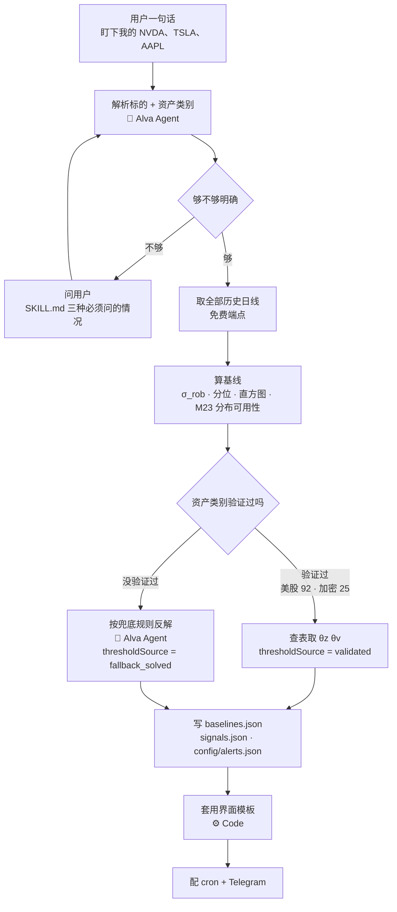
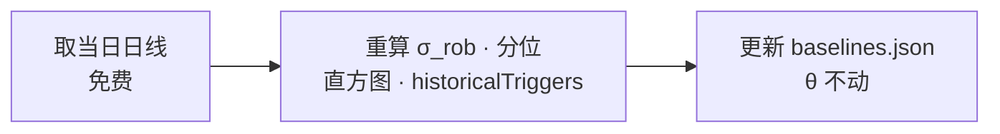
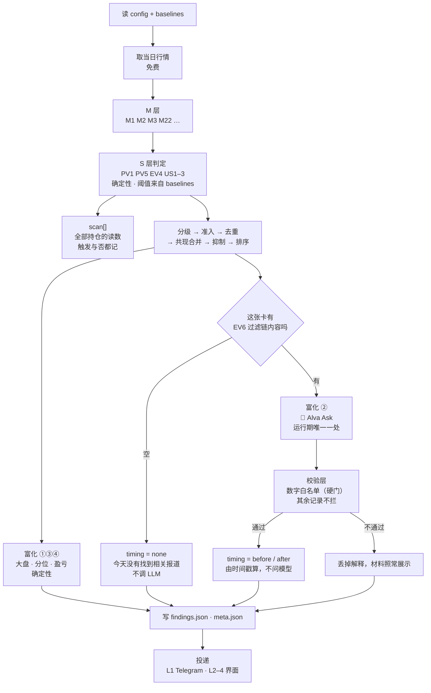
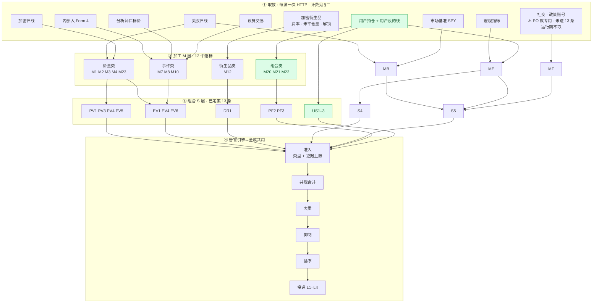
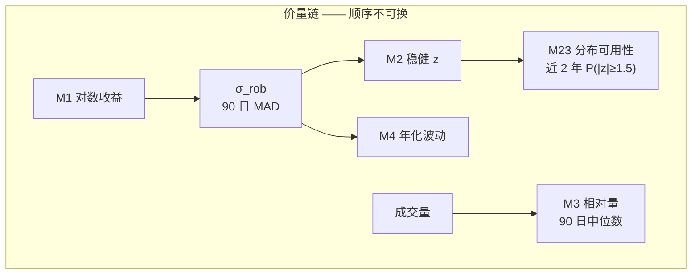
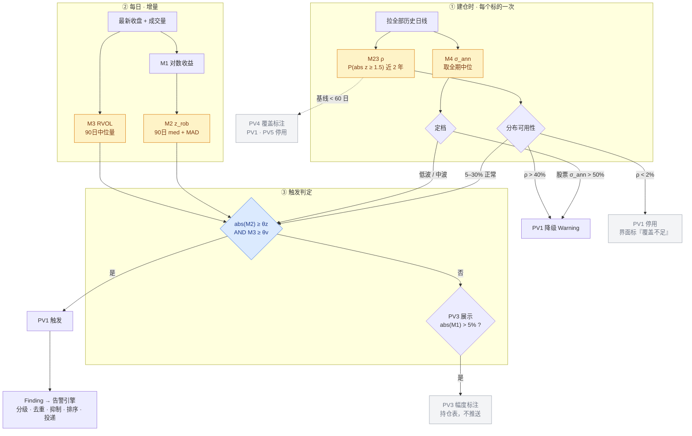

# 数据处理链路 · 全族

<sub>`product/data-pipeline.md` — 只画链路，不定义信号。阈值与算式一律引用 [`../signal-registry.md`](../backtest/signal-registry.md)</sub>

> **本文回答「要算出某条信号，得先干什么、按什么顺序」。**
> registry 回答「信号是什么」，本文回答「怎么把它算出来」。两者分工不重叠。
>
> **全链路有两处 LLM，都在 §零 画出。** 运行期只有一处：告警富化②的归因（`ask()`）。
> 另一处是 PO 族的内容提取（M18），但 **PO 族未进已定案 13 条**，其流水线已移出本文 ——
> 见 `../backtest/results-po.md`。本文只画运行期实际会跑的那条。

---

<!-- toc:start -->
**目录**（自动生成，改标题后重跑 `backtest/scripts/add_toc.py`）

- [零、三条链路 · 按运行节奏](#零三条链路-按运行节奏)
  - [① 初始化 · Skill 跑一次](#①-初始化-skill-跑一次)
  - [② 每日基线滚动 · 收盘后](#②-每日基线滚动-收盘后)
  - [③ 运行期 · 每 15 分钟](#③-运行期-每-15-分钟)
  - [运行期 LLM 的四条约束](#运行期-llm-的四条约束)
  - [成本](#成本)
- [九、归因调用规格](#九归因调用规格)
  - [一次调用的形状](#一次调用的形状)
  - [system（固定，逐字）](#system固定逐字)
  - [user（每张卡拼一次，逐字模板）](#user每张卡拼一次逐字模板)
  - [拼什么，不拼什么](#拼什么不拼什么)
  - [代码算什么](#代码算什么)
  - [输出解析与校验](#输出解析与校验)
- [一、四层总览](#一四层总览)
- [二、取数层](#二取数层)
- [三、M 层加工 · 依赖顺序](#三m-层加工-依赖顺序)
  - [这一层只画顺序，不重复「被谁引用」](#这一层只画顺序不重复被谁引用)
- [四、文本链](#四文本链)
  - [EV6 的过滤链 · 四步确定性](#ev6-的过滤链-四步确定性)
- [五、运行时自检插在哪](#五运行时自检插在哪)
- [六、状态层](#六状态层)
- [七、缓存与重算](#七缓存与重算)
- [八、输出层 · 链路的终点](#八输出层-链路的终点)

<!-- toc:end -->

## 零、三条链路 · 按运行节奏

§一 之后的所有章节画的是**层**（取数 → M → S → 引擎）。本节画的是**时间** ——
同一套层在三个不同节奏上各跑一遍，节奏不同则输入不同、成本不同、能不能用 LLM 也不同。

```
① 初始化      Skill 跑一次        Alva Agent 两处
② 每日基线    收盘后              无
③ 运行期      每 15 分钟          Alva Ask 一处，且两道门都过才调
```

⚠️ **常被数成两条。** 「初始化一次 + 之后定期跑」漏掉的是基线滚动：
θ 在初始化时锁死不再变，但 σ_rob、分位、直方图、历史触发次数每天都要重算。
它跟运行期节奏不同（日频 vs 15 分钟）、输入不同（收盘日线 vs 当日行情），
混在一起会让「阈值到底会不会自己漂」这个问题答不清楚。锁定规则见
[output-schema §十一](output-schema.md)。

### ① 初始化 · Skill 跑一次



产物锁定：**θ 锁死，σ 每日滚动。**

⚠️ **界面是套模板，不是生成。** Skill 随包发一份界面模板，它读
[output-schema](output-schema.md) 那七个 JSON 渲染四个 Tab。agent 只填配置
（语言 · 哪些区块按资产类别出现 · 用户设的线），**不重写页面**。

理由是**复用性就落在这里**：版面、告警卡结构、pill 体系、颜色语义、K 线标记约定、
弹窗两段结构、两种语言的文案模板 —— 这些是规格反复收敛出来的结果，
让 agent 每次拿 content-spec 从头写一遍，等于每个用户拿到一个不同的产品。

**同时它让 eval 可测**：模板固定 + 一组固定的 JSON → 固定的渲染，可以逐像素断言。
生成式的界面没有这个性质。

⚠️ 模板不覆盖的需求（用户额外要一个区块）由 agent 扩展模板，
**但那是例外路径，默认路径是套用**。

⚠️ **两处都是 Alva 在做 LLM 工作，但执行形态不同。**

```
Alva Agent   把 Skill 发给 Alva 执行，agent 读完 SKILL.md 自己判断
             链路里没有显式的函数调用点
Alva Ask     脚本从 V8 runtime 显式调用 @alva/alvaask 的 ask()
             有确定的调用点，可以数次数
```

⚠️ **`ask()` 不是裸补全，是一个带工具的 agent。** SDK 文档：
「The agent runs in a full sandbox session with **access to tools, skills, and ALFS**」。

归因这个调用**要它自己检索** —— 严链只覆盖美股，加密每次材料都是空的，
不检索就永远没有归因。**自搜来源与链路来源分开标记**（`origin: "model"` / `"chain"`），
时点判定只认后者，见 §九。

⚠️ **不要写死 `model`。** SDK 文档：「Omit unless the user explicitly requested a
specific model — calls default to the platform model (currently gpt-5.5), which is
cheaper and kept up to date server-side. **Hard-coding an expensive model here silently
inflates the feed's per-run cost**」。

**不要把某次回测选的型号搬到归因上** —— 那是为另一类任务挑的，
对归因没有依据**。归因调用省略 `model`，用平台默认。

区分它们的实际用处是**可观测性**：运行期那一处能数清楚调了几次、传了什么模型，
所以能加校验层（数字白名单 · URL 必需 · 措辞黑名单）。初始化那三处没有这样的钩子，
质量只能靠 SKILL.md 的写法和事后检查产物来保证。

⚠️ **不要据此推断计费。** `ask` 作为**计费类目**比 `ask()` 这个函数宽 ——
CLAUDE.md §三 记着 MCP 工具调用也记在 `source = ask` 下（583 credits，该 session 未调过 LLM）。
初始化会不会落进这个类目**未实测**。

### ② 每日基线滚动 · 收盘后



零 LLM，零 credits。**θ 不在这里动** —— 动了就等于阈值会自己漂，
决策 #9「阈值用固定值不用滚动分位」直接失效。

### ③ 运行期 · 每 15 分钟



### 运行期 LLM 的四条约束

**① 它在排序之后，碰不到投递决定。**
`分级 → 准入 → 去重 → 共现合并 → 抑制 → 排序` 全部跑完、这张卡确定要出，
才轮到归因。它改不了推不推、改不了排第几。这是它与决策 #6
「LLM 只判内容和性质，不判量级」相容的**唯一**原因 ——
放到判定层的任何位置都会破坏该决策。

**② 两道门串联，大部分时候不调。**

```
没触发            不调    scan 行只是两个数字，没有可归因的事件
触发但两条链都空   不调    直接落 timing = none
触发且有内容       调一次
```

`timing` 因此**全程是确定性结论** —— 空就是 `none`，有内容就按 `publishedAt` 与
移动时刻比出 `before` / `after`。**不问模型。**
「有没有报道」「报道在移动之前还是之后」都是事实主张，不接受在两次运行之间跳变。

**③ 单位是卡片，不是合并。**

```
一张卡  =  一次 ask()  =  一条解释
```

合并只决定有几张卡，不决定每张卡几条解释。单条 PV1 的卡是退化情形，同样一次调用 ——
引擎按卡遍历，不判断这张卡合并过没有。

NVDA 同一个 episode 触发 PV1 + US1 是一张卡、一次 `ask()`，因为归因回答的是
「NVDA 今天这次移动为什么」，与触发了哪几条信号无关。
**两次调用会让同一张卡出现两个互相打架的解释。**

⚠️ **EV4 不调。** 它不参与共现合并（日历无 `episodeId`），
而且自带原因 —— 「明天发财报」没有需要归因的东西。

**④ 挂了告警照发。**
富化层的定义是「已经决定投递了，补上下文」。`ask()` 超时或失败 →
卡片照出，只是没有②，①③④ 不受影响。**这条必须实现**，
否则一次 LLM 故障能让整条告警链停摆。

### 成本

**这里不写单价。** `ask()` 的计费、每日额度都是平台定价，写进规格只会过期。
要当前的数就跑 `alva credits wallet` 与 `alva credits items --today`。

| | 频次 | 计费 |
|---|---|---|
| 初始化 | 建一次 playbook | Alva Agent 执行整段 Skill，与逐次 `ask()` 不同计量 |
| 每日基线 | 每日 | 0 —— 基线端点全部免费 |
| 运行期归因 | 一张告警卡一次 | `ask()`，按 token 实际用量 |
| 运行期新闻 | `market-news` 按需取不轮询 | 按次 |

⚠️ **`ask` 按 token 实际用量计费，不是固定单价** —— SDK 文档原文
「Billing is based on actual token usage (not fixed credits)」。
同一个调用，prompt 长一倍成本就长一倍。**不要用「均价 × 次数」估算。**

⚠️ **初始化成本更不能用 `ask` 均价乘次数估** —— 那是逐次调用的单价，
而初始化是一整段 agent 执行，计量单位不同。要给数就真跑一次，
**等几分钟**再解析 `alva credits items --today`（计费有分钟级延迟，
`alva run` 返回的 `credits_used` 恒为 0）。

⚠️ **成本几乎完全由「今天几张卡调了模型」决定**，而告警量在体制转换时会聚集。
按平均值配额度会在最需要解释的那几天用光。

⚠️ **过滤链命中率 19% 是按现行严链算的**（相关度 = 1.0 · 事件主题 ≥ 0.5 · ±120 分钟）。
下游有了 LLM，这道门本可以放宽（相关度 ≥ 0.8 · ±240 分钟）来提高覆盖 ——
**但 EV6 现在的 🟡 是按严链测出来的，放宽等于换了一条规则，误挂率要重测。**
这是一个独立验证项，不要顺手改。

---

## 九、归因调用规格

§零 画了归因在链路里的位置。本节给**那一次调用的完整拼装** ——
system 逐字、user 模板逐字、输出契约逐字，照抄即可运行。
测过什么、哪些写法被证伪，在 [`../backtest/results-attribution.md`](../backtest/results-attribution.md)。

### 一次调用的形状

```
对每张卡（共现合并之后，排序之后，投递之前）：

  1  信号是 US1–3 或 EV4          → 不调，attribution 整块留空，界面不渲染
  2  取材料                       严链 + 宽链，0–3 条
  3  ask(user, { system })        材料为空也调，让它自己检索
  4  剥 ```json 包装，解析
  5  数字白名单                    输出里的数字必须在输入集合内，否则丢掉解释、保留材料
  6  合并来源                      链路取回的打 origin:"chain"，模型自搜的打 origin:"model"
  7  算 timing                     只读 chain，四档
  8  写 findings[].context.attribution

失败（超时 · 异常 · 解析不出）→ 没有解释，材料照常展示，卡照发
```

**省略 `model` 参数，用平台默认。** `attribution.model` 字段从返回里取实际值，取不到置 `null`。

### system（固定，逐字）

```
You are a JSON-emitting subroutine inside a portfolio-watch product.
You are NOT chatting with a person and you are NOT giving investment guidance.
Your entire output is parsed by a program; any prose outside the JSON breaks it.

A deterministic rule has already fired and the alert is already being delivered.
You are not deciding whether to alert; nothing you write changes that.

WHERE THE GIVEN MATERIAL CAME FROM
  Items under MATERIAL were pulled by a retrieval heuristic, not by a judgement:
  highest ticker-relevance score, published within 120 minutes either side of the
  alert timestamp. It is a starting set, not a guarantee — an item may be
  off-target or about a peer. Judge each item on its own content.

  Reporting normally lags the move it describes. Traders act on information well
  before a newsroom writes it up, so an item filed after the move is ordinary
  material, not disqualified material. Each item's offset is given to you as fact,
  and the product prints that same offset next to the item for the reader.

RULES for "explanation"
  1  Do not judge magnitude. Report what the material says; do not characterise the
     size of the move.
  2  Every number you write must appear verbatim in the input above. A downstream
     check compares your numbers against that text and discards the whole answer if
     one is missing — it cannot read inside the pages you searched, so a figure you
     saw there counts as missing. Describe such a finding in words, without the
     figure, or leave it out.
  3  Do not predict and do not advise.
  4  Do not assert causation, and do not comment on how long before or after the
     move an item was published. The reader already sees that offset next to each
     item, and it is not evidence either way, because reporting lags the move.
     A sentence spent on it is a sentence spent on nothing.
  5  Describe only what the material says. Do not add context it does not contain.
  6  No disclaimer. The product already carries one.
  7  The card already shows the symbol, the move, the volume ratio, the time and the
     rank, right above your sentence. Repeating them spends your whole budget on what
     the reader can already see. Write only what the material adds to them.
  8  An explanation must rest on something the reader can open. If you write one,
     at least one item in MATERIAL or one URL in "additionalSources" has to support
     it; a downstream check discards any explanation that arrives with no source at
     all. So if neither MATERIAL nor your own search turns up anything that says
     what happened at this symbol, return null for "explanation". Null is a real
     answer here, not a failure: the product renders it as "no reporting found",
     which is what the reader needs to know. Do not reach for a general account of
     the market or the sector to fill the gap — unsourced, that is a guess wearing
     the clothes of an explanation — and do not write a sentence about what you
     could not find.
```

⚠️ **模型不得评述条目的时间关系。** 新闻天然滞后于它描述的那次移动 ——
交易者拿到信息远早于媒体发稿，所以「这条晚了 47 分钟」既不是反证也不是佐证。
时差照样给模型（它是事实），也照样印在每条来源旁给读者，
但模型再复述一遍只会把 220 字的预算花在页面上已有的标签上。

⚠️ **「没找到」是一个结论，必须能说出口。** 取材与模型自检索都没有交代
这只标的发生了什么时，`explanation` 返回 `null`，页面显示「未找到与这次移动相关的报道」。
不给这条出口，模型只能拿手边的材料凑一句话。经过见
[`../backtest/revisions.md`](../backtest/revisions.md) R51。

⚠️ **本节必须与实际跑的提示词逐字一致。改提示词先改这里，再跑。**

`opts.system` 是**追加**到平台默认 system 之后的，不是替换。
**凡是希望模型照做的一律写进 user 末尾** —— 格式契约 · 禁用词表 · 检索指令。
写进 system 的会被平台默认人格压过。

### user（每张卡拼一次，逐字模板）

session 档：

```
SYMBOL   NVDA (NVIDIA), US equity
MOVE     -6.2% on the session
FIRED    Drawdown line        14:52 ET   your -12% line from its own high
         Price-volume move    16:05 ET   z -2.85, RVOL 3.4x, lines ±3.3% / 2.0x
MARKET   SPY -0.3% the same session
RANK     7th largest drop of the 502 sessions on record

MATERIAL
  [0] 13:40 ET, 25 minutes before the move, Reuters
      Supplier flags slower shipment schedule for next-gen accelerator racks
      <summary>
  [1] 13:52 ET, 13 minutes before the move, Bloomberg
      Second outlet reports the same revised rack shipment timeline
      <summary>
```

bar 档只有四行不一样，其余同上：

```
MOVE     -4.1% on the 10:15-10:30 ET bar, -5.0% on the session so far
FIRED    Intraday price-volume move   10:30 ET   z -5.10, RVOL 3.9x,
                                                 lines ±1.4% / 2.0x
MARKET   SPY -0.1% over the same 15 minutes
RANK     2nd largest of the 90 bars recorded at 10:15 ET — this slot only, not across the day
```

`RANK` 一行的分母跟 unit 走，**限定词写死在输入里**，不要指望模型保留它。

⚠️ 实测：给「1 of 135 bars recorded at 00:30」，模型写回
「the top-ranked bar in the sample」—— 「同一时刻」这个限定丢了。

⚠️ **但不要为此加硬门。** 我一度想拦「排名措辞丢限定词」，理由是「另一个量级的主张」——
那个理由经不起数据检验：SOL 那根按同一时刻是 135 根里第 1，按全天混排是 12,959 根里第 10，
**两个都是极端，读者的判断不会因此改变**。

真正会误导的是**美股开盘那根**：13:45 UTC 的常态幅度是全天中位的 2.12 倍
（NVDA 0.388% vs 0.184%，TSLA 0.467% vs 0.205%，最平静与最活跃时刻相差 3.6–3.7 倍）。
一根开盘 0.4% 的 bar，按同一时刻很普通，按全天混排能排进前列。

而运行期分不出「这一条属于哪种」，所以：**从源头堵，不在事后检测** ——
把「this slot only, not across the day」直接写进 `RANK` 那一行，
让模型没有简写的余地。页面上那句话本来就是这么写的，提示词里漏了。

`MATERIAL` 的时差**预先算好写成「25 minutes before」**，不给两个时刻让模型自己减。

`MATERIAL` 为空时**照拼，并写明「none」及原因** —— 不拼会留下一个静默的空行，
模型不知道是「没取到」还是「这一栏本来就不存在」。
空态原文：`MATERIAL none. Retrieval returned nothing published in the 120 minutes
before the move. Your own search is the only remaining source.`

#### user 末尾的输出契约

**每张卡都要拼上，不能只写在 system 里。**

```
OUTPUT - read this twice before answering
Return exactly this object, all three keys present, nothing before or after it:

{"explanation":"<English, 2 to 3 sentences, at most 220 characters>","additionalSources":[]}

  explanation  English, always. Must NOT contain any of:
               <禁用词表，给具体的词，不要只给概念>
               Must NOT end with a disclaimer or a follow-up-watchlist sentence.

Your first character must be { and your last character must be }.
```

```
  additionalSources  anything you searched up yourself. Each needs a real URL you
                     saw in the results. If you did not search, return [].

STEP 1 - SEARCH NOW. Do it before writing anything.
```

禁用词表给具体的词，不给概念。英文这一组：

```
significant · sharp · dramatic · unusual · extreme · rare · suggests · implies ·
expected to · likely to · investors should · watch for · not investment advice
```

⚠️ **中文表不能靠机器翻译这一组得到。** 中文的「显著」既是统计词也是日常词，
`significant` 触发的是另一批措辞。要出中文版就重新实测一组。

### 拼什么，不拼什么

```
拼进去                      为什么
标的与资产类别               判断材料指的是不是这只标的
被解释的移动                 session  当日方向与幅度
                          bar      那一根的方向与幅度，另附当日至今累计
触发了哪几条 · 各自时刻        材料的时点要跟触发时刻比
  以及各自的实测值与线值        让模型能说「z −2.85，线 1.5」而不用自己算
大盘对比                    区分「大盘在跌」和「这只票自己在跌」；加密两档均为「无可比基准」
幅度分位                    「502 天里第 7 大」是事实，可被引用
材料 0–3 条                 id · 时刻 · 相对触发的时差 · 来源 · 标题 · 摘要

不拼进去                    为什么不
价格绝对值                  给了价格，模型会开始编价位相关的因果
仓位权重                    会诱发「这对你影响很大」—— 那是判断不是解释
thresholdSource            那是我们对规则的信心，与价格为什么动无关
novelty · priority         排序的输入，不是解释的输入
用户设的线的具体值           用户线不调归因
```

⚠️ **三个量必须同 unit 取。** 拿 502 根日线的分位去解释一根 15 分钟 K，
模型会写成「近两年第 7 大」，而那根 bar 在日线上可能什么都不是。
`大盘对比` 同理。

⚠️ **bar 的分位取同一时刻。** 全天 26 根混排会被开盘和收盘那两根结构性地压制
（PV5 的 $\sigma_{\mathrm{rob}}$ 同理，见 [signal-spec PV5](signal-spec.md)）。

⚠️ **摘要要传。** 只给标题，模型基本只能做关键词匹配。

⚠️ **一切要给人看的时刻走同一个 ET 格式化函数，输入是带偏移量的 ISO。**
禁止切字符串取 `HH:MM` 再拼时区名 —— 槽位串是 UTC，是连接键，不是显示值。

⚠️ **拼装时同步记下「输入里出现过的数字集合」**，校验层的白名单直接用它，
不要事后从 prompt 文本里正则扒。

### 代码算什么

模型只做两件事：写解释、补充自己检索到的来源。**其余全部由代码算。**

`sources[]` 逐条打出处：

```
origin: "chain"   确定性链路（严链 · 宽链）取回的。publishedAt 可信
origin: "model"   模型自己检索到的。publishedAt 是它报的，不可核实
```

`timing` 是 `sources[]` 与 `moveAt` 的纯函数，**四档**：

```
chain 非空   → before    存在 chain 来源 publishedAt ≤ moveAt
              after     其余
chain 为空   → untimed   sources 非空：找到了报道，时点未核实
              none      sources 为空：确实没有材料
```

⚠️ **两侧调同一个函数，不许各算各的。** 档位数会变。

⚠️ **`untimed` 不能并进 `none`。** 并进去，徽章会在几条来源之上说「没有找到报道」。
它用实心徽章，不用描边 —— 描边是 `none` 的样子。

⚠️ **`untimed` 那一档下面必须跟一句说明**：这几条是模型自己检索到的，
不是筛选链取回的，发布时刻无法核实，因此不参与「移动前/后」的判定。

⚠️ **`after` 不是失败档。** 事后报道对用户有用，只要标清楚是事后的。
它拿与 `before` 同样的字号与来源列表；要区别的是它与 `none`。

⚠️ **不做因果分类。** 徽章不是因果主张 —— EV6 的声明层级写明
「不声明该稿件驱动了这根 bar」。

⚠️ **`publishedAt` 只有日期时就按日期显示**，不补零成 `00:00` 再格式化。

⚠️ **不向模型要出版方字段。** 它不回传 `source`，出版方从 `url` 取 host。

### 输出解析与校验

平台 `ask()` 不支持结构化输出约束，只能从文本里解析。

```
先剥包装再解析      输出会被裹进 ```json，直接 parse 必失败
三种结局分开记录     成功 · 解析失败 · 规则拦截
                  混在一个「失败」计数里，就分不清是模型不行还是解析不行
```

**只有一条硬门**，因为只有这一类错误用户自己发现不了：

```
硬门     数字白名单       输出里的数字必须在输入集合内
                       比较前先规范化：去正负号 · 去千分位 · 去尾随零 · 剥百分号与倍号
                       -7.35 → 7.35    3.11x → 3.11    1,250 → 1250

记录不拦  措辞黑名单 · 长度 · 语言 · 免责声明
        免责声明按**句式**检测，不能只列词 ——「本文只作信息用途，不是投资意见」
        不含 `仅供` `参考` `不构成` 中的任何一个
```

来源的可解析性：

```
❌ HTTP 状态码       付费墙站点对非浏览器一律 401/403，真假路径同样返回
✅ 标题反查          精确短语查 serper-search，看返回里有没有同一条 URL
⚠️ 都确认不了发布时刻   所以模型自搜来源不参与 timing，只进列表
```

## 一、四层总览

⚠️ **本图画的是全族链路，含未进已定案 13 条的支路。**
运行期实际跑的是 §零 ③ 那一条 —— **社交 / 政策账号（D8）与整个 PO 族不在其中**。
判断某条支路跑不跑，以 [signal-spec §一](signal-spec.md) 的 13 条为准。

⚠️ **取数不是全免费。** 逐来源实况：社交端点约 21 credits/次 · `market-news` 与
`price-target-news` 与 `crypto/unlock-events` 各 1 credit/次 · 日线 / 盘中 / 宏观 /
内部人 / 议员 / 财报日历 / 资金费率免费。



<sub>🟢 用户输入相关。**M 层全部是算术，没有一格含 LLM** ——
运行期唯一的 LLM 是告警富化②的归因，它在引擎之后、不产出指标，见 §零 与 §九。</sub>

---

## 二、取数层

| 数据源 | 端点 | 喂给 | 深度 |
|---|---|---|---|
| 美股日线 | `/api/v1/stocks/kline` | M1–M4 · M23 | 2018-01 → 今 |
| 加密日线 | `/api/v1/crypto/binance/spot/usdt/kline` | M1–M4 · M23 | 2018-01 → 今 |
| 内部人 | `/api/v1/stocks/insider/transactions` | M7 M8 | 8.5 年 |
| 资金费率 | `/api/v1/crypto/funding-rate` | M12 | 2020-03 起 |
| 公司新闻 | `/api/v1/stocks/market-news` | **EV6** | **1 credit/次** · 见 signal-spec EV6 字段表 |
| 财报日历 | `/api/v1/stocks/earnings-calendar` | **EV4** | 免费 · 提前量约 30 天 |
| 公司信息 | `/api/v1/stocks/company/detail` | logo · sector · ipo_date | ⚠️ 计费未知，用前须核对 |
| 市场基准 | 同美股日线，`symbol=SPY` | 富化① 大盘对比 | 同上 |

⚠️ **已移出的取数源**：分析师目标价 · 议员交易 · 未平仓量 · 代币解锁 · 宏观指标 · 社交与政策账号。
它们只喂未进 13 条的信号，端点实测记录见 [`../backtest/data/README.md`](../backtest/data/README.md)。

**共用的取数口径**（详见 [`../backtest/data/README.md`](../backtest/data/README.md)）：

```
返回一律按时间倒序           用前必须重排
字段名股票与加密不同          股票 time_period_start / price_close / volume_traded
                          加密 time_open / price_close / volume
必须显式给 start_time/end_time  缺参数返回 400，不是后端故障
limit 默认值会静默截断        资金费率默认 30 条，且上限 1000
limit 有上限                 加密日线约 3000，超了整段报错
symbol 格式加密要 BTCUSDT     不是 BTC
盘中 interval 写 15min       写 15m 返回 400
分段取数要单独数失败段        `ERR 400` 不是「取到 1 根」——
                          把失败折叠进计数，一个 400 看起来就像成功
跨日第一根丢掉               它的「前一根」是昨天收盘，不是一根 bar 的移动
```

⚠️ **美股盘中只算 RTH，而 RTH 窗口必须从 ET 换算，不能写死 UTC 常量。**
夏令时 9:30–16:00 ET = 13:30–20:00 UTC，标准时 = 14:30–21:00 UTC。
**写死任一个，另外半年就整体错一小时** —— 取到一小时盘前、丢掉收盘前一小时。

⚠️ **「每天 25–26 根」不能用来自查这件事。** 两个窗口都是 6.5 小时，根数都对，
**这个检查在错的那半年照样通过。** 要查就查边界：
每天第一根的 ET 时刻必须是 09:30，最后一根必须是 15:45。

⚠️ **盘中量比出现 20–50 倍时，先查那根 bar 是几点。**
盘前时段的同时刻量能中位接近零，任何成交对上去都是巨大倍数。

⚠️ **`POST /api/v1/social-feeds/x/handles` 是计费的 premium discovery unit，不得调用。**

---

## 三、M 层加工 · 依赖顺序

**同一族内有严格先后**，跨族无依赖、可并行。



```
M1  →  σ_rob（90 日窗，不含当日）  →  M2 · M4
                                  →  M23（M2 的 2 年统计）
成交量  →  M3（90 日中位数，不是均值）
```

**基线窗口一律 90 日且不含当日** —— 含当日会让触发日自己参与定义自己的基线。

**M3 用中位数不用均值** —— 均值被历史尖峰拉高，会系统性压低 RVOL。

盘中场景 M3 需按**同时段**归一（今日累计量 vs 前 90 日同时段），与平台官方做法一致。

### 这一层只画顺序，不重复「被谁引用」

**引用关系的唯一定义处是 [signal-spec §四](signal-spec.md)** —— 那里 12 个指标，
每个都标明被哪条信号用。本文写第二份只会漂。

已定案 13 条实际用到的 12 个指标，按依赖顺序：

```
价量链   M1 对数收益 → σ_rob → M2 稳健 z → M23 分布可用性
                            → M4 年化波动
         成交量 → M3 相对量
事件类   M7 内部人簇计数 · M8 申报滞后 · M10 财报日历距离
衍生品   M12 资金费率
组合类   M20 单股权重 · M21 主题敞口 · M22 距高点回撤
```

⚠️ **M5 beta · M6 异常收益 · M9 · M11 · M13–M19 · M24 已移出。**
它们只服务未进 13 条的信号（PO / MA / EV2 / EV3 / EV5 / DR2–4），
定义与实验记录见 [`../backtest/signal-registry.md`](../backtest/signal-registry.md) §五
与 [`../backtest/results-po.md`](../backtest/results-po.md)。


## 四、文本链

已定案的文本通路只有一条：**EV6 的确定性过滤链**，输出挂在告警卡上作归因源，不独立触发。

```
数据源   market-news 公司新闻
处理     四步确定性过滤，不碰 LLM
输出     喂给归因（§九），并在告警卡的材料块里展示
状态     🟡 收窄后待审核 · 仅美股（相关度门槛所致，非端点限制）
```

⚠️ **PO 族（社交 · 政策账号）的流水线与 M18 抽取校验已移出本文**，
它未进已定案 13 条，属实验记录 —— 见
[`../backtest/results-po.md`](../backtest/results-po.md) 附录。

### EV6 的过滤链 · 四步确定性

```
① 相关度    该标的 tickers[].relevance_score = 1.0
② 事件类    topics 含 earnings / M&A / IPO 且该主题相关度 ≥ 0.5
③ 时点      |publish_time − alert_time| ≤ 120 分钟  且  publish_time ≤ alert_time
④ 排序      按 publish_time 倒序取最近 3 条
```

⚠️ **③ 的后半段是入选条件不是排序规则。** 覆盖率 19.01% 就是它换来的 ——
不截断是 25.73%，差出来的部分里 26.1% 是事后报道。放事后报道进来接近循环论证。

⚠️ **本节这条链是回测覆盖率统计用的，不是线上归因取材用的。两者窗口不同，
不要互相套用。**

```
回测覆盖率   publish_time ≤ alert_time    要回答「公开报道能不能对上触发」，
                                         「涨了才写涨」的稿子进来就是循环论证
线上归因     |Δt| ≤ 120 分钟，双向       要回答「这次动了，外面在说什么」，
                                         新闻滞后于移动是常态，
                                         只收事前稿会把真正的解释材料滤光，
                                         加密尤其如此
```

线上取材另见 §九。把回测那条窗口套到线上，代价是归因几乎恒为空。

⚠️ **先筛后排，不能先排后筛。** 新闻密度逐标的差 500 倍
（JPM 200 条/天 · NVDA 172 · XOM 15 · MSTR 1.2 · QFIN 0.02）——
对 JPM 取「最近 3 条」拿到的是最近二十分钟的转载。

⚠️ **判别力在媒体家数不在条数**（触发日 1.35 家 vs 对照 0.79，倍数 1.71，p=0.0002；
条数倍数仅 1.06，p=0.93）。去重键用 `source_domain` 不用 `source`。

⚠️ **`symbol` 过滤不严** —— 查 NVDA 会返回别家公司的稿，必须用 `tickers[].relevance_score` 自己过滤。

⚠️ **加密不走这条链**：六个相关度阈值 × 两个窗口 × 媒体家数门槛，倍数全部 < 1.0。

## 五、运行时自检插在哪

两道自检守卫复用性，**必须在信号计算之前执行**。

```
M23 分布可用性     算完 M2 之后、判 PV1 之前
                  ρ = 近 2 年 P(|z_rob| ≥ 1.5)
                  ρ 异常低 → 该标的的固定阈值够不到 → 标「统计类异动检测不适用」
                  防的是：均匀分布下 max|z| = 1.35 < 1.5，PV1 静默失效

运行时验证        信号首次为某标的启用时执行一次
                  在该标的自身历史上算相对基准倍数及其 95% 区间，**并数独立块数**
                  区间下界 > 1.0  ∧  块数 ≥ 5   → 🟢 可 L1
                  区间跨 1.0                    → 🟡 最高 L2
                  块数 < 5                      → 🟡 最高 L2，标「样本不足，暂不评估」
                  防的是：阈值够得到，但触发之后没有意义
```

两者防的不是同一件事：**M23 防「够不到」，运行时验证防「够到了但没意义」。**

⚠️ **块数那条腿之前漏了。** 判据是两条合取（`95% 区间下界 > 1.0` ∧ `独立块数 ≥ 5`），
只查区间会让触发极少的标的凭噪声拿到 🟢 —— 区间在 n=3 时本来就宽得没有约束力。

⚠️ **这条自检是「逐标的排除」唯一可实现的形式。**
回测里按名字列出的排除（如 PV5 的 CALY · TSLA 块数 4）对用户的任意组合不可实现 ——
我们没在他的标的上跑过回测，也就数不出块数……**除非在运行时数**，而这正是本节做的事。

所以 §二「新标的不需要重新回测」与「块数不足暂不评估」不矛盾：
**阈值不逐标的标定（查表即可），可评估性逐标的现算。**
回测里的名单是当时的观测记录，不是运行时的配置。

详见 registry §6.8。

---

## 六、状态层

运行时**没有键值状态模块** —— 实测 `storage` / `kv` / `cache` / `db` / `state` 全部不存在
（探测记录见 [`../backtest/revisions.md`](../backtest/revisions.md)）。

⚠️ **本节原写作「没有任何持久化模块」，那是过时的。**
[output-schema](output-schema.md) 的整套设计**依赖跨次运行写文件**：
`series.json` 每日收盘后追加一点、`baselines.json` 每日重算后下一轮读回。
**这本身就是跨轮状态。**

所以下表的「无处存」应读作「**尚未设计对应的文件**」，不是「平台不支持」。
去重键、冷却时点、运行时验证结果都可以落成 Alva FS 上的文件，
代价是每轮多一次读写，**写盘不计费**。

真正待解的是两件更细的事：

```
并发     15 分钟 cron 与每日 cron 若重叠，读-改-写同一文件会互相覆盖
增长     去重键集合与告警历史需要保留窗口和裁剪规则，否则单调增长
```

而以下环节都需要跨次运行的状态：

| 环节 | 需要的状态 | 现状 |
|---|---|---|
| 告警去重（registry §6.4） | 同 `anomalyEpisodeId` 是否已推过 | ❌ 无处存 |
| L3 深层去重（PO 族，已移出） | 近 30 日的 `dedup_key` 三元组集合 | ❌ 无处存 |
| 运行时验证结果 | 每标的每信号的证据等级，避免每次重算 | ❌ 无处存 |
| 冷却窗口（EV 族 45 日） | 上次推送时点 | ❌ 无处存 |

**这仍是待补的一块**，且不属于信号设计问题。可能的出路（按代价排序）：
**Alva FS 上的状态文件（最直接，与现有七个文件同一机制）** ·
平台 Episode 状态机（`research/platform-capability.md` 记有该机制）· Playbook 自身的持久化能力 ·
或把状态编码进告警本身。**三条都未验证。**

---

## 七、缓存与重算

**节奏与落盘契约以 [`output-schema.md`](output-schema.md) §十 §十一 为准**，本节只列 M 层的重算依据。

| 层 | 重算频率 | 依据 |
|---|---|---|
| 取数 · 价格 | 15 分钟增量 | PV5 是 15 分钟粒度，最快的那条决定节奏 |
| 取数 · 新闻 | **按需，不轮询** | EV6 是挂在告警卡上的归因源，没有告警的 bar 不需要归因。轮询 130 credits/天 vs 按需约 6 |
| M 层价量类 | 每次增量 | 90 日窗滚动，必须重算 |
| M 层 M23 · σ · 分位 | **每日收盘后** | 最短窗口也有 90 个交易日（M23 与分位是 2 年），盘中重算是纯浪费 |
| **θz · θv 阈值** | **只在初始化时定，之后锁定** | 每次重解会让阈值随市场漂移，且破坏「同一组合两次运行配置逐字节相同」 |
| 运行时验证 | 仅信号首次启用 + 定期复核 | 结果是证据等级，变动很慢 |
| M 层文本类 | 每条新帖 | 事件驱动 |
| M 层组合类 | 持仓变动时 | M20 M21 M22 |

**σ 滚动，θ 不动。** 常态随时间变，「几倍常态算异常」是在样本池上验证过的规则，不该跟着漂 ——
这正是「相对自身常态而非固定百分比」的落地形式。

⚠️ 缓存策略依赖 §六 的状态层，**状态层未解决前这一节是设计意图不是实现方案**。

---

## 八、输出层 · 链路的终点

M 层 → S 层 → 告警引擎之后，结果落在 Alva FS 上的七个文件。
**字段定义不在本文**，见 [`output-schema.md`](output-schema.md)。

```
config/alerts.json    用户配置 · 唯一可写
data/signals.json     信号清单 · 由 signal-spec 生成
data/findings.json    今日 findings ← 告警引擎的输出
data/portfolio.json   持仓 · KPI · 分配
data/series.json      净值序列 · 当日盈亏
data/news.json        今日相关新闻
data/baselines.json   逐标的基线 ← M 层 σ · 分位 · M23 · 锁定的阈值
meta.json             运行时间 · 数据新鲜度 · 缺口
```

**两处对应关系**：

```
M 层的 σ · 分位 · M23 · 阈值   →  data/baselines.json
告警引擎的 Finding             →  data/findings.json（字段名以 output-schema §三 为准）
```

⚠️ **本文的 Finding 字段（`symbol · signalId · direction · strength · evidence · episodeId · knownAt`）
是早期草稿**，正式形状以 output-schema §三 为准 —— 那里补了 `thresholdSource` ·
`context` 四键 · `recurrence` · `positionWeight` 等本文没有的字段。

---

# 附 · 从 signal-registry 迁入


#### 处理链路



<sub> 蓝 = 阈值写死，不随标的变　 黄 = 按标的运行时计算　⬜ 灰 = 展示，永不推送</sub>
